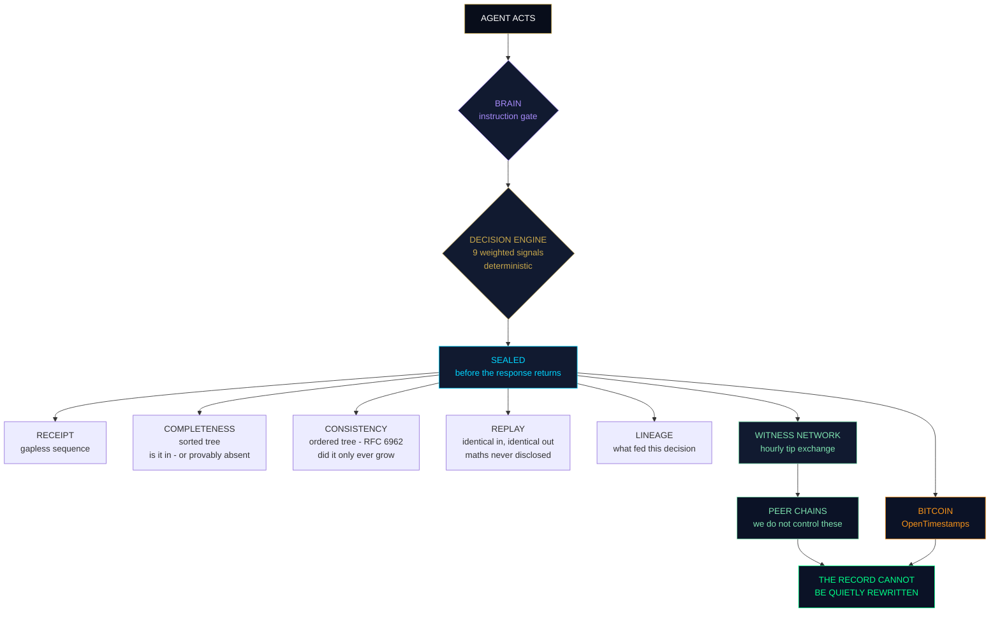
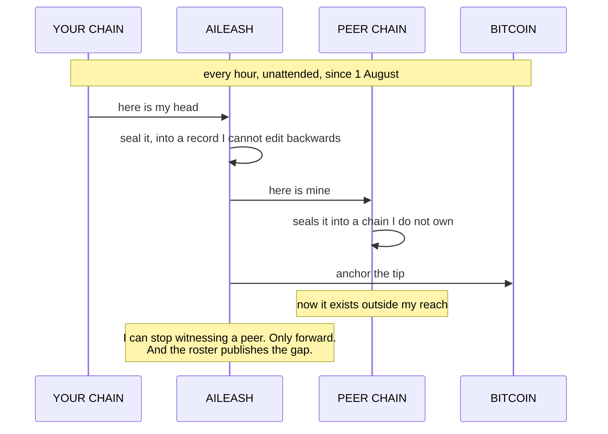

<div align="center">



### **ONE CHAIN. EVERY PROOF.**

*Every event sealed the moment it happens — the decision, **and the basis it rested on** —*
*unalterable by anyone. Including us.*

<br>

[](https://sebbi.pro)
[](https://sebbi.pro/api/verify-chain)
[](https://sebbi.pro/seal)
[](https://sebbi.pro/self-check)

**[Try it](https://sebbi.pro/seal)** · **[Verify it](https://sebbi.pro/verify)** · **[Docs](https://sebbi.pro/developers)** · **[Packs](https://sebbi.pro/packs.html)** · **[Whitepaper](https://sebbi.pro/whitepaper)**

</div>

---

> ### *A system that does not trust its own creator*
> ### *is the only kind whose records qualify as evidence.*

---

## Don't read about it. Watch it break.

A **real** four-block chain. Every hash is reproducible — same inputs, same seals, forever.

```
        ╔═══════════════════════════════════════════════════════╗
        ║   #4  brain: approve supplier 88          ALLOW       ║ ◄── tip
        ║       6abba40eb964959e…                               ║
        ╚═══════════════════════════════════════════════════════╝
             ╲                                                ╲
              ╔═══════════════════════════════════════════════════════╗
              ║   #3  govern: payment 9000 GBP          BLOCK         ║
              ║       293181a2bc2dab88…                               ║
              ╚═══════════════════════════════════════════════════════╝
                   ╲                                                ╲
                    ╔═══════════════════════════════════════════════════════╗
                    ║   #2  seal_post: quarterly_report     NOTARISED       ║
                    ║       c7309616a9e92bc7…                               ║
                    ╚═══════════════════════════════════════════════════════╝
                         ╲                                                ╲
                          ╔═══════════════════════════════════════════════════════╗
                          ║   #1  system_regmap                    ALLOW         ║
                          ║       411ffd9a31a3d9f4…                              ║
                          ╚═══════════════════════════════════════════════════════╝
                                          genesis  9fd06d6fdc19761d…
```

Now watch someone cover up that blocked £9,000 payment by flipping block 3 from **BLOCK** to **ALLOW**:

```diff
- tip  6abba40eb964959e…      ← what the chain says
+ tip  5e15bc5710426088…      ← what the forgery produces
```

**The tip changed. The forgery is exposed instantly, by arithmetic, to anyone — no account, no trust required.**

That is the entire product in four lines. Everything below is detail.

<details>
<summary><b>▸ Reproduce every hash yourself — 10 lines of Python</b></summary>

<br>

```python
import hashlib, json
seal = lambda prev, ts, ev, res, basis: hashlib.sha256(
    json.dumps({"prev":prev,"ts":ts,"event":ev,"result":res,"basis":basis},
               sort_keys=True).encode()).hexdigest()

prev = hashlib.sha256(b"AILEASH_BRAIN_GENESIS|sebbi.pro|v5").hexdigest()
chain = [("system_regmap","ALLOW","regmap-v7"),
         ("seal_post: quarterly_report.pdf","NOTARISED","NO_BASIS"),
         ("govern: payment 9000 GBP","BLOCK","invoice_4471|regmap-v7"),
         ("brain: approve supplier 88","ALLOW","invoice_4471|regmap-v7")]
ts = 1752940000
for ev,res,basis in chain:
    prev = seal(prev, ts, ev, res, basis); ts += 3600
    print(prev[:16], "…", ev)
# final line prints the tip: 6abba40eb964959e …
```

Change one character of one event and every seal after it changes. That's the whole idea.

</details>

---

## Thirty seconds, no account

```bash
curl https://sebbi.pro/api/verify-chain
```
```json
{ "valid": true, "blocks": 1874, "tip": "bf9257ab…" }
```

Now the one nobody else can do — **prove something is not there**:

```bash
curl "https://sebbi.pro/x/complete/prove?period=2026-08&value=neverhappened"
```
```json
{ "absent": true,
  "left":  { "index": 14, "leaf": "3a1f…" },
  "right": { "index": 15, "leaf": "9c02…" },
  "why": "consecutive indices. nothing can sit between them." }
```

Anyone can show you a log of what happened. **Absence is the one that decides disputes.**

<details>
<summary><b>▸ Four more, right now</b></summary>

<br>

```bash
# Prove the log only ever grew — RFC 6962, works with existing CT verifiers
curl "https://sebbi.pro/x/consistency/proof?first=100&second=500"

# Every chain witnessing us, with first-seen dates
curl https://sebbi.pro/x/roster/list

# Determinism, without us ever disclosing the maths
curl -X POST https://sebbi.pro/x/replay/challenge \
  -d '{"inputs":{"action":"payment","amount":49.99,"trust":0.5,"v60":1,
       "v5m":1,"v1h":1,"device_risk":0.05,"anomaly":0.1,
       "country":"UK","country_shift":0}}'

# The ten conformance checks, and which are publicly demonstrable
curl https://sebbi.pro/.well-known/ordering-test.json
```

Then run the **whole suite yourself** in a browser at **[sebbi.pro/self-check](https://sebbi.pro/self-check)** — it reads the published document, runs every check in declared order, and never counts *reachable* as a pass.

</details>

---

## Why this exists

Every system keeps logs. Logs live in databases. Databases can be edited — by an attacker, an insider, or the operator itself. So an ordinary log only ever says *"this is what we currently claim happened."* It can never say *"and nobody changed it since."*

Nobody notices the difference — until a regulator, a court, an insurer or a customer asks for **proof**. Then *"our system recorded it"* and *"here is proof it wasn't changed"* become two very different sentences. Only the second carries weight.

**sebbi.pro produces the second sentence automatically, as a by-product of your system doing its normal work.**

---

## The chain, in one formula

```
seal(n) = SHA-256( seal(n−1) · timestamp · event · result · basis )
```

| Property | What it means |
|---|---|
| **Tamper-evident** | Each seal contains its predecessor. Alter history → every later seal fails, publicly. |
| **Gapless receipts** | A sequence number issued in the same transaction as the write. Edited records break the chain; **missing** records break the sequence. |
| **Truncation-evident** | The tip is anchored per-write. Chop blocks off the end and the anchor breaks. |
| **Basis-sealed** | Not just *what* was decided — *what it rested on*: sources, versions, ruleset. Same block. |
| **Jurisdiction-tagged** | Sealed with the frameworks that applied at that moment. |
| **Fast** | Score, decide, seal and respond inline. **~28 ms** median. |
| **Crash-safe** | WAL journaling, full-sync commits, single-lock seal path, no race window, daily sealed backups. |

> **The one honest boundary, up front:** basis-sealing proves **what** a decision relied on — not that it was **correct**. Cryptography verifies integrity, never truth. Any product claiming to prove correctness is misdescribing what maths can do. We won't.

---

## The stack



| Layer | What it proves | Key |
|:--|:--|:--:|
| **Brain** | Instructions gated before the AI acts, basis sealed with the verdict | ○ |
| **Decision engine** | Nine weighted signals, EWMA trust decay, deterministic below the model layer | ◐ |
| **The chain** | Sealed before the response returns · gapless receipts | ○ |
| **Completeness** | What is in the record — and what provably is not | ○ |
| **Consistency** | The log only ever grew | ○ |
| **Replay** | Identical inputs, identical verdict, maths undisclosed | ○ |
| **Lineage** | Which receipts fed a decision, across organisations | ◐ |
| **Authority** | Derivable from a named human, re-derived at execution | ● |
| **Witness network** | Somebody we do not control holds a copy | ○ **forever** |
| **Anchoring** | The time was fixed where we cannot reach | ○ |

○ no key · ◐ part keyed · ● keyed

---

## The thing nobody else will say

Our own published manifest contains this line:

```yaml
Audit-Rewritable-By-Operator-Without-External-Reference: true
Audit-Rewrite-Prevention: external-timestamp + independent-witnesses
```

Read it again. **We publish that the operator can rewrite forward.** Every competitor claims immutability and hopes you never ask who holds the keys.

Because the answer to an operator who can rewrite is not a better promise *from the operator*.

**It is a copy held by somebody else.**



**Joining is free and ungated. Permanently.** The protocol code never checks subscription status. There is no membership list, no seat to grant, none to revoke.

If that sounds like giving the network away — **it is, deliberately.** Gating it would make the operator the party asking to be trusted, which is precisely the thing this removes.

---

## The products — one chain underneath all of them

| | Product | What it does | Access |
|---|---|---|---|
| 🧠 | **Brain** | Instruction gate for AI. Blocks prompt injection, exfiltration, compliance-bypass, child-safety and destruction patterns — with unicode and homoglyph defences — and seals every decision plus its basis. Pure Python, runs on your machine. | **Free** |
| ⚡ | **SonicBoom** | Decision engine. Any event scored in ~28 ms: ALLOW / CHALLENGE / BLOCK, plain-English reasons, sealed before it replies. Trust learned per user and lost 8× faster than earned, so burst attacks destroy their own standing. | API key |
| 🐕 | **Sebdog** | The engine on your own hardware. **Ed25519 licence validated locally — no phone home, ever.** Serves its own `/tip`, so your record is externally witnessed while the data never leaves the building. | Licence |
| 💰 | **Token saver** | Cost reduction over nine spend signals. Change one line — `base_url` to localhost. Fails open. Prompts never leave your machine; `--offline` needs no account at all. | 50p/device |
| 📦 | **Cost packs** | An open library of decision rules. Free to read, write, fork and publish — publishing seals your authorship with the date, **including against us**. Running one is the metered part. | **Free to write** |
| 🧾 | **Evidence packs** | The quarterly auditor document. Every block re-verified, links rewalked, sequence checked, with an *unbroken since* date that resets if the run breaks. | API key |
| 🔒 | **Wallet gate** | Give an agent a budget; stop it when the budget is gone. The spend record and the decision record are **the same record**. | API key |
| 🔐 | **Delegation layer** | Signed authority tokens — who may approve, to what limit, until when, the grant itself sealed. KYC outcome provable with zero personal data held. Article 14 human oversight as engineering. | API key |
| 🛡️ | **Sentinel** | Fraud pattern and velocity detection: credential stuffing, card testing, country-jump takeovers. Flags sealed as evidence. | API key |
| 👁️ | **Guardian** | Child-safety flags — grooming patterns: secrecy, isolation, channel-moving. Content never stored, only fingerprints. | Platform |
| 📝🆔💷 | **The Notaries** | Prove exact text existed on a date · prove a profile is the genuine original · stop invoice and APP fraud, with MISMATCH stopping the payment and the check itself sealed. | **Free, no account** |

**Privacy by design:** the notaries fingerprint content *locally*. Your content never leaves your device — only the 64-character hash is sealed. The KYC sealer keeps only the SHA-256 of the provider reference, never the document.

---

## The open standard — `ai.txt`

Like `robots.txt` for crawlers and `security.txt` for researchers, **`ai.txt`** is a public, machine-readable declaration of how your AI is governed: decision model, audit method, regulations designed toward, human override. Its companion **`comply.txt`** declares the rulebook every instruction is subject to.

Declarations are claims. **Sealing them into the chain makes them provable** — and their history tamper-evident.

```
   declaration   ──▶   rulebook   ──▶   enforcement
     ai.txt          comply.txt          brain.py
    "we claim"       "the rules"     "the code that proves it"
```

Publish yours at `/.well-known/ai.txt`. Read [ours](https://sebbi.pro/.well-known/ai.txt).

---

## Integrate in minutes

```python
# ── Notary: seal anything, free, no key. Content stays on your machine. ──
import hashlib, requests
fp = hashlib.sha256(content.encode()).hexdigest()
requests.post("https://sebbi.pro/api/post/seal", json={"fingerprint": fp})
#   → { sealed, seal, block_index, code }   ← keep the code; anyone can verify it

# ── Decision engine: score + seal an event (API key) ──
requests.post("https://sebbi.pro/api/govern",
  headers={"Authorization":"Bearer YOUR_KEY"},
  json={"user_id":"u1","action":"payment","amount":9000,
        "country":"UK","device_id":"d1","anomaly":0,"device_risk":0})
#   → ALLOW / CHALLENGE / BLOCK · reasons · jurisdiction tag · sealed hash · receipt_seq

# ── Delegated authority: grant sealed, enforcement deterministic ──
tok = requests.post("https://sebbi.pro/api/authority/issue",
  headers={"Authorization":"Bearer YOUR_KEY"},
  json={"user_id":"u1","role":"payments_approver",
        "max_amount":5000,"ttl_hours":24}).json()["authority_token"]

# ── Brain: gate an instruction and seal its basis (free, local) ──
from brain import BrainGovernor
BrainGovernor().evaluate("approve payment to supplier 88", basis={
  "sources":["invoice_4471.pdf"], "source_versions":["sha256:ab12…"],
  "ruleset":"AI-TXT/1.0 + EU-AI-Act-2024/1689", "ruleset_version":"regmap-v7"})
```

<details>
<summary><b>▸ For agents: one decorator</b></summary>

<br>

```python
from sebbi_sdk import witness

@witness()
def run_agent(prompt):
    return model.complete(prompt)
```

Single file, zero dependencies, **~0.1 ms added per call**. Never blocks the caller, never swallows the caller's exception. Background daemon thread, batching, disk spool on outage and replay.

Egress is hash-only — and there is a test that plants a secret in a payload, then greps the wire *and* the spool files to prove it never left.

</details>

Full reference → **[sebbi.pro/developers](https://sebbi.pro/developers)**

---

## Verify without us

> A proof you can only check with the prover's own online tool is a reassurance, not a proof.

```bash
curl -sO https://sebbi.pro/verify-authority.py
curl -s "https://sebbi.pro/x/continuity/proof" | python3 verify-authority.py -
```

```
RESULT: VERIFIED - BLOCK
This is a proof that the action was NOT authorised, and where it failed.
Checked with no network access, no dependencies, and nothing taken on
the issuer's word except the meaning of their public key.
```

**Standard library only** — including the Ed25519 implementation. No network. No dependencies. **No telemetry.** A verification tool that phones home to the party being verified is not a verification tool.

It checks four things, each able to fail alone: the **signature**, every recomputed **digest**, the whole authority path **re-derived** from published rules, and its own verdict **against ours**. A disagreement is reported as *our* failure, not its.

---

## Architecture

Pure Python standard library. No FastAPI. No framework. No build step.

```
server.py              the engine, the chain, the API
modules/<name>.py      everything else  ──▶  /x/<name>/<action>
```

A module exposes exactly one function:

```python
PUBLIC = {("GET", "spec"), ("POST", "observe")}    # (METHOD, action) tuples

def handle(method, action, data, api_key, ctx):
    return {"ok": True}, 200                       # (dict, status) — that order
```

New features are new files. `server.py` does not get edited.

<details>
<summary><b>⚠️ The one that catches everybody</b></summary>

<br>

A **method mismatch returns 404 `unknown_action`** — not 405 — with the accepted GET and POST lists in the body.

A client that reads 404 as *endpoint missing* will report false failures against every POST-only route. This has cost more debugging hours than anything else in the codebase.

</details>

---

## The Ordering Test

Ten checks, published as a discovery document **any vendor can serve from their own domain**.

```
rule_binding          commit_before_reveal   completeness_proof
absence_proof         consistency_proof      reproducibility
mutual_witnessing     external_anchoring     authority_tokens
reconciliation
```

Each check declares `supported` and — separately — `demonstrable_publicly`.

Because **"we built it"** and **"you can check it without an account"** are different claims, and separating them is the only thing that stops an operator marking their own homework.

**Nobody owns a test.** That is the point of publishing it.

---

## What this evidences — stated precisely

A versioned, hash-sealed **regulation map** links each capability to the obligations it helps evidence: EU AI Act record-keeping, transparency and human oversight (Articles 9, 12, 13, 14 — delegated-authority tokens directly supporting Article 14's attributable human oversight), UK Online Safety Act duty-of-care documentation, ICO Children's Code. Jurisdiction tagging extends this per decision: every sealed block records which frameworks applied at the moment.

These tools help you **evidence** your obligations — tamper-evident, explainable, independently verifiable records of what your systems decided and why. **They do not, on their own, make you compliant. No software does. Anyone who says otherwise is selling you something.**

---

<details>
<summary><b>🔍 Honest limits — click, because we would rather you heard it here</b></summary>

<br>

*A vendor who states their limits is giving you the strongest available evidence of how they'll behave when it matters.*

- **Sealing proves integrity, not truth** — exact content, exact time, unchanged. Not that it was true or agreed to.
- **Basis-sealing proves what was relied on, not that it was right** — cryptography can't verify the real world.
- **An operator holding the file and the keys can rebuild a chain forward** with no internal gap. External timestamps and independent witnesses are what make that visible — which is exactly why both exist.
- **Collusion resistance scales with the number of independent chains.** With a handful of peers it is thin, and the status route names that limit rather than reporting a comfortable number. Five peers is a claim. Fifty is a structure.
- **An OpenTimestamps proof is `pending` until upgraded.** Both states are reported as what they are, everywhere — because your own verifier will say it first.
- **Authority tokens prove the grant, not the wisdom** — who was empowered, to what limit, until when. Not that granting it was a good idea.
- **Jurisdiction tagging records applicable frameworks; it does not decide law** — courts do that. A versioned, sealed lookup, nothing grander, deliberately.
- **Brain's filter is a first line, not a wall** — known patterns caught, novel phrasing can pass. The guarantee is the sealed record.
- **Fingerprints match exact content** — a re-encoded copy or a paraphrase won't match.
- **Lineage edges are dated, non-repudiable claims** about what fed a decision. Not proof the claim is true.
- No external security audit. Single replica, SQLite.
- **We evidence compliance; we don't confer it.**

</details>

---

## Deployment & pricing

- **Cloud** — a few lines against the hosted API. Notaries and Brain free forever.
- **Sovereign** — the whole engine inside your own network. **Ed25519 licence validated locally against a published public key**: we sign on our server and ship only the public half, so nothing that can mint a licence ever reaches a customer machine. No phone home, air-gap ready.
- **50p per active device per month.** Partners set their own price above the platform fee and keep the margin.

## Investors

The whitepaper carries a dedicated investor section — market timing, the metered per-device model, the moat, and the stage stated honestly: **[sebbi.pro/whitepaper](https://sebbi.pro/whitepaper)** · justin@monopcontent.com

---

<div align="center">

## Check us. Don't trust us.

*That's not a slogan. It's the design requirement — and the only standard by which an evidence layer should ever be judged.*

**[Verify the chain now →](https://sebbi.pro/api/verify-chain)**

<br>

```
  Built by Justin Dobson · Monop Content · Blyth, Northumberland, UK
  Solo-built, from scratch, on a phone —
  because the evidence layer wasn't going to build itself.
```

[LinkedIn](https://www.linkedin.com/in/justin-dobson-037721217) · [sebbi.pro](https://sebbi.pro) · [developers](https://sebbi.pro/developers) · [packs](https://sebbi.pro/packs.html) · [self-check](https://sebbi.pro/self-check)

</div>

<!--
Keywords: tamper-evident audit trail · AI governance · AI compliance evidence ·
EU AI Act record keeping · hash chain audit log · provable ordering · absence proof ·
RFC 6962 consistency proof · APP fraud prevention · invoice verification ·
prompt injection defence · AI decision audit · delegated authority tokens ·
KYC evidence sealing · jurisdiction tagging · ai.txt standard · comply.txt ·
cryptographic proof of action · witness network · OpenTimestamps · Bitcoin anchoring ·
agentic AI governance · sovereign AI deployment · token cost reduction ·
SonicBoom · Brain · Sentinel · Guardian · Sebdog · AILeash
-->
