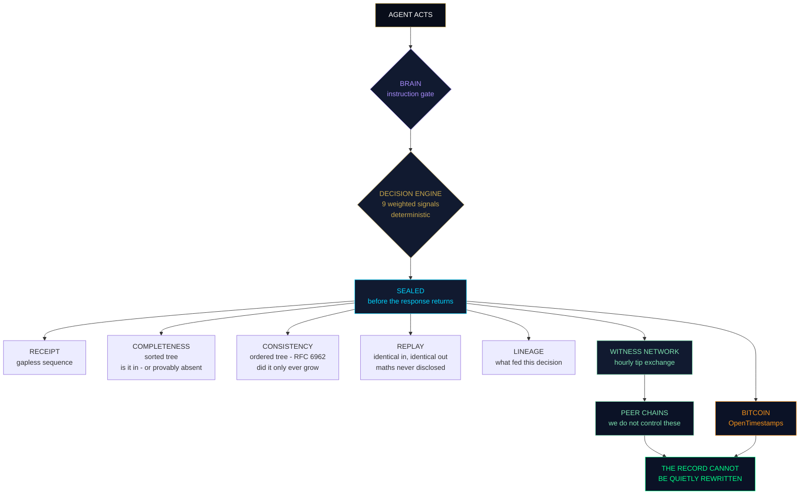
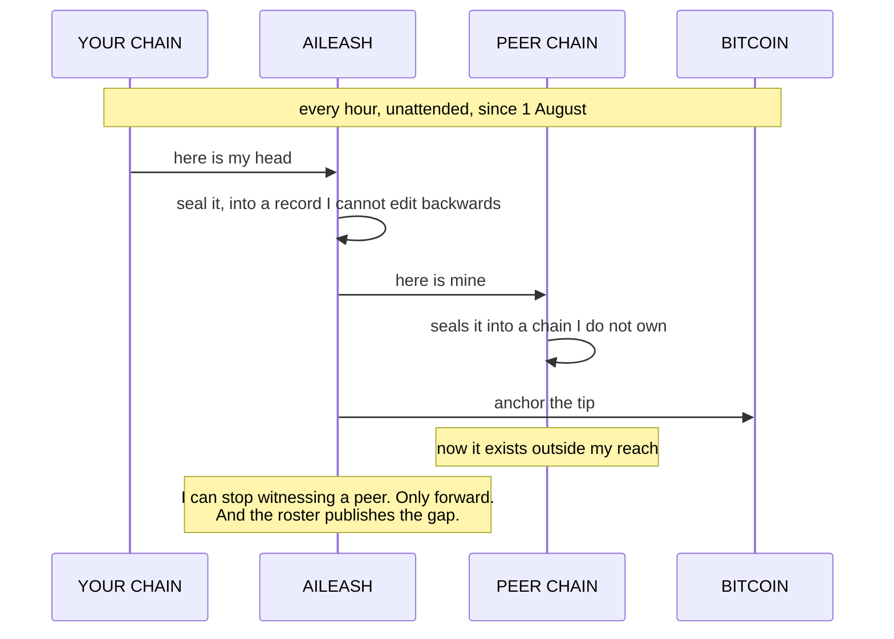

# Codebase — part 22 of 33

Contains:
- `README.md`
- `admin.html`
- `ai-standard.html`
- `ai-txt-kit.html`
- `aileash-game.html`


## `README.md`

498 lines, 24821 bytes

```markdown
<div align="center">


### **ONE CHAIN. EVERY PROOF.**

*Every event sealed the moment it happens — the decision, **and the basis it rested on** —*
*unalterable by anyone. Including us.*

<br>

[](https://sebbi.pro)
[](https://sebbi.pro/api/verify-chain)
[](https://sebbi.pro/seal)
[](https://sebbi.pro/self-check)

**[Try it](https://sebbi.pro/seal)** · **[Verify it](https://sebbi.pro/verify)** · **[Docs](https://sebbi.pro/developers)** · **[Packs](https://sebbi.pro/packs.html)** · **[Whitepaper](https://sebbi.pro/whitepaper)**

</div>

---

> ### *A system that does not trust its own creator*
> ### *is the only kind whose records qualify as evidence.*

---

## Don't read about it. Watch it break.

A **real** four-block chain. Every hash is reproducible — same inputs, same seals, forever.

```
        ╔═══════════════════════════════════════════════════════╗
        ║   #4  brain: approve supplier 88          ALLOW       ║ ◄── tip
        ║       6abba40eb964959e…                               ║
        ╚═══════════════════════════════════════════════════════╝
             ╲                                                ╲
              ╔═══════════════════════════════════════════════════════╗
              ║   #3  govern: payment 9000 GBP          BLOCK         ║
              ║       293181a2bc2dab88…                               ║
              ╚═══════════════════════════════════════════════════════╝
                   ╲                                                ╲
                    ╔═══════════════════════════════════════════════════════╗
                    ║   #2  seal_post: quarterly_report     NOTARISED       ║
                    ║       c7309616a9e92bc7…                               ║
                    ╚═══════════════════════════════════════════════════════╝
                         ╲                                                ╲
                          ╔═══════════════════════════════════════════════════════╗
                          ║   #1  system_regmap                    ALLOW         ║
                          ║       411ffd9a31a3d9f4…                              ║
                          ╚═══════════════════════════════════════════════════════╝
                                          genesis  9fd06d6fdc19761d…
```

Now watch someone cover up that blocked £9,000 payment by flipping block 3 from **BLOCK** to **ALLOW**:

```diff
- tip  6abba40eb964959e…      ← what the chain says
+ tip  5e15bc5710426088…      ← what the forgery produces
```

**The tip changed. The forgery is exposed instantly, by arithmetic, to anyone — no account, no trust required.**

That is the entire product in four lines. Everything below is detail.

<details>
<summary><b>▸ Reproduce every hash yourself — 10 lines of Python</b></summary>

<br>

```python
import hashlib, json
seal = lambda prev, ts, ev, res, basis: hashlib.sha256(
    json.dumps({"prev":prev,"ts":ts,"event":ev,"result":res,"basis":basis},
               sort_keys=True).encode()).hexdigest()

prev = hashlib.sha256(b"AILEASH_BRAIN_GENESIS|sebbi.pro|v5").hexdigest()
chain = [("system_regmap","ALLOW","regmap-v7"),
         ("seal_post: quarterly_report.pdf","NOTARISED","NO_BASIS"),
         ("govern: payment 9000 GBP","BLOCK","invoice_4471|regmap-v7"),
         ("brain: approve supplier 88","ALLOW","invoice_4471|regmap-v7")]
ts = 1752940000
for ev,res,basis in chain:
    prev = seal(prev, ts, ev, res, basis); ts += 3600
    print(prev[:16], "…", ev)
# final line prints the tip: 6abba40eb964959e …
```

Change one character of one event and every seal after it changes. That's the whole idea.

</details>

---

## Thirty seconds, no account

```bash
curl https://sebbi.pro/api/verify-chain
```
```json
{ "valid": true, "blocks": 1874, "tip": "bf9257ab…" }
```

Now the one nobody else can do — **prove something is not there**:

```bash
curl "https://sebbi.pro/x/complete/prove?period=2026-08&value=neverhappened"
```
```json
{ "absent": true,
  "left":  { "index": 14, "leaf": "3a1f…" },
  "right": { "index": 15, "leaf": "9c02…" },
  "why": "consecutive indices. nothing can sit between them." }
```

Anyone can show you a log of what happened. **Absence is the one that decides disputes.**

<details>
<summary><b>▸ Four more, right now</b></summary>

<br>

```bash
# Prove the log only ever grew — RFC 6962, works with existing CT verifiers
curl "https://sebbi.pro/x/consistency/proof?first=100&second=500"

# Every chain witnessing us, with first-seen dates
curl https://sebbi.pro/x/roster/list

# Determinism, without us ever disclosing the maths
curl -X POST https://sebbi.pro/x/replay/challenge \
  -d '{"inputs":{"action":"payment","amount":49.99,"trust":0.5,"v60":1,
       "v5m":1,"v1h":1,"device_risk":0.05,"anomaly":0.1,
       "country":"UK","country_shift":0}}'

# The ten conformance checks, and which are publicly demonstrable
curl https://sebbi.pro/.well-known/ordering-test.json
```

Then run the **whole suite yourself** in a browser at **[sebbi.pro/self-check](https://sebbi.pro/self-check)** — it reads the published document, runs every check in declared order, and never counts *reachable* as a pass.

</details>

---

## Why this exists

Every system keeps logs. Logs live in databases. Databases can be edited — by an attacker, an insider, or the operator itself. So an ordinary log only ever says *"this is what we currently claim happened."* It can never say *"and nobody changed it since."*

Nobody notices the difference — until a regulator, a court, an insurer or a customer asks for **proof**. Then *"our system recorded it"* and *"here is proof it wasn't changed"* become two very different sentences. Only the second carries weight.

**sebbi.pro produces the second sentence automatically, as a by-product of your system doing its normal work.**

---

## The chain, in one formula

```
seal(n) = SHA-256( seal(n−1) · timestamp · event · result · basis )
```

| Property | What it means |
|---|---|
| **Tamper-evident** | Each seal contains its predecessor. Alter history → every later seal fails, publicly. |
| **Gapless receipts** | A sequence number issued in the same transaction as the write. Edited records break the chain; **missing** records break the sequence. |
| **Truncation-evident** | The tip is anchored per-write. Chop blocks off the end and the anchor breaks. |
| **Basis-sealed** | Not just *what* was decided — *what it rested on*: sources, versions, ruleset. Same block. |
| **Jurisdiction-tagged** | Sealed with the frameworks that applied at that moment. |
| **Fast** | Score, decide, seal and respond inline. **~28 ms** median. |
| **Crash-safe** | WAL journaling, full-sync commits, single-lock seal path, no race window, daily sealed backups. |

> **The one honest boundary, up front:** basis-sealing proves **what** a decision relied on — not that it was **correct**. Cryptography verifies integrity, never truth. Any product claiming to prove correctness is misdescribing what maths can do. We won't.

---

## The stack



| Layer | What it proves | Key |
|:--|:--|:--:|
| **Brain** | Instructions gated before the AI acts, basis sealed with the verdict | ○ |
| **Decision engine** | Nine weighted signals, EWMA trust decay, deterministic below the model layer | ◐ |
| **The chain** | Sealed before the response returns · gapless receipts | ○ |
| **Completeness** | What is in the record — and what provably is not | ○ |
| **Consistency** | The log only ever grew | ○ |
| **Replay** | Identical inputs, identical verdict, maths undisclosed | ○ |
| **Lineage** | Which receipts fed a decision, across organisations | ◐ |
| **Authority** | Derivable from a named human, re-derived at execution | ● |
| **Witness network** | Somebody we do not control holds a copy | ○ **forever** |
| **Anchoring** | The time was fixed where we cannot reach | ○ |

○ no key · ◐ part keyed · ● keyed

---

## The thing nobody else will say

Our own published manifest contains this line:

```yaml
Audit-Rewritable-By-Operator-Without-External-Reference: true
Audit-Rewrite-Prevention: external-timestamp + independent-witnesses
```

Read it again. **We publish that the operator can rewrite forward.** Every competitor claims immutability and hopes you never ask who holds the keys.

Because the answer to an operator who can rewrite is not a better promise *from the operator*.

**It is a copy held by somebody else.**



**Joining is free and ungated. Permanently.** The protocol code never checks subscription status. There is no membership list, no seat to grant, none to revoke.

If that sounds like giving the network away — **it is, deliberately.** Gating it would make the operator the party asking to be trusted, which is precisely the thing this removes.

---

## The products — one chain underneath all of them

| | Product | What it does | Access |
|---|---|---|---|
| 🧠 | **Brain** | Instruction gate for AI. Blocks prompt injection, exfiltration, compliance-bypass, child-safety and destruction patterns — with unicode and homoglyph defences — and seals every decision plus its basis. Pure Python, runs on your machine. | **Free** |
| ⚡ | **SonicBoom** | Decision engine. Any event scored in ~28 ms: ALLOW / CHALLENGE / BLOCK, plain-English reasons, sealed before it replies. Trust learned per user and lost 8× faster than earned, so burst attacks destroy their own standing. | API key |
| 🐕 | **Sebdog** | The engine on your own hardware. **Ed25519 licence validated locally — no phone home, ever.** Serves its own `/tip`, so your record is externally witnessed while the data never leaves the building. | Licence |
| 💰 | **Token saver** | Cost reduction over nine spend signals. Change one line — `base_url` to localhost. Fails open. Prompts never leave your machine; `--offline` needs no account at all. | 50p/device |
| 📦 | **Cost packs** | An open library of decision rules. Free to read, write, fork and publish — publishing seals your authorship with the date, **including against us**. Running one is the metered part. | **Free to write** |
| 🧾 | **Evidence packs** | The quarterly auditor document. Every block re-verified, links rewalked, sequence checked, with an *unbroken since* date that resets if the run breaks. | API key |
| 🔒 | **Wallet gate** | Give an agent a budget; stop it when the budget is gone. The spend record and the decision record are **the same record**. | API key |
| 🔐 | **Delegation layer** | Signed authority tokens — who may approve, to what limit, until when, the grant itself sealed. KYC outcome provable with zero personal data held. Article 14 human oversight as engineering. | API key |
| 🛡️ | **Sentinel** | Fraud pattern and velocity detection: credential stuffing, card testing, country-jump takeovers. Flags sealed as evidence. | API key |
| 👁️ | **Guardian** | Child-safety flags — grooming patterns: secrecy, isolation, channel-moving. Content never stored, only fingerprints. | Platform |
| 📝🆔💷 | **The Notaries** | Prove exact text existed on a date · prove a profile is the genuine original · stop invoice and APP fraud, with MISMATCH stopping the payment and the check itself sealed. | **Free, no account** |

**Privacy by design:** the notaries fingerprint content *locally*. Your content never leaves your device — only the 64-character hash is sealed. The KYC sealer keeps only the SHA-256 of the provider reference, never the document.

---

## The open standard — `ai.txt`

Like `robots.txt` for crawlers and `security.txt` for researchers, **`ai.txt`** is a public, machine-readable declaration of how your AI is governed: decision model, audit method, regulations designed toward, human override. Its companion **`comply.txt`** declares the rulebook every instruction is subject to.

Declarations are claims. **Sealing them into the chain makes them provable** — and their history tamper-evident.

```
   declaration   ──▶   rulebook   ──▶   enforcement
     ai.txt          comply.txt          brain.py
    "we claim"       "the rules"     "the code that proves it"
```

Publish yours at `/.well-known/ai.txt`. Read [ours](https://sebbi.pro/.well-known/ai.txt).

---

## Integrate in minutes

```python
# ── Notary: seal anything, free, no key. Content stays on your machine. ──
import hashlib, requests
fp = hashlib.sha256(content.encode()).hexdigest()
requests.post("https://sebbi.pro/api/post/seal", json={"fingerprint": fp})
#   → { sealed, seal, block_index, code }   ← keep the code; anyone can verify it

# ── Decision engine: score + seal an event (API key) ──
requests.post("https://sebbi.pro/api/govern",
  headers={"Authorization":"Bearer YOUR_KEY"},
  json={"user_id":"u1","action":"payment","amount":9000,
        "country":"UK","device_id":"d1","anomaly":0,"device_risk":0})
#   → ALLOW / CHALLENGE / BLOCK · reasons · jurisdiction tag · sealed hash · receipt_seq

# ── Delegated authority: grant sealed, enforcement deterministic ──
tok = requests.post("https://sebbi.pro/api/authority/issue",
  headers={"Authorization":"Bearer YOUR_KEY"},
  json={"user_id":"u1","role":"payments_approver",
        "max_amount":5000,"ttl_hours":24}).json()["authority_token"]

# ── Brain: gate an instruction and seal its basis (free, local) ──
from brain import BrainGovernor
BrainGovernor().evaluate("approve payment to supplier 88", basis={
  "sources":["invoice_4471.pdf"], "source_versions":["sha256:ab12…"],
  "ruleset":"AI-TXT/1.0 + EU-AI-Act-2024/1689", "ruleset_version":"regmap-v7"})
```

<details>
<summary><b>▸ For agents: one decorator</b></summary>

<br>

```python
from sebbi_sdk import witness

@witness()
def run_agent(prompt):
    return model.complete(prompt)
```

Single file, zero dependencies, **~0.1 ms added per call**. Never blocks the caller, never swallows the caller's exception. Background daemon thread, batching, disk spool on outage and replay.

Egress is hash-only — and there is a test that plants a secret in a payload, then greps the wire *and* the spool files to prove it never left.

</details>

Full reference → **[sebbi.pro/developers](https://sebbi.pro/developers)**

---

## Verify without us

> A proof you can only check with the prover's own online tool is a reassurance, not a proof.

```bash
curl -sO https://sebbi.pro/verify-authority.py
curl -s "https://sebbi.pro/x/continuity/proof" | python3 verify-authority.py -
```

```
RESULT: VERIFIED - BLOCK
This is a proof that the action was NOT authorised, and where it failed.
Checked with no network access, no dependencies, and nothing taken on
the issuer's word except the meaning of their public key.
```

**Standard library only** — including the Ed25519 implementation. No network. No dependencies. **No telemetry.** A verification tool that phones home to the party being verified is not a verification tool.

It checks four things, each able to fail alone: the **signature**, every recomputed **digest**, the whole authority path **re-derived** from published rules, and its own verdict **against ours**. A disagreement is reported as *our* failure, not its.

---

## Architecture

Pure Python standard library. No FastAPI. No framework. No build step.

```
server.py              the engine, the chain, the API
modules/<name>.py      everything else  ──▶  /x/<name>/<action>
```

A module exposes exactly one function:

```python
PUBLIC = {("GET", "spec"), ("POST", "observe")}    # (METHOD, action) tuples

def handle(method, action, data, api_key, ctx):
    return {"ok": True}, 200                       # (dict, status) — that order
```

New features are new files. `server.py` does not get edited.

<details>
<summary><b>⚠️ The one that catches everybody</b></summary>

<br>

A **method mismatch returns 404 `unknown_action`** — not 405 — with the accepted GET and POST lists in the body.

A client that reads 404 as *endpoint missing* will report false failures against every POST-only route. This has cost more debugging hours than anything else in the codebase.

</details>

---

## The Ordering Test

Ten checks, published as a discovery document **any vendor can serve from their own domain**.

```
rule_binding          commit_before_reveal   completeness_proof
absence_proof         consistency_proof      reproducibility
mutual_witnessing     external_anchoring     authority_tokens
reconciliation
```

Each check declares `supported` and — separately — `demonstrable_publicly`.

Because **"we built it"** and **"you can check it without an account"** are different claims, and separating them is the only thing that stops an operator marking their own homework.

**Nobody owns a test.** That is the point of publishing it.

---

## What this evidences — stated precisely

A versioned, hash-sealed **regulation map** links each capability to the obligations it helps evidence: EU AI Act record-keeping, transparency and human oversight (Articles 9, 12, 13, 14 — delegated-authority tokens directly supporting Article 14's attributable human oversight), UK Online Safety Act duty-of-care documentation, ICO Children's Code. Jurisdiction tagging extends this per decision: every sealed block records which frameworks applied at the moment.

These tools help you **evidence** your obligations — tamper-evident, explainable, independently verifiable records of what your systems decided and why. **They do not, on their own, make you compliant. No software does. Anyone who says otherwise is selling you something.**

---

<details>
<summary><b>🔍 Honest limits — click, because we would rather you heard it here</b></summary>

<br>

*A vendor who states their limits is giving you the strongest available evidence of how they'll behave when it matters.*

- **Sealing proves integrity, not truth** — exact content, exact time, unchanged. Not that it was true or agreed to.
- **Basis-sealing proves what was relied on, not that it was right** — cryptography can't verify the real world.
- **An operator holding the file and the keys can rebuild a chain forward** with no internal gap. External timestamps and independent witnesses are what make that visible — which is exactly why both exist.
- **Collusion resistance scales with the number of independent chains.** With a handful of peers it is thin, and the status route names that limit rather than reporting a comfortable number. Five peers is a claim. Fifty is a structure.
- **An OpenTimestamps proof is `pending` until upgraded.** Both states are reported as what they are, everywhere — because your own verifier will say it first.
- **Authority tokens prove the grant, not the wisdom** — who was empowered, to what limit, until when. Not that granting it was a good idea.
- **Jurisdiction tagging records applicable frameworks; it does not decide law** — courts do that. A versioned, sealed lookup, nothing grander, deliberately.
- **Brain's filter is a first line, not a wall** — known patterns caught, novel phrasing can pass. The guarantee is the sealed record.
- **Fingerprints match exact content** — a re-encoded copy or a paraphrase won't match.
- **Lineage edges are dated, non-repudiable claims** about what fed a decision. Not proof the claim is true.
- No external security audit. Single replica, SQLite.
- **We evidence compliance; we don't confer it.**

</details>

---

## Deployment & pricing

- **Cloud** — a few lines against the hosted API. Notaries and Brain free forever.
- **Sovereign** — the whole engine inside your own network. **Ed25519 licence validated locally against a published public key**: we sign on our server and ship only the public half, so nothing that can mint a licence ever reaches a customer machine. No phone home, air-gap ready.
- **50p per active device per month.** Partners set their own price above the platform fee and keep the margin.

## Investors

The whitepaper carries a dedicated investor section — market timing, the metered per-device model, the moat, and the stage stated honestly: **[sebbi.pro/whitepaper](https://sebbi.pro/whitepaper)** · justin@monopcontent.com

---

<div align="center">

## Check us. Don't trust us.

*That's not a slogan. It's the design requirement — and the only standard by which an evidence layer should ever be judged.*

**[Verify the chain now →](https://sebbi.pro/api/verify-chain)**

<br>

```
  Built by Justin Dobson · Monop Content · Blyth, Northumberland, UK
  Solo-built, from scratch, on a phone —
  because the evidence layer wasn't going to build itself.
```

[LinkedIn](https://www.linkedin.com/in/justin-dobson-037721217) · [sebbi.pro](https://sebbi.pro) · [developers](https://sebbi.pro/developers) · [packs](https://sebbi.pro/packs.html) · [self-check](https://sebbi.pro/self-check)

</div>

<!--
Keywords: tamper-evident audit trail · AI governance · AI compliance evidence ·
EU AI Act record keeping · hash chain audit log · provable ordering · absence proof ·
RFC 6962 consistency proof · APP fraud prevention · invoice verification ·
prompt injection defence · AI decision audit · delegated authority tokens ·
KYC evidence sealing · jurisdiction tagging · ai.txt standard · comply.txt ·
cryptographic proof of action · witness network · OpenTimestamps · Bitcoin anchoring ·
agentic AI governance · sovereign AI deployment · token cost reduction ·
SonicBoom · Brain · Sentinel · Guardian · Sebdog · AILeash
-->

```


## `admin.html`

761 lines, 43637 bytes

```html
<!DOCTYPE html>
<html lang="en">
<head>
<meta charset="UTF-8">
<meta name="viewport" content="width=device-width,initial-scale=1">
<meta name="robots" content="noindex,nofollow">
<title>sebbi.pro — command centre</title>
<style>
*{box-sizing:border-box;margin:0;padding:0}
:root{
  --bg:#070b16;--panel:#0e1628;--panel2:#0a1120;--line:#1c2742;--line2:#26355a;
  --gold:#c9a84c;--gold2:#f0d78a;--cyan:#00d4ff;--green:#7fe3b0;--ok:#00ff88;
  --red:#ff6b5e;--amber:#ffb020;--txt:#e8e8f0;--mut:#6f7793;--dim:#454d69;
  --mono:'JetBrains Mono',ui-monospace,SFMono-Regular,Menlo,Consolas,monospace;
}
body{font-family:-apple-system,BlinkMacSystemFont,"Segoe UI",Roboto,sans-serif;background:var(--bg);color:var(--txt);line-height:1.5;-webkit-font-smoothing:antialiased}
body::before{content:'';position:fixed;inset:0;pointer-events:none;z-index:0;
  background:radial-gradient(ellipse 70% 45% at 50% 0%,rgba(201,168,76,.10),transparent 70%),
             radial-gradient(ellipse 50% 40% at 85% 20%,rgba(0,212,255,.06),transparent 70%)}
.wrap{max-width:1120px;margin:0 auto;padding:16px;position:relative;z-index:1}

#login{max-width:380px;margin:14vh auto;text-align:center}
#login input{width:100%;padding:14px;border-radius:10px;border:1px solid var(--line2);background:var(--panel2);color:#fff;font-size:16px;margin:14px 0;font-family:var(--mono)}
#login input:focus{outline:none;border-color:var(--gold)}
button{background:var(--gold);color:#070b16;border:none;border-radius:9px;padding:13px 22px;font-weight:800;cursor:pointer;font-size:15px;width:100%;font-family:inherit;transition:filter .15s}
button:hover{filter:brightness(1.1)}button:active{transform:translateY(1px)}
button.sm{width:auto;padding:9px 15px;font-size:12.5px;font-weight:700}
button.ghost{background:transparent;border:1px solid var(--line2);color:var(--mut)}
button.ghost:hover{color:#fff;border-color:var(--gold)}
button.danger{background:#2a0f0c;border:1px solid var(--red);color:var(--red)}
button.go{background:#07301f;border:1px solid #1fae79;color:var(--green)}
.err{color:var(--red);font-size:13px;margin-top:10px;min-height:18px;font-family:var(--mono)}

#dash{display:none}
.hdr{display:flex;justify-content:space-between;align-items:flex-start;gap:12px;flex-wrap:wrap;margin-bottom:14px;padding-bottom:14px;border-bottom:1px solid var(--line)}
h1{font-size:19px;font-weight:800;letter-spacing:-.3px}h1 span{color:var(--gold)}
.sub{color:var(--dim);font-size:11px;font-family:var(--mono);letter-spacing:1.4px;text-transform:uppercase;margin-top:3px}
.live{display:inline-flex;align-items:center;gap:6px;font-family:var(--mono);font-size:10px;letter-spacing:1.5px;color:var(--green);text-transform:uppercase}
.dot{width:7px;height:7px;border-radius:50%;background:var(--ok);box-shadow:0 0 9px var(--ok);animation:bl 2s ease-in-out infinite}
@keyframes bl{0%,100%{opacity:1}50%{opacity:.25}}

.rail{display:grid;grid-template-columns:repeat(auto-fit,minmax(122px,1fr));gap:9px;margin-bottom:16px}
.st{background:linear-gradient(160deg,var(--panel),var(--panel2));border:1px solid var(--line);border-radius:11px;padding:13px 14px;position:relative;overflow:hidden}
.st::after{content:'';position:absolute;left:0;top:0;bottom:0;width:2px;background:var(--gold);opacity:.5}
.st.good::after{background:var(--ok)}.st.bad::after{background:var(--red)}.st.cy::after{background:var(--cyan)}
.st .big{font-size:25px;font-weight:800;color:var(--gold);font-family:var(--mono);line-height:1.15}
.st.good .big{color:var(--ok)}.st.bad .big{color:var(--red)}.st.cy .big{color:var(--cyan)}
.st .lab{font-size:9.5px;color:var(--dim);text-transform:uppercase;letter-spacing:1.4px;margin-top:4px;font-family:var(--mono)}

.tabs{display:flex;gap:6px;margin-bottom:15px;flex-wrap:wrap}
.tab{background:var(--panel);border:1px solid var(--line);color:var(--mut);padding:8px 14px;border-radius:8px;cursor:pointer;font-size:12px;font-weight:700;font-family:var(--mono);letter-spacing:.6px;transition:.15s}
.tab:hover{color:#fff;border-color:var(--line2)}
.tab.on{background:var(--gold);color:#070b16;border-color:var(--gold)}
.panel{display:none}.panel.on{display:block;animation:fi .22s ease}
@keyframes fi{from{opacity:0;transform:translateY(5px)}to{opacity:1;transform:none}}

.card{background:var(--panel);border:1px solid var(--line);border-radius:11px;padding:13px 14px;margin-bottom:9px;font-size:14px}
.card .top{display:flex;justify-content:space-between;gap:10px;flex-wrap:wrap;margin-bottom:5px}
.card .nm{font-weight:700}
.meta{color:var(--mut);font-size:12px}
.mono{font-family:var(--mono);font-size:11.5px;color:var(--dim);word-break:break-all}
.badge{font-size:9.5px;padding:2px 8px;border-radius:10px;font-weight:800;text-transform:uppercase;font-family:var(--mono);letter-spacing:.8px}
.badge.paid{background:#07301f;color:var(--green);border:1px solid #1fae79}
.badge.free{background:#1a1206;color:var(--gold);border:1px solid var(--gold)}
.empty{color:var(--dim);text-align:center;padding:34px 14px;font-size:13.5px;font-family:var(--mono)}
.sechead{font-family:var(--mono);font-size:10px;letter-spacing:2.4px;text-transform:uppercase;color:var(--dim);margin:20px 0 9px;padding-top:14px;border-top:1px solid var(--line)}
.row{display:flex;gap:8px;flex-wrap:wrap;align-items:center;margin-bottom:12px}
input.f{flex:1;min-width:170px;padding:10px 12px;border-radius:8px;border:1px solid var(--line2);background:var(--panel2);color:#fff;font-size:13px;font-family:var(--mono)}
input.f:focus{outline:none;border-color:var(--gold)}
a.ext{display:inline-block;background:#07301f;border:1px solid #1fae79;color:var(--green);padding:10px 15px;border-radius:9px;text-decoration:none;font-size:12.5px;font-weight:700;margin-bottom:14px}
.out{font-family:var(--mono);font-size:11.5px;color:var(--green);margin-bottom:12px;padding:11px 13px;background:var(--panel2);border:1px solid var(--line);border-radius:9px;white-space:pre-wrap;word-break:break-all;min-height:40px;line-height:1.75}
.out.bad{color:var(--red);border-color:rgba(255,107,94,.4);background:#1a0b09}
.out.warn{color:var(--amber);border-color:rgba(255,176,32,.35)}
.out.idle{color:var(--dim)}
.note{border:1px solid rgba(201,168,76,.3);background:rgba(201,168,76,.05);border-radius:9px;padding:12px 14px;font-size:12.5px;color:var(--mut);margin-bottom:12px}
.note b{color:var(--gold)}

/* ---------- route grid ---------- */
.rgrid{display:grid;grid-template-columns:repeat(auto-fill,minmax(148px,1fr));gap:7px}
.rt{background:var(--panel2);border:1px solid var(--line);border-radius:8px;padding:9px 10px;font-family:var(--mono);font-size:11px;cursor:pointer;transition:.15s;position:relative;overflow:hidden}
.rt:hover{border-color:var(--line2)}
.rt .rn{color:var(--txt);font-weight:600;font-size:11.5px}
.rt .rs{font-size:9px;letter-spacing:1.2px;text-transform:uppercase;margin-top:3px;color:var(--dim)}
.rt.armed{border-color:rgba(0,255,136,.45)}.rt.armed .rs{color:var(--ok)}
.rt.armed::before{content:'';position:absolute;inset:0;background:rgba(0,255,136,.05)}
.rt.fail{border-color:rgba(255,107,94,.45)}.rt.fail .rs{color:var(--red)}
.rt.err{border-color:rgba(255,176,32,.5)}.rt.err .rs{color:var(--amber)}
.rt.wait .rs{color:var(--amber)}
.bar{height:3px;background:var(--line);border-radius:2px;overflow:hidden;margin:12px 0}
.bar i{display:block;height:100%;background:linear-gradient(90deg,var(--gold),var(--ok));width:0;transition:width .3s}

/* ================= CHAIN NODE GRAPH ================= */
.graphwrap{border:1px solid var(--line);border-radius:12px;background:linear-gradient(180deg,var(--panel),var(--panel2));overflow:hidden}
.gtop{display:flex;justify-content:space-between;align-items:center;gap:10px;flex-wrap:wrap;padding:11px 14px;border-bottom:1px solid var(--line);background:rgba(0,0,0,.25)}
.gtop .gt{font-family:var(--mono);font-size:10px;letter-spacing:2px;text-transform:uppercase;color:var(--dim)}
.gtop .gv{font-family:var(--mono);font-size:11px;color:var(--green)}
.gtop .gv.bad{color:var(--red)}

.spine{position:relative;padding:16px 14px 6px 14px;max-height:70vh;overflow-y:auto;-webkit-overflow-scrolling:touch}
.spine::-webkit-scrollbar{width:4px}
.spine::-webkit-scrollbar-thumb{background:rgba(201,168,76,.3);border-radius:2px}

.node{position:relative;padding-left:44px;padding-bottom:14px}
/* the vertical link line */
.node::before{content:'';position:absolute;left:15px;top:26px;bottom:-4px;width:2px;
  background:linear-gradient(180deg,rgba(0,255,136,.55),rgba(0,255,136,.14))}
.node:last-child::before{display:none}
.node.broken::before{background:linear-gradient(180deg,var(--red),rgba(255,107,94,.2));width:3px;left:14.5px}

/* the block itself */
.orb{position:absolute;left:6px;top:8px;width:21px;height:21px;border-radius:6px;
  transform:rotate(45deg);border:1.6px solid;background:var(--panel2);transition:.18s}
.orb::after{content:'';position:absolute;inset:3px;border-radius:2px;opacity:.85}
.node:hover .orb{transform:rotate(45deg) scale(1.16)}
.node.broken .orb{border-color:var(--red)!important;box-shadow:0 0 14px rgba(255,107,94,.55)}

.blk{background:rgba(255,255,255,.018);border:1px solid var(--line);border-radius:9px;
  padding:9px 11px;cursor:pointer;transition:.15s}
.blk:hover{border-color:var(--line2);background:rgba(255,255,255,.04)}
.blk .l1{display:flex;justify-content:space-between;align-items:baseline;gap:9px;flex-wrap:wrap}
.blk .seq{font-family:var(--mono);font-size:12.5px;font-weight:700;color:var(--gold2)}
.blk .dec{font-family:var(--mono);font-size:10px;font-weight:800;letter-spacing:1.4px;padding:1px 7px;border-radius:4px}
.blk .tm{font-family:var(--mono);font-size:10px;color:var(--dim);margin-left:auto}
.blk .sl{font-family:var(--mono);font-size:10.5px;color:var(--green);margin-top:4px;word-break:break-all;opacity:.8}
.blk .who{font-family:var(--mono);font-size:10px;color:var(--mut);margin-top:2px}
.det{display:none;margin-top:8px;padding-top:8px;border-top:1px dashed var(--line2);
  font-family:var(--mono);font-size:10.5px;line-height:1.9;color:var(--mut);word-break:break-all}
.det.on{display:block}
.det .k{color:var(--dim);display:inline-block;min-width:52px}
.det .v{color:var(--green)}
.det .v.p{color:var(--cyan)}

.breakflag{margin:2px 0 12px 44px;font-family:var(--mono);font-size:10.5px;color:var(--red);
  border:1px solid rgba(255,107,94,.45);background:#1a0b09;border-radius:7px;padding:8px 10px;line-height:1.8}
.gfoot{padding:12px 14px;border-top:1px solid var(--line);display:flex;gap:8px;flex-wrap:wrap;align-items:center;background:rgba(0,0,0,.2)}
.gcount{font-family:var(--mono);font-size:10.5px;color:var(--dim);margin-left:auto}
.sentinel{height:1px}

.glass{border:1px solid rgba(255,107,94,.35);background:linear-gradient(160deg,#170a09,#0b0709);border-radius:12px;padding:16px;margin-top:8px}
.glass h3{font-family:var(--mono);font-size:11px;letter-spacing:2.4px;text-transform:uppercase;color:var(--red);margin-bottom:8px}
.glass p{font-size:13px;color:var(--mut);margin-bottom:12px}
.steps{font-family:var(--mono);font-size:11px;color:var(--dim);line-height:2;margin-bottom:13px}
.steps b{color:var(--mut);font-weight:400}
@media(max-width:640px){.wrap{padding:12px}.rail{grid-template-columns:repeat(2,1fr)}.spine{max-height:66vh}}
</style>
</head>
<body>
<div class="wrap">

  <div id="login">
    <h1>sebbi<span>.pro</span></h1>
    <div class="sub">command centre</div>
    <input id="pw" type="password" placeholder="admin password" onkeydown="if(event.key==='Enter')doLogin()">
    <button onclick="doLogin()">Authenticate</button>
    <div class="err" id="loginerr"></div>
  </div>

  <div id="dash">
    <div class="hdr">
      <div>
        <h1>sebbi<span>.pro</span> command centre</h1>
        <div class="sub">Monop Content &middot; <span class="live"><span class="dot"></span>live</span></div>
      </div>
      <div style="display:flex;gap:7px">
        <button class="sm ghost" onclick="loadAll()">Refresh</button>
        <button class="sm ghost" onclick="logout()">Log out</button>
      </div>
    </div>

    <div class="rail" id="rail"></div>

    <div class="tabs">
      <div class="tab on" onclick="show('blocks',this)">Blocks</div>
      <div class="tab" onclick="show('routes',this)">Routes</div>
      <div class="tab" onclick="show('chain',this)">Chain</div>
      <div class="tab" onclick="show('network',this)">Network</div>
      <div class="tab" onclick="show('traffic',this)">Traffic</div>
      <div class="tab" onclick="show('customers',this)">Customers</div>
      <div class="tab" onclick="show('contacts',this)">Messages</div>
      <div class="tab" onclick="show('referrals',this)">Referrals</div>
    </div>

    <!-- ================= BLOCKS — the node graph ================= -->
    <div class="panel on" id="p-blocks">
      <div class="row">
        <input class="f" id="apikey" type="password" placeholder="your API key (al_live_…) — needed for block reads">
        <button class="sm go" onclick="loadBlocks()">Load chain</button>
      </div>
      <div class="row">
        <input class="f" id="bsearch" placeholder="search seal, user, decision…" oninput="renderGraph(true)">
        <button class="sm ghost" onclick="checkLinks()">Check links</button>
        <button class="sm ghost" onclick="toggleAll()">Expand all</button>
        <button class="sm ghost" onclick="exportBlocks()">Export</button>
      </div>

      <div class="graphwrap">
        <div class="gtop">
          <div><div class="gt">chain integrity</div><div class="gv" id="gint">not loaded</div></div>
          <div><div class="gt">tip</div><div class="gv" id="gtip">—</div></div>
          <div><div class="gt">blocks</div><div class="gv" id="gblocks">—</div></div>
        </div>
        <div class="spine" id="spine">
          <div class="empty">Tap <b>Load chain</b> to walk the blocks.</div>
        </div>
        <div class="gfoot">
          <button class="sm ghost" onclick="more()">Show more</button>
          <button class="sm ghost" onclick="document.getElementById('spine').scrollTop=0">Top</button>
          <span class="gcount" id="gcount"></span>
        </div>
      </div>

      <div class="note" style="margin-top:12px"><b>Every link is checked as it draws.</b> The connector between two nodes is green when a block's <span class="mono">prev_hash</span> equals the seal of the block below it. If it ever doesn't, that joint turns red and the exact mismatch is printed in place — you don't have to go looking for the break, it shows itself.</div>
      <div class="note" id="depthnote" style="display:none"></div>
    </div>

    <!-- ================= ROUTES ================= -->
    <div class="panel" id="p-routes">
      <div class="note"><b>The arming dance, in one tap.</b> Every module 404s after a deploy until something hits its <span class="mono">/x/</span> prefix.<br><br>
      <span style="color:var(--ok)">green</span> = armed. A <span class="mono">401</span> counts, because the router loads the module and matches the action <i>before</i> checking auth, so a key demand proves the route is live.
      <span style="color:var(--amber)">amber</span> = loaded but its status action is throwing.
      <span style="color:var(--red)">red</span> = genuinely missing from <span class="mono">modules/</span>.</div>
      <div class="row">
        <button class="sm go" onclick="armAll()">Arm every route</button>
        <button class="sm ghost" onclick="armAll(true)">Re-check failures</button>
        <input class="f" id="newroute" placeholder="add a module, e.g. map">
        <button class="sm ghost" onclick="addRoute()">Add</button>
      </div>
      <div class="bar"><i id="armbar"></i></div>
      <div class="out idle" id="armout">not run yet</div>
      <div class="rgrid" id="rgrid"></div>
      <div class="sechead">Pages</div>
      <div class="rgrid" id="pgrid"></div>
    </div>

    <!-- ================= CHAIN ================= -->
    <div class="panel" id="p-chain">
      <div class="row">
        <button class="sm go" onclick="verifyChain()">Verify chain</button>
        <button class="sm ghost" onclick="consRoot()">Consistency root</button>
        <button class="sm ghost" onclick="otsStatus()">Anchoring</button>
        <button class="sm ghost" onclick="ownTip()">Tip</button>
      </div>
      <div class="out idle" id="chainout">not checked yet</div>
      <div class="sechead">Break glass</div>
      <div class="glass">
        <h3>If the chain ever breaks</h3>
        <p>This does <b>not</b> repair anything. Repairing a broken chain is the operator rewriting the record — the one thing this platform exists to make impossible. It captures the break instead, so its exact shape stays provable.</p>
        <div class="steps">
          <b>1.</b> freeze &mdash; read and pin the current tip<br>
          <b>2.</b> locate &mdash; walk the links, name the first block whose prev_hash stops matching<br>
          <b>3.</b> export &mdash; pull every record to this phone as JSON<br>
          <b>4.</b> externalise &mdash; hand the frozen tip to the witness network
        </div>
        <button class="danger" onclick="breakGlass()">Capture the break</button>
      </div>
      <div class="out idle" id="glassout" style="margin-top:12px">standing by</div>
    </div>

    <!-- ================= NETWORK ================= -->
    <div class="panel" id="p-network">
      <div class="row">
        <button class="sm go" onclick="loadNetwork()">Refresh network</button>
        <button class="sm ghost" onclick="openRaw('/x/roster/list')">Raw roster</button>
        <button class="sm ghost" onclick="openRaw('/x/mutual/status')">Mutual status</button>
      </div>
      <div class="out idle" id="netout">not loaded</div>
      <div id="netlist"></div>
    </div>

    <!-- ================= TRAFFIC ================= -->
    <div class="panel" id="p-traffic">
      <div class="row">
        <button class="sm go" onclick="loadTraffic()">Load traffic</button>
        <button class="sm ghost" onclick="openRaw('/x/stats')">Raw stats</button>
        <button class="sm ghost" onclick="openRaw('/x/demo/stats')">Proving ground</button>
      </div>
      <div class="out idle" id="trafout">not loaded</div>
      <div class="note" style="margin-top:14px"><b>Unique visitors is not counted anywhere yet.</b> Nothing in server.py records a visit, so no route can report it. Everything above is decision and demo activity, not people.</div>
    </div>

    <div class="panel" id="p-customers">
      <a class="ext" href="https://dashboard.stripe.com" target="_blank" rel="noopener">Stripe dashboard &rarr;</a>
      <div id="custlist"><div class="empty">Loading&hellip;</div></div>
    </div>
    <div class="panel" id="p-contacts"><div id="contlist"><div class="empty">Loading&hellip;</div></div></div>
    <div class="panel" id="p-referrals"><div id="reflist"><div class="empty">Loading&hellip;</div></div></div>

  </div>
</div>

<script>
var TOKEN="";
var BLOCKS=[];          /* newest first, exactly as the server returns */
var SHOWN=0;            /* how many are drawn */
var PAGE=40;
var LOADED_LIMIT=0;
var CHAININFO={};
var EXPANDED={};
var ALLOPEN=false;

var ROUTES=["selfcheck","standard","savings","verifier","network","publish","continuity",
            "praxis","roster","mutual","witness","packs","pack","packconsole","register",
            "demo","wallet","ots","complete","consistency","replay","lineage","witnessed",
            "codebase","identify","watch","tokensaver","signed","stats","console"];
var PAGES=["/console","/pack","/witness","/self-check","/praxis","/packs.html","/registry.html",
           "/developers","/whitepaper","/seal","/verify","/scan","/notary"];
var RSTATE={};

function esc(s){return String(s==null?"":s).replace(/[&<>"']/g,function(c){return{"&":"&amp;","<":"&lt;",">":"&gt;",'"':"&quot;","'":"&#39;"}[c]})}
function when(ts){if(!ts)return"";try{var n=Number(ts);if(n>1e12)n=n/1000;return new Date(n*1000).toLocaleString()}catch(e){return""}}
function shortT(ts){if(!ts)return"";try{var n=Number(ts);if(n>1e12)n=n/1000;var d=new Date(n*1000);
  return d.toLocaleDateString([], {day:"2-digit",month:"short"})+" "+d.toLocaleTimeString([], {hour:"2-digit",minute:"2-digit"});}catch(e){return""}}
function setOut(id,txt,cls){var e=document.getElementById(id);if(!e)return;e.textContent=txt;e.className="out"+(cls?" "+cls:"")}
function openRaw(p){window.open(p,"_blank")}

/* a block's colour comes from its own seal, so identical hashes always
   look identical and a changed hash visibly changes face */
function hueOf(h){
  var s=String(h||"");if(s.length<6)return 200;
  return parseInt(s.slice(0,4),16)%360;
}

/* ---------- auth ---------- */
async function doLogin(){
  var pw=document.getElementById("pw").value;
  document.getElementById("loginerr").textContent="";
  try{
    var r=await fetch("/admin/auth",{method:"POST",headers:{"Content-Type":"application/json"},body:JSON.stringify({password:pw})});
    var d=await r.json();
    if(d.token){TOKEN=d.token;document.getElementById("login").style.display="none";document.getElementById("dash").style.display="block";loadAll();}
    else if(d.error==="admin_disabled"){document.getElementById("loginerr").textContent="Admin password not set. Add ADMIN_PASSWORD in Railway variables.";}
    else if(d.error==="too_many_attempts"){document.getElementById("loginerr").textContent="Too many attempts. Wait a minute.";}
    else{document.getElementById("loginerr").textContent="Wrong password.";}
  }catch(e){document.getElementById("loginerr").textContent="Connection error.";}
}
function logout(){TOKEN="";document.getElementById("dash").style.display="none";document.getElementById("login").style.display="block";document.getElementById("pw").value="";}

async function api(path,body){
  var r=await fetch(path,{method:"POST",
    headers:{"Authorization":"Bearer "+TOKEN,"Content-Type":"application/json"},
    body:JSON.stringify(body||{})});
  var txt=await r.text();var d;
  /* Admin tokens live in memory on the server. Any restart or redeploy wipes
     them, so a 401 here almost always means the container bounced rather than
     anything being wrong with the chain. Say so, and send them back to log in. */
  if(r.status===401){ sessionLost(); throw new Error("session expired — the server restarted and dropped its in-memory tokens. Log in again."); }
  try{ d=JSON.parse(txt); }
  catch(e){ throw new Error("HTTP "+r.status+" — not JSON: "+txt.slice(0,150)); }
  if(!r.ok) throw new Error("HTTP "+r.status+" — "+(d.error||txt.slice(0,150)));
  if(d && d.error) throw new Error(String(d.error));
  return d;
}
function sessionLost(){
  if(!TOKEN)return;
  TOKEN="";
  document.getElementById("dash").style.display="none";
  document.getElementById("login").style.display="block";
  document.getElementById("loginerr").textContent="Session expired — the server restarted. Log in again.";
}

async function loadAll(){
  try{
    var s=await api("/admin/stats");
    document.getElementById("rail").innerHTML=
      st(s.total_keys,"signups")+
      st(s.paid_keys,"paying","good")+
      st((s.total_keys||0)-(s.paid_keys||0),"free / leads")+
      st(s.audit_blocks,"audit blocks","cy")+
      st(s.chain_valid?"OK":"BROKEN","chain",s.chain_valid?"good":"bad")+
      st('<span id="armcount">—</span>',"routes armed","cy")+
      st('<span id="peercount">—</span>',"peers","cy");
  }catch(e){
    document.getElementById("rail").innerHTML='<div class="st bad"><div class="big">ERR</div><div class="lab">'+esc(e.message).slice(0,60)+'</div></div>';
  }
  buildRoutes();loadCustomers();loadContacts();loadReferrals();loadNetwork();
}
function st(v,l,cls){return '<div class="st '+(cls||"")+'"><div class="big">'+v+'</div><div class="lab">'+esc(l)+'</div></div>';}

/* ================= BLOCKS ================= */
/* Reads through modules/blocks.py, not /admin/audit.
   /admin/audit re-verifies the entire chain on every call, which is what
   was taking the container down. This route only reads rows, and it takes
   an offset, so the whole chain is reachable a page at a time. */
var APIKEY="";
var OFFSET=0;

function keyBox(){
  var k=document.getElementById("apikey");
  APIKEY=k?k.value.trim():"";
  return APIKEY;
}

async function xget(mod,action,params){
  var q=[];
  for(var k in params){ if(params[k]!==""&&params[k]!=null) q.push(encodeURIComponent(k)+"="+encodeURIComponent(params[k])); }
  var url="/x/"+mod+"/"+action+(q.length?"?"+q.join("&"):"");
  var r=await fetch(url,{cache:"no-store",headers:{"Authorization":"Bearer "+keyBox()}});
  var txt=await r.text();var d;
  try{ d=JSON.parse(txt); }catch(e){ throw new Error("HTTP "+r.status+" — not JSON: "+txt.slice(0,140)); }
  if(r.status===401) throw new Error("401 — this route needs your API key. Paste it in the box above (al_live_…).");
  if(!r.ok) throw new Error("HTTP "+r.status+" — "+(d.error||txt.slice(0,140)));
  if(d&&d.error) throw new Error(String(d.error));
  return d;
}

async function loadBlocks(reset){
  if(reset!==false){ OFFSET=0; BLOCKS=[]; }
  document.getElementById("spine").innerHTML='<div class="empty">Reading blocks&hellip;</div>';
  var d;
  try{ d=await xget("blocks","list",{limit:50,offset:OFFSET,api_key:""}); }
  catch(e){
    document.getElementById("spine").innerHTML='<div class="empty" style="color:var(--red)">'+esc(e.message)
      +'<br><br>If this says 404, <span class="mono">modules/blocks.py</span> is not deployed yet.</div>';
    document.getElementById("gint").textContent="request failed";
    document.getElementById("gint").className="gv bad";
    return;
  }
  var got=d.blocks||[];
  BLOCKS=OFFSET?BLOCKS.concat(got):got;
  OFFSET=d.next_offset;
  CHAININFO={chain_blocks:d.total,has_more:d.has_more};
  SHOWN=0;EXPANDED={};
  document.getElementById("gint").textContent="reading — not verified";
  document.getElementById("gint").className="gv";
  document.getElementById("gtip").textContent=BLOCKS.length?String(BLOCKS[0].audit_hash||"").slice(0,16)+"…":"—";
  document.getElementById("gblocks").textContent=(d.total!=null?d.total:"?");

  var note=document.getElementById("depthnote");
  if(d.total&&BLOCKS.length<d.total){
    note.style.display="block";
    note.innerHTML='<b>Holding '+BLOCKS.length+' of '+d.total+' blocks.</b> Scroll or tap Show more and the next page loads. This route takes an offset, so the whole chain is reachable.';
  } else note.style.display="none";
  renderGraph(true);
}

/* whole-chain verification stays deliberate, on its own button */
async function checkLinks(){
  document.getElementById("gint").textContent="checking…";
  try{
    var d=await xget("blocks","links",{limit:200,offset:0});
    if(d.clean){
      document.getElementById("gint").textContent="links hold ("+d.pairs_checked+" pairs)";
      document.getElementById("gint").className="gv";
    }else{
      document.getElementById("gint").textContent="BROKEN at #"+d.broken[0].between;
      document.getElementById("gint").className="gv bad";
    }
  }catch(e){
    document.getElementById("gint").textContent="check failed";
    document.getElementById("gint").className="gv bad";
  }
}

function matchQ(b,q){
  if(!q)return true;
  q=q.toLowerCase();
  return String(b.audit_hash||"").toLowerCase().indexOf(q)>=0
      || String(b.prev_hash||"").toLowerCase().indexOf(q)>=0
      || String(b.user_id||"").toLowerCase().indexOf(q)>=0
      || String(b.decision||"").toLowerCase().indexOf(q)>=0
      || String(b.seq||"").indexOf(q)>=0;
}

function renderGraph(reset){
  var q=document.getElementById("bsearch").value.trim();
  var list=BLOCKS.filter(function(b){return matchQ(b,q)});
  if(reset)SHOWN=0;
  SHOWN=Math.min(list.length,SHOWN?SHOWN:PAGE);
  var spine=document.getElementById("spine");
  if(!list.length){
    spine.innerHTML='<div class="empty">'+(BLOCKS.length?'Nothing matches that.':'No records returned. The chain reports '+(CHAININFO.chain_blocks!=null?CHAININFO.chain_blocks:"?")+' blocks &mdash; if that is above zero the rows exist and something is filtering them out.')+'</div>';
    document.getElementById("gcount").textContent="";
    return;
  }
  var h="";
  for(var i=0;i<SHOWN;i++){
    var b=list[i];
    var older=list[i+1];              /* the block below it in time */
    /* the link holds when this block's prev_hash equals the older block's seal */
    var linked = older ? (String(b.prev_hash||"")===String(older.audit_hash||"")) : true;
    var broken = older && !linked;
    var dec=String(b.decision||"—");
    var col=dec==="BLOCK"?"var(--red)":dec==="CHALLENGE"?"var(--gold)":dec==="ALLOW"?"var(--ok)":"var(--mut)";
    var hue=hueOf(b.audit_hash);
    var open=(ALLOPEN||EXPANDED[b.seq])?" on":"";

    h+='<div class="node'+(broken?" broken":"")+'">'
      +'<span class="orb" style="border-color:hsl('+hue+',65%,58%)"><span style="position:absolute;inset:3px;border-radius:2px;background:hsl('+hue+',60%,45%);opacity:.8"></span></span>'
      +'<div class="blk" onclick="tog(\''+esc(b.seq)+'\')">'
        +'<div class="l1"><span class="seq">#'+esc(b.seq)+'</span>'
        +'<span class="dec" style="color:'+col+';border:1px solid '+col+'">'+esc(dec)+'</span>'
        +'<span class="tm">'+esc(shortT(b.ts))+'</span></div>'
        +'<div class="sl">'+esc(String(b.audit_hash||"").slice(0,32))+'…</div>'
        +'<div class="who">'+esc(b.user_id||"—")
          +(b.score!=null&&b.score!==""?" · score "+esc(b.score):"")
          +(b.reasons&&b.reasons.length?" · "+esc(b.reasons.slice(0,3).join(", ")):"")+'</div>'
        +'<div class="det'+open+'" id="det-'+esc(b.seq)+'">'
          +'<div><span class="k">seal</span> <span class="v">'+esc(b.audit_hash||"—")+'</span></div>'
          +'<div><span class="k">prev</span> <span class="v p">'+esc(b.prev_hash||"—")+'</span></div>'
          +'<div><span class="k">time</span> '+esc(when(b.ts))+'</div>'
          +'<div><span class="k">user</span> '+esc(b.user_id||"—")+'</div>'
          +(b.reasons&&b.reasons.length?'<div><span class="k">why</span> '+esc(b.reasons.join(", "))+'</div>':'')
          +'<div><span class="k">link</span> '+(older?(linked?'<span style="color:var(--ok)">holds — prev matches #'+esc(older.seq)+'</span>':'<span style="color:var(--red)">BROKEN</span>'):'<span style="color:var(--dim)">oldest loaded</span>')+'</div>'
        +'</div>'
      +'</div></div>';

    if(broken){
      h+='<div class="breakflag">LINK BROKEN between #'+esc(b.seq)+' and #'+esc(older.seq)+'<br>'
        +'expected prev: '+esc(String(older.audit_hash||"").slice(0,44))+'…<br>'
        +'found prev:&nbsp;&nbsp;&nbsp; '+esc(String(b.prev_hash||"").slice(0,44))+'…</div>';
    }
  }
  spine.innerHTML=h;
  document.getElementById("gcount").textContent=SHOWN+" of "+list.length+(q?" matching":" loaded");
  attachSentinel(list.length);
}

function attachSentinel(total){
  if(SHOWN>=total)return;
  var spine=document.getElementById("spine");
  var s=document.createElement("div");
  s.className="sentinel";
  spine.appendChild(s);
  if(!window.IntersectionObserver)return;
  var io=new IntersectionObserver(function(en){
    if(en[0].isIntersecting){io.disconnect();more();}
  },{root:spine,rootMargin:"200px"});
  io.observe(s);
}
function more(){
  var q=document.getElementById("bsearch").value.trim();
  var total=BLOCKS.filter(function(b){return matchQ(b,q)}).length;
  if(SHOWN>=total){
    if(CHAININFO.has_more){ loadBlocks(false); }   /* pull the next page */
    return;
  }
  SHOWN=Math.min(total,SHOWN+PAGE);
  renderGraph(false);
}
function tog(seq){
  var el=document.getElementById("det-"+seq);
  if(!el)return;
  var on=el.className.indexOf("on")>=0;
  el.className="det"+(on?"":" on");
  EXPANDED[seq]=!on;
}
function toggleAll(){ALLOPEN=!ALLOPEN;EXPANDED={};renderGraph(false);}
function exportBlocks(){
  if(!BLOCKS.length)return;
  var blob=new Blob([JSON.stringify({exported_at:new Date().toISOString(),chain:CHAININFO.chain_valid,tip:CHAININFO.chain_tip,blocks:BLOCKS},null,2)],{type:"application/json"});
  var url=URL.createObjectURL(blob);var a=document.createElement("a");
  a.href=url;a.download="sebbi-blocks-"+Date.now()+".json";a.click();URL.revokeObjectURL(url);
}

/* ================= ROUTES ================= */
function buildRoutes(){
  var h="";
  ROUTES.forEach(function(m){
    var s=RSTATE[m]||{cls:"",txt:"not checked"};
    h+='<div class="rt '+s.cls+'" id="rt-'+m+'" onclick="armOne(\''+m+'\')">'
      +'<div class="rn">/x/'+esc(m)+'</div><div class="rs">'+esc(s.txt)+'</div></div>';
  });
  document.getElementById("rgrid").innerHTML=h;
  var p="";
  PAGES.forEach(function(u){p+='<div class="rt" onclick="openRaw(\''+u+'\')"><div class="rn">'+esc(u)+'</div><div class="rs">open</div></div>';});
  document.getElementById("pgrid").innerHTML=p;
}
function addRoute(){
  var v=document.getElementById("newroute").value.trim().replace(/[^a-z0-9_-]/gi,"");
  if(!v)return;
  if(ROUTES.indexOf(v)<0)ROUTES.push(v);
  document.getElementById("newroute").value="";buildRoutes();
}
function mark(m,cls,txt){
  RSTATE[m]={cls:cls,txt:txt};
  var el=document.getElementById("rt-"+m);
  if(el){el.className="rt "+cls;el.querySelector(".rs").textContent=txt;}
}
async function armOne(m){
  mark(m,"wait","pinging");
  var t0=Date.now();
  try{
    var r=await fetch("/x/"+m+"/status",{cache:"no-store"});
    var ms=Date.now()-t0;var txt=await r.text();
    /* The router imports the module and matches the action BEFORE checking
       auth, so anything other than "module not found" proves it loaded. */
    if(r.ok){ mark(m,"armed","armed "+ms+"ms"); return true; }
    if(r.status===401||r.status===403){ mark(m,"armed","armed · keyed"); return true; }
    if(r.status===500){ mark(m,"err","armed · 500 error"); return true; }
    if(txt.indexOf("unknown_action")>=0){ mark(m,"armed","armed "+ms+"ms"); return true; }
    if(r.status===404){ mark(m,"fail","not deployed"); return false; }
    mark(m,"fail","HTTP "+r.status);return false;
  }catch(e){ mark(m,"fail","unreachable"); return false; }
}
async function armAll(failsOnly){
  var list=failsOnly?ROUTES.filter(function(m){return !RSTATE[m]||RSTATE[m].cls==="fail"}):ROUTES.slice();
  if(!list.length){setOut("armout","nothing to re-check","");return;}
  setOut("armout","arming "+list.length+" routes…","warn");
  var done=0;
  for(var i=0;i<list.length;i++){
    await armOne(list[i]);done++;
    document.getElementById("armbar").style.width=Math.round(done/list.length*100)+"%";
  }
  var armed=ROUTES.filter(function(m){var s=RSTATE[m];return s&&(s.cls==="armed"||s.cls==="err")}).length;
  var ac=document.getElementById("armcount");if(ac)ac.textContent=armed+"/"+ROUTES.length;
  var erroring=ROUTES.filter(function(m){return RSTATE[m]&&RSTATE[m].cls==="err"});
  var missing=ROUTES.filter(function(m){return RSTATE[m]&&RSTATE[m].cls==="fail"});
  var msg=armed+" of "+ROUTES.length+" armed.";
  if(erroring.length)msg+="\nloaded but throwing: "+erroring.join(", ");
  if(missing.length)msg+="\nnot deployed — check modules/: "+missing.join(", ");
  if(!erroring.length&&!missing.length)msg+="\neverything is up.";
  setOut("armout",msg,(erroring.length||missing.length)?"warn":"");
  setTimeout(function(){document.getElementById("armbar").style.width="0"},900);
}

/* ================= CHAIN ================= */
async function verifyChain(){
  setOut("chainout","verifying…","warn");
  try{
    var r=await fetch("/api/verify-chain",{cache:"no-store"});var d=await r.json();
    if(d.valid)setOut("chainout","VERIFIED — CHAIN INTACT\nblocks: "+d.blocks+"\ntip:    "+(d.tip||"")+(d.message?"\n"+d.message:""),"");
    else setOut("chainout","CHAIN BROKEN\nblocks: "+d.blocks+"\n"+(d.message||"")+"\n\nGo to Break glass. Do not redeploy first.","bad");
  }catch(e){setOut("chainout","could not reach /api/verify-chain — "+e.message,"bad");}
}
async function grab(url,id){
  setOut(id,"reading…","warn");
  try{var r=await fetch(url,{cache:"no-store"});var t=await r.text();setOut(id,t.slice(0,1600),r.ok?"":"bad");}
  catch(e){setOut(id,"unreachable — "+e.message,"bad");}
}
function consRoot(){grab("/x/consistency/root","chainout")}
function otsStatus(){grab("/x/ots/status","chainout")}
function ownTip(){grab("/x/witness/tip","chainout")}

async function breakGlass(){
  var log=[];function push(s){log.push(s);setOut("glassout",log.join("\n"),"warn");}
  push("CAPTURE STARTED — "+new Date().toISOString());
  var frozenTip="";
  try{
    var r=await fetch("/api/verify-chain",{cache:"no-store"});var d=await r.json();
    frozenTip=d.tip||"";
    push("1. frozen tip: "+(frozenTip||"(none)"));
    push("   chain reports: "+(d.valid?"INTACT":"BROKEN")+" across "+d.blocks+" blocks");
  }catch(e){push("1. could not read tip — "+e.message);}
  var recs=[];
  try{
    var d2=await xget("blocks","list",{limit:200,offset:0});
    recs=d2.blocks||[];push("2. pulled "+recs.length+" of "+(d2.total!=null?d2.total:"?")+" blocks");
    var brk=null;
    for(var i=0;i<recs.length-1;i++){
      var newer=recs[i],older=recs[i+1];
      if(newer.prev_hash&&older.audit_hash&&newer.prev_hash!==older.audit_hash){
        brk={at:newer.seq,below:older.seq,expected:older.audit_hash,found:newer.prev_hash};break;}
    }
    if(brk)push("3. FIRST BREAK between #"+brk.at+" and #"+brk.below+"\n   expected prev: "+String(brk.expected).slice(0,32)+"…\n   found prev:    "+String(brk.found).slice(0,32)+"…");
    else push("3. no link mismatch in the records pulled");
  }catch(e){push("2. could not pull records — "+e.message);}
  try{
    var blob=new Blob([JSON.stringify({captured_at:new Date().toISOString(),frozen_tip:frozenTip,record_count:recs.length,records:recs},null,2)],{type:"application/json"});
    var url=URL.createObjectURL(blob);var a=document.createElement("a");
    a.href=url;a.download="sebbi-break-capture-"+Date.now()+".json";a.click();URL.revokeObjectURL(url);
    push("4. evidence file downloaded to this device");
  }catch(e){push("4. export failed — "+e.message);}
  try{
    var rp=await fetch("/x/mutual/status",{cache:"no-store"});
    push("5. witness layer reachable: "+(rp.ok?"yes — the tip goes out next cycle":"NO, check /x/mutual/status"));
  }catch(e){push("5. witness layer unreachable — "+e.message);}
  push("");push("CAPTURE COMPLETE. Keep that file off this server.");
  push("Do not redeploy or reset until it is saved elsewhere.");
  setOut("glassout",log.join("\n"),"bad");
}

/* ================= NETWORK ================= */
async function loadNetwork(){
  setOut("netout","loading roster…","warn");
  try{
    var r=await fetch("/x/roster/list",{cache:"no-store"});var d=await r.json();
    var ch=d.chains||d.roster||d.peers||[];
    setOut("netout","roster v"+(d.roster_version||"?")+" — "+(d.count!=null?d.count:ch.length)+" listed"
      +(d.witnessable!=null?", "+d.witnessable+" witnessable":"")
      +(d.stale!=null?", "+d.stale+" stale":"")+(d.silent!=null?", "+d.silent+" silent":""),"");
    var pc=document.getElementById("peercount");if(pc)pc.textContent=(d.count!=null?d.count:ch.length);
    if(!ch.length){document.getElementById("netlist").innerHTML='<div class="empty">Roster returned no chains.</div>';return;}
    var h="";
    ch.forEach(function(c){
      var stt=(c.status||c.liveness||"").toLowerCase();
      var col=stt.indexOf("current")>=0?"var(--ok)":stt.indexOf("stale")>=0?"var(--amber)":stt.indexOf("silent")>=0?"var(--red)":"var(--mut)";
      h+='<div class="card"><div class="top"><span class="nm">'+esc(c.chain||c.name||c.peer||"(unnamed)")+'</span>'
        +'<span class="badge" style="color:'+col+';border:1px solid '+col+'">'+esc(c.status||c.liveness||"—")+'</span></div>'
        +'<div class="meta">'+(c.observations!=null?esc(c.observations)+' observations · ':'')
        +(c.hours_since!=null?esc(c.hours_since)+'h since last · ':'')+'name: '+esc(c.name_status||"—")+'</div>'
        +(c.first_seen?'<div class="meta">first seen '+esc(c.first_seen)+'</div>':'')
        +(c.url?'<div class="mono">'+esc(c.url)+'</div>':'')+'</div>';
    });
    document.getElementById("netlist").innerHTML=h;
  }catch(e){setOut("netout","could not load roster — "+e.message,"bad");}
}

/* ================= TRAFFIC ================= */
async function loadTraffic(){
  setOut("trafout","loading…","warn");
  var out=[];
  try{var r=await fetch("/x/stats",{cache:"no-store"});out.push("/x/stats\n"+(await r.text()).slice(0,900));}
  catch(e){out.push("/x/stats unreachable");}
  try{var r2=await fetch("/x/demo/stats",{cache:"no-store"});out.push("\n/x/demo/stats\n"+(await r2.text()).slice(0,700));}
  catch(e){out.push("\n/x/demo/stats unreachable");}
  setOut("trafout",out.join("\n"),"");
}

/* ================= LISTS ================= */
async function loadCustomers(){
  try{
    var d=await api("/admin/keys");var ks=d.keys||[];
    if(!ks.length){document.getElementById("custlist").innerHTML='<div class="empty">No signups yet.</div>';return;}
    var h="";
    ks.forEach(function(k){
      var paid=k.is_paid==1;
      h+='<div class="card"><div class="top"><span class="nm">'+esc(k.name||"(no name)")+' <span class="meta">'+esc(k.org||"")+'</span></span>'
        +'<span class="badge '+(paid?"paid":"free")+'">'+(paid?"paying":"free")+'</span></div>'
        +'<div class="meta">'+esc(k.email||"")+' · '+esc(k.product||"")+' · '+esc(k.devices||0)+' devices · used '+esc(k.actions_used||0)+'/'+esc(k.free_quota||0)+'</div>'
        +'<div class="meta">joined '+when(k.created)+'</div>'
        +(k.key?'<div class="mono">'+esc(k.key)+'</div>':'')+'</div>';
    });
    document.getElementById("custlist").innerHTML=h;
  }catch(e){document.getElementById("custlist").innerHTML='<div class="empty">Could not load — '+esc(e.message)+'</div>';}
}
async function loadContacts(){
  try{
    var d=await api("/admin/contacts");var cs=d.contacts||[];
    if(!cs.length){document.getElementById("contlist").innerHTML='<div class="empty">No messages yet.</div>';return;}
    var h="";
    cs.forEach(function(c){
      h+='<div class="card"><div class="top"><span class="nm">'+esc(c.name||"(no name)")+'</span><span class="meta">'+when(c.ts)+'</span></div>'
        +'<div class="meta">'+esc(c.email||"")+(c.phone?' · '+esc(c.phone):'')+(c.org?' · '+esc(c.org):'')+'</div>'
        +'<div style="margin-top:6px">'+esc(c.message||"")+'</div></div>';
    });
    document.getElementById("contlist").innerHTML=h;
  }catch(e){document.getElementById("contlist").innerHTML='<div class="empty">Could not load — '+esc(e.message)+'</div>';}
}
async function loadReferrals(){
  try{
    var d=await api("/admin/referrals");var rs=d.referrals||[];
    if(!rs.length){document.getElementById("reflist").innerHTML='<div class="empty">No referrals yet.</div>';return;}
    var h="";
    rs.forEach(function(r){
      h+='<div class="card"><div class="top"><span class="nm">'+esc(r.referrer_name||"(no name)")+' <span class="meta">'+esc(r.code||"")+'</span></span>'
        +'<span class="badge paid">£'+((r.earnings_pence||0)/100).toFixed(2)+'</span></div>'
        +'<div class="meta">'+esc(r.referrer_email||"")+' · '+esc(r.devices_referred||0)+' devices referred</div></div>';
    });
    document.getElementById("reflist").innerHTML=h;
  }catch(e){document.getElementById("reflist").innerHTML='<div class="empty">Could not load — '+esc(e.message)+'</div>';}
}

function show(name,el){
  document.querySelectorAll(".tab").forEach(function(t){t.className="tab"});el.className="tab on";
  document.querySelectorAll(".panel").forEach(function(p){p.className="panel"});
  document.getElementById("p-"+name).className="panel on";
}
</script>
</body>
</html>

```


## `ai-standard.html`

97 lines, 4847 bytes

```html
<!DOCTYPE html>
<html lang="en">
<head>
<meta charset="UTF-8">
<meta name="viewport" content="width=device-width,initial-scale=1">
<meta name="theme-color" content="#0a0f1e">
<title>ai.txt - Free Download</title>
<style>
*{box-sizing:border-box;margin:0;padding:0}
body{font-family:-apple-system,BlinkMacSystemFont,"Segoe UI",Roboto,sans-serif;background:#0a0f1e;color:#e8e8f0;min-height:100vh;display:flex;flex-direction:column}
nav{border-bottom:1px solid #1e2a45;padding:16px 20px}
nav a{color:#c9a84c;text-decoration:none;font-family:monospace;font-size:14px}
.wrap{flex:1;display:flex;align-items:center;justify-content:center;padding:30px 20px}
.card{max-width:560px;width:100%;background:#0d1428;border:1px solid #1e2a45;border-radius:16px;padding:36px 28px;text-align:center}
h1{font-size:32px;font-weight:800;margin-bottom:14px;line-height:1.15}
h1 span{color:#c9a84c}
p{color:#8a90a6;font-size:15px;line-height:1.7;margin-bottom:14px}
p b{color:#e8e8f0}
.btn{display:inline-flex;align-items:center;justify-content:center;gap:10px;width:100%;background:#c9a84c;color:#0a0f1e;padding:18px;border-radius:10px;font-weight:800;font-size:17px;border:none;cursor:pointer;font-family:inherit;margin:20px 0 10px}
.sub{font-family:monospace;font-size:12px;color:#7fe3b0;margin-bottom:24px}
.steps{text-align:left;background:#0b1226;border:1px solid #1e2a45;border-radius:10px;padding:18px 20px;margin-top:8px}
.steps li{color:#8a90a6;font-size:14px;margin:10px 0 10px 6px;line-height:1.6}
.steps li b{color:#c9a84c}
.back{margin-top:22px}
.back a{color:#c9a84c;text-decoration:none;font-size:14px;font-weight:600}
footer{border-top:1px solid #1e2a45;padding:20px;text-align:center;color:#5a6178;font-size:12px}
footer a{color:#c9a84c;text-decoration:none}
</style>
</head>
<body>
<nav><a href="/">&larr; AILeash</a></nav>
<div class="wrap">
  <div class="card">
    <h1>Download <span>ai.txt</span> &mdash; free</h1>
    <div class="sub">NO KEY &middot; NO ACCOUNT &middot; NO COST</div>
    <p>ai.txt is the free, open standard for declaring how your AI is governed. Download the file, and it shows your system exactly what it needs to become compliant.</p>
    <button class="btn" onclick="downloadIt()">&#8681; Download ai.txt free</button>
    <ul class="steps">
      <li><b>1.</b> Tap download &mdash; the file saves as ai.txt</li>
      <li><b>2.</b> Fill in your details, put it on your domain at yourdomain.com/ai.txt</li>
      <li><b>3.</b> Want it verified and provable? <b><a href="/" style="color:#c9a84c">Come back to AILeash</a></b> to seal it into a tamper-evident chain.</li>
    </ul>
    <div class="back"><a href="/ai.txt">See the live ai.txt &rarr;</a></div>
  </div>
</div>
<footer>ai.txt is a free, open standard by <a href="/">Monop Content</a> &middot; Blyth, UK &middot; <a href="/ai.txt">reference</a></footer>
<script>
var AITXT = [
"# ============================================================================",
"# ai.txt - AI Governance Declaration  (AI-TXT/1.0)",
"# A free, open standard. Copy this to the root of your domain as /ai.txt",
"# Replace the values below with your own. Delete any line that does not apply.",
"# No key, no account, no permission, no cost. Just publish it.",
"# See it live: https://sebbi.pro/ai.txt",
"# ============================================================================",
"",
"Standard: AI-TXT/1.0",
"Operator: YOUR COMPANY NAME",
"Operator-Location: YOUR CITY, COUNTRY",
"Contact: you@yourdomain.com",
"Last-Updated: 2026-01-01",
"",
"# --- How your AI makes decisions ---",
"Decision-Model: describe it (deterministic rules / ML model / human-in-loop)",
"Decision-Outcomes: ALLOW, REVIEW, BLOCK",
"Human-Override: yes / no",
"Plain-Language-Reasons: yes / no",
"",
"# --- Your audit record (how you prove what happened) ---",
"Audit-Chain: describe it (SHA-256 hash chain / signed logs / none)",
"Chain-Property: tamper-evident / tamper-resistant / none",
"Verify-Endpoint: https://yourdomain.com/your-verify-url",
"",
"# --- Regulations you are designing towards ---",
"Regulation: EU AI Act 2024/1689",
"Regulation: UK Online Safety Act 2023",
"",
"# --- Optional: public status surfaces ---",
"Live-Status: https://yourdomain.com/health",
"Whitepaper: https://yourdomain.com/whitepaper",
"",
"# ============================================================================",
"# ai.txt is a free, open standard. Publish yours, share it, build on it.",
"# ============================================================================"
].join("\n");
function downloadIt(){
  var blob = new Blob([AITXT], {type:"text/plain"});
  var url = URL.createObjectURL(blob);
  var a = document.createElement("a");
  a.href = url; a.download = "ai.txt";
  document.body.appendChild(a); a.click();
  document.body.removeChild(a); URL.revokeObjectURL(url);
}
</script>
</body>
</html>

```


## `ai-txt-kit.html`

86 lines, 6554 bytes

```html
<!DOCTYPE html>
<html lang="en">
<head>
<meta charset="UTF-8">
<meta name="viewport" content="width=device-width,initial-scale=1">
<meta name="theme-color" content="#0a0f1e">
<title>ai.txt Starter Kit &mdash; publish AI governance free in 5 minutes</title>
<meta name="description" content="Publish an ai.txt on your own domain, free. Copy the template, add the badge, make it provable. No key, no account.">
<style>
*{box-sizing:border-box;margin:0;padding:0}
body{font-family:-apple-system,BlinkMacSystemFont,"Segoe UI",Roboto,sans-serif;background:#0a0f1e;color:#e8e8f0;line-height:1.6}
.mono{font-family:"JetBrains Mono",ui-monospace,Menlo,monospace}
nav{position:sticky;top:0;z-index:10;background:rgba(10,15,30,.94);backdrop-filter:blur(10px);border-bottom:1px solid #1e2a45;padding:0 20px;height:54px;display:flex;align-items:center;justify-content:space-between}
nav a.logo{display:flex;align-items:center;gap:8px;color:#c9a84c;text-decoration:none;font-family:"JetBrains Mono",monospace;font-size:13px}
nav .links a{color:#8a90a6;text-decoration:none;font-size:13px;margin-left:16px}
.wrap{max-width:760px;margin:0 auto;padding:44px 20px 90px}
.eyebrow{font-family:"JetBrains Mono",monospace;font-size:11px;letter-spacing:3px;text-transform:uppercase;color:#c9a84c;margin-bottom:12px}
h1{font-size:34px;font-weight:800;letter-spacing:-.02em;line-height:1.1;margin-bottom:14px}
h1 span{color:#c9a84c}
.lede{color:#8a90a6;font-size:16px;margin-bottom:8px}
.free{display:inline-block;background:rgba(0,229,160,.1);border:1px solid #00b87d;color:#7fe3b0;font-family:"JetBrains Mono",monospace;font-size:12px;padding:5px 12px;border-radius:5px;margin:14px 0 30px}
h2{font-size:20px;font-weight:700;margin:40px 0 8px;padding-top:26px;border-top:1px solid #1e2a45}
.step-n{font-family:"JetBrains Mono",monospace;color:#c9a84c;font-size:13px}
p{color:#8a90a6;margin-bottom:14px}
p b{color:#e8e8f0}
.box{background:#0b1226;border:1px solid #1e2a45;border-radius:10px;padding:18px;margin:16px 0;font-family:"JetBrains Mono",monospace;font-size:12.5px;color:#7fe3b0;white-space:pre-wrap;word-break:break-word;line-height:1.8;overflow-x:auto}
.btn{display:inline-flex;align-items:center;gap:8px;background:#c9a84c;color:#0a0f1e;padding:12px 22px;border-radius:8px;font-weight:800;font-size:14px;text-decoration:none;border:none;cursor:pointer;font-family:inherit}
.btn.ghost{background:transparent;border:1px solid #2a3350;color:#e8e8f0}
.btnrow{display:flex;gap:10px;flex-wrap:wrap;margin:16px 0}
.badge-demo{display:inline-flex;align-items:center;gap:8px;background:#111a30;border:1px solid #c9a84c;border-radius:8px;padding:8px 14px;font-family:"JetBrains Mono",monospace;font-size:12px;color:#c9a84c;text-decoration:none}
.badge-demo svg{flex-shrink:0}
.onramp{background:linear-gradient(135deg,rgba(0,229,160,.06),rgba(201,168,76,.05));border:1px solid #00b87d;border-radius:12px;padding:24px;margin-top:30px}
.onramp h3{color:#7fe3b0;font-size:16px;margin-bottom:8px}
.onramp p{color:#a9b0c4}
.copied{color:#7fe3b0;font-size:12px;margin-left:10px;opacity:0;transition:opacity .2s}
.copied.show{opacity:1}
footer{border-top:1px solid #1e2a45;padding:26px 20px;text-align:center;color:#5a6178;font-size:12px}
footer a{color:#c9a84c;text-decoration:none}
</style>
</head>
<body>
<nav>
  <a class="logo" href="/"><svg width="18" height="18" viewBox="0 0 32 32"><circle cx="16" cy="16" r="13.5" fill="none" stroke="#c9a84c" stroke-width="2.6" stroke-dasharray="66 20" stroke-linecap="round" transform="rotate(-50 16 16)"/><circle cx="26.5" cy="7" r="3.1" fill="#c9a84c"/></svg>AILeash</a>
  <div class="links"><a href="/ai.txt">Spec</a><a href="/whitepaper">Whitepaper</a></div>
</nav>
<div class="wrap">
  <div class="eyebrow">// ai.txt starter kit</div>
  <h1>Publish AI governance on your own site. <span>Free.</span></h1>
  <p class="lede">ai.txt is the robots.txt of AI governance: one small file at your domain root that declares how your AI is governed and where anyone can verify it. Here is everything you need to publish one in about five minutes.</p>
  <div class="free">FREE STANDARD &middot; NO KEY &middot; NO ACCOUNT &middot; NO PERMISSION</div>

  <h2><span class="step-n">01 /</span> Grab the template</h2>
  <p>A ready-to-fill ai.txt with every line commented. Download it, or read the live example on our own domain.</p>
  <div class="btnrow">
    <a class="btn" href="/ai-txt-template.txt" download="ai.txt">&#8681; Download template</a>
    <a class="btn ghost" href="/ai.txt" target="_blank">Read a live example</a>
  </div>

  <h2><span class="step-n">02 /</span> Fill it in and publish</h2>
  <p>Replace the example values with your own facts. <b>Delete any line you cannot back with a real verify endpoint</b> &mdash; an honest short ai.txt beats an aspirational long one. Then upload it to the root of your domain so it lives at:</p>
  <div class="box">https://yourdomain.com/ai.txt</div>
  <p>That is the whole spec. One file, at the root, readable by anyone &mdash; a regulator, a partner, or another machine deciding whether to trust you.</p>

  <h2><span class="step-n">03 /</span> Add the badge</h2>
  <p>Show visitors and crawlers that you have declared your AI governance. Copy this HTML onto your site &mdash; it renders a small badge linking to your ai.txt:</p>
  <p>Preview:</p>
  <a class="badge-demo" href="/ai.txt"><svg width="14" height="14" viewBox="0 0 32 32"><circle cx="16" cy="16" r="13.5" fill="none" stroke="#c9a84c" stroke-width="3" stroke-dasharray="66 20" stroke-linecap="round" transform="rotate(-50 16 16)"/><circle cx="26.5" cy="7" r="3.4" fill="#c9a84c"/></svg>AI-Governed &middot; ai.txt</a>
  <div class="box" id="badge">&lt;a href="/ai.txt" style="display:inline-flex;align-items:center;gap:6px;font-family:monospace;font-size:12px;color:#c9a84c;text-decoration:none;border:1px solid #c9a84c;border-radius:6px;padding:6px 10px"&gt;AI-Governed &middot; ai.txt&lt;/a&gt;</div>
  <button class="btn ghost" onclick="copyBadge()">Copy badge HTML<span class="copied" id="cp">copied</span></button>

</div>
</div>
<footer>
  ai.txt (AI-TXT/1.0) is a free, open standard by <a href="/">Monop Content</a> &middot; Blyth, UK &middot; <a href="/ai.txt">spec</a> &middot; <a href="/comply.txt">comply.txt</a>
</footer>
<script>
function copyBadge(){
  var t=document.getElementById('badge').textContent;
  navigator.clipboard.writeText(t).then(function(){
    var c=document.getElementById('cp');c.classList.add('show');setTimeout(function(){c.classList.remove('show')},1500);
  });
}
</script>
</body>
</html>

```


## `aileash-game.html`

665 lines, 26104 bytes

```html
<!DOCTYPE html>
<html lang="en">
<head>
<meta charset="utf-8">
<meta name="viewport" content="width=device-width,initial-scale=1,viewport-fit=cover,maximum-scale=1,user-scalable=no">
<meta name="theme-color" content="#05070f">
<meta name="robots" content="noindex">
<title>AILeash — Deep Run</title>
<style>
:root{--ink:#05070f;--ink2:#0d1424;--gold:#c9a84c;--ok:#7fe3b0;--err:#ff8a80;--mute:#7d89a8;
  --line:rgba(201,168,76,.22)}
*{box-sizing:border-box;-webkit-tap-highlight-color:transparent}
html,body{height:100%;margin:0;overflow:hidden;background:#05070f;color:#e8edf7;
  font-family:"Inter","Helvetica Neue",Helvetica,Arial,sans-serif;overscroll-behavior:none}
.num{font-family:ui-monospace,SFMono-Regular,Menlo,monospace;font-variant-numeric:tabular-nums}
#wrap{position:fixed;inset:0}
canvas{display:block;width:100%;height:100%;touch-action:none}

#hud{position:absolute;left:0;right:0;top:0;z-index:10;display:flex;align-items:flex-start;
  gap:16px;padding:10px 14px;padding-top:calc(10px + env(safe-area-inset-top));
  pointer-events:none}
#hud .cell{display:flex;flex-direction:column;gap:1px}
#hud .k{font-size:9px;letter-spacing:.1em;color:var(--mute)}
#hud .v{font-size:15px;font-weight:700;text-shadow:0 0 10px rgba(0,0,0,.9)}
#combo{color:var(--gold)}
#right{margin-left:auto;display:flex;flex-direction:column;align-items:flex-end;gap:5px}
#hull{width:88px;height:7px;border:1px solid rgba(201,168,76,.5);border-radius:3px;overflow:hidden}
#hullF{height:100%;width:100%;background:linear-gradient(90deg,#ff8a80,#7fe3b0);
  transition:width .2s}
#sector{font-size:9px;letter-spacing:.1em;color:var(--mute)}

.screen{position:absolute;inset:0;z-index:20;display:none;flex-direction:column;
  align-items:center;justify-content:center;gap:16px;padding:28px 22px;text-align:center;
  background:rgba(5,7,15,.93);overflow-y:auto}
.screen.on{display:flex}
h1{margin:0;font-size:36px;font-weight:800;letter-spacing:-.02em;line-height:1}
h1 span{color:var(--gold)}
h2{margin:0;font-size:22px;font-weight:700}
p.lede{margin:0;max-width:32ch;font-size:14px;line-height:1.55;color:#b6c0d6}
.btn{border:0;border-radius:11px;padding:15px 32px;font-size:15px;font-weight:700;
  background:var(--gold);color:#05070f;cursor:pointer;min-width:210px}
.btn.ghost{background:transparent;color:var(--gold);border:1.5px solid var(--line)}
.stats{display:flex;gap:28px;justify-content:center;flex-wrap:wrap}
.stats .k{font-size:9px;letter-spacing:.1em;color:var(--mute)}
.stats .v{font-size:26px;font-weight:700}
#lv{display:grid;grid-template-columns:repeat(5,1fr);gap:7px;width:100%;max-width:280px}
#lv button{aspect-ratio:1;border-radius:8px;border:1px solid var(--line);cursor:pointer;
  background:rgba(255,255,255,.03);color:#c3cbdd;font-size:14px;font-weight:700;
  font-family:ui-monospace,monospace}
#lv button.done{background:rgba(201,168,76,.16);color:var(--gold);border-color:var(--gold)}
#lv button.lock{opacity:.25;cursor:not-allowed}
#flash{position:absolute;left:0;right:0;top:30%;z-index:15;text-align:center;
  font-size:19px;font-weight:700;pointer-events:none;opacity:0;transition:opacity .35s;
  text-shadow:0 0 16px rgba(0,0,0,.9)}
#hint{position:absolute;left:0;right:0;bottom:calc(12px + env(safe-area-inset-bottom));
  z-index:10;text-align:center;font-size:11px;letter-spacing:.05em;color:var(--mute);
  pointer-events:none}
@media (prefers-reduced-motion:reduce){*{transition:none!important}}
</style>
</head>
<body>
<div id="wrap">
<canvas id="cv"></canvas>

<div id="hud">
  <div class="cell"><div class="k">SCORE</div><div class="v num" id="hScore">0</div></div>
  <div class="cell"><div class="k">SECTOR</div><div class="v num" id="hLevel">1</div></div>
  <div class="cell"><div class="k">COMBO</div><div class="v num" id="combo">x1</div></div>
  <div id="right">
    <div id="hull"><div id="hullF"></div></div>
    <div id="sector">HULL</div>
  </div>
</div>

<div id="flash"></div>
<div id="hint">Drag to fly</div>

<div class="screen on" id="scTitle">
  <h1>AI<span>Leash</span></h1>
  <h2>Deep Run</h2>
  <p class="lede">Ten sectors, out past the rings and back. Drag to fly your ship — the guns fire themselves. Don't let them reach you.</p>
  <button class="btn" id="bStart">Launch</button>
  <button class="btn ghost" id="bPick">Choose a sector</button>
  <p class="lede" style="font-size:11.5px" id="bestLine"></p>
</div>

<div class="screen" id="scPick">
  <h2>Choose a sector</h2>
  <p class="lede" id="pickSub"></p>
  <div id="lv"></div>
  <button class="btn ghost" id="bBack">Back</button>
</div>

<div class="screen" id="scNext">
  <h2 id="nextTitle">Sector clear</h2>
  <div class="stats">
    <div><div class="k">SCORE</div><div class="v num" id="nScore">0</div></div>
    <div><div class="k">KILLS</div><div class="v num" id="nKills">0</div></div>
  </div>
  <p class="lede" id="nextNote"></p>
  <button class="btn" id="bNext">Next sector</button>
  <button class="btn ghost" id="bQuit">Back to start</button>
</div>

<div class="screen" id="scOver">
  <h2>Hull breached</h2>
  <div class="stats">
    <div><div class="k">SCORE</div><div class="v num" id="oScore">0</div></div>
    <div><div class="k">SECTOR</div><div class="v num" id="oLevel">1</div></div>
    <div><div class="k">KILLS</div><div class="v num" id="oKills">0</div></div>
  </div>
  <p class="lede" id="overNote"></p>
  <button class="btn" id="bRetry">Fly it again</button>
  <button class="btn ghost" id="bHome">Back to start</button>
</div>
</div>

<script>
(function(){
"use strict";

var cv=document.getElementById("cv"),ctx=cv.getContext("2d");
var W=0,H=0,dpr=1,CX=0,CY=0,F=460,MAXLV=10;

/* ---------- sectors ---------- */
var SECTORS=[
 {name:"Rings of Saturn", sky:"#0a1020", planet:"saturn",  count:26, speed:340, fire:0.30, mix:["scout","scout","hulk"]},
 {name:"Ochre Belt",      sky:"#120c14", planet:"rust",    count:30, speed:380, fire:0.45, mix:["scout","hulk","mine"]},
 {name:"Blue Giant",      sky:"#08111f", planet:"ice",     count:34, speed:420, fire:0.60, mix:["scout","darter","hulk"]},
 {name:"Ash Field",       sky:"#0d0d12", planet:"moon",    count:38, speed:455, fire:0.75, mix:["darter","mine","hulk"]},
 {name:"Green Drift",     sky:"#07130f", planet:"jade",    count:42, speed:490, fire:0.90, mix:["scout","darter","turret"]},
 {name:"Inner Rings",     sky:"#0a1020", planet:"saturn",  count:46, speed:525, fire:1.05, mix:["darter","hulk","turret"]},
 {name:"Crimson Reach",   sky:"#140a0d", planet:"ember",   count:50, speed:560, fire:1.20, mix:["darter","mine","turret"]},
 {name:"Shattered Moon",  sky:"#0b0e16", planet:"moon",    count:54, speed:600, fire:1.35, mix:["hulk","turret","darter"]},
 {name:"The Long Dark",   sky:"#050710", planet:"void",    count:60, speed:640, fire:1.55, mix:["darter","turret","mine","hulk"]},
 {name:"The Nest",        sky:"#12070c", planet:"ember",   count:26, speed:600, fire:1.30, mix:["darter","turret"], boss:true}
];

/* ---------- enemies ---------- */
var TYPE={
 scout: {hp:1,pts:60, r:26,col:"#7fe3b0",spd:1.00,sway:1.0,shoot:0.5},
 darter:{hp:1,pts:110,r:22,col:"#8fd0ff",spd:1.55,sway:2.2,shoot:0.7},
 hulk:  {hp:4,pts:220,r:44,col:"#c9a84c",spd:0.72,sway:0.4,shoot:0.8},
 mine:  {hp:1,pts:90, r:24,col:"#ff8a80",spd:0.85,sway:0.0,shoot:0.0},
 turret:{hp:2,pts:170,r:30,col:"#f5c26b",spd:0.80,sway:0.7,shoot:2.0}
};

/* ---------- state ---------- */
var level=1,cfg=SECTORS[0],running=false,paused=true;
var score=0,kills=0,hull=100,streak=0,mult=1;
var stars=[],dust=[],foes=[],bolts=[],flak=[],pops=[],rocks=[];
var boss=null,spawned=0,spawnT=0,shotT=0,shake=0,warp=0,last=0;
var ship={x:0,y:0,tx:0,ty:0,roll:0,inv:0};
var prog=load();

function load(){try{var r=localStorage.getItem("aileash.deeprun");
  return r?JSON.parse(r):{lv:0,best:0};}catch(e){return{lv:0,best:0};}}
function save(){try{localStorage.setItem("aileash.deeprun",JSON.stringify(prog));}catch(e){}}
function clamp(v,a,b){return v<a?a:(v>b?b:v);}
function rnd(a,b){return a+Math.random()*(b-a);}
function pick(a){return a[(Math.random()*a.length)|0];}

function resize(){
  dpr=Math.min(window.devicePixelRatio||1,2);
  W=window.innerWidth;H=window.innerHeight;CX=W/2;CY=H*0.46;
  cv.width=Math.round(W*dpr);cv.height=Math.round(H*dpr);
  ctx.setTransform(dpr,0,0,dpr,0,0);
  F=Math.max(380,Math.min(W,H)*1.15);
}
window.addEventListener("resize",resize);
window.addEventListener("orientationchange",function(){setTimeout(resize,200);});

/* ---------- projection ---------- */
function proj(x,y,z){
  var s=F/z;
  return {x:CX+(x-ship.x*0.45)*s, y:CY+(y-ship.y*0.45)*s, s:s};
}

/* ---------- world build ---------- */
function fieldInit(){
  stars=[];dust=[];rocks=[];
  for(var i=0;i<190;i++)
    stars.push({x:rnd(-2600,2600),y:rnd(-1800,1800),z:rnd(60,3600),b:rnd(0.35,1)});
  for(i=0;i<70;i++)
    dust.push({x:rnd(-1400,1400),y:rnd(-900,900),z:rnd(60,2400)});
  if(cfg.planet==="saturn"||cfg.planet==="moon"){
    for(i=0;i<26;i++)
      rocks.push({x:rnd(-1600,1600),y:rnd(-700,700),z:rnd(400,3400),r:rnd(6,26),sp:rnd(0.5,1.2)});
  }
}

function build(n){
  level=n;cfg=SECTORS[n-1];
  foes=[];bolts=[];flak=[];pops=[];boss=null;
  spawned=0;spawnT=0.8;shotT=0;shake=0;warp=1.1;
  ship.x=0;ship.y=0;ship.tx=0;ship.ty=0;ship.roll=0;ship.inv=1.4;
  fieldInit();
  if(cfg.boss) boss={hp:150,max:150,x:0,y:-40,z:1500,t:0,ph:0,r:190};
  document.body.style.background=cfg.sky;
}

/* ---------- spawning ---------- */
function spawnFoe(){
  var t=pick(cfg.mix),d=TYPE[t];
  foes.push({t:t,hp:d.hp,r:d.r,col:d.col,
    x:rnd(-460,460),y:rnd(-320,300),z:rnd(2400,3000),
    ph:rnd(0,6.3),fire:rnd(0.8,2.6),dead:false});
  spawned++;
}

/* ---------- feedback ---------- */
var flashEl=document.getElementById("flash"),flashT=0;
function say(t,c){flashEl.textContent=t;flashEl.style.color=c||"#c9a84c";
  flashEl.style.opacity="1";flashT=1.1;}
function pop(x,y,z,col,n){
  for(var i=0;i<n;i++)
    pops.push({x:x,y:y,z:z,vx:rnd(-160,160),vy:rnd(-160,160),vz:rnd(-90,140),
      life:1,col:col});
}

/* ---------- loop ---------- */
function step(t){
  if(!running)return;
  var dt=Math.min((t-last)/1000,0.05);last=t;
  if(!paused)update(dt);
  render(dt);
  requestAnimationFrame(step);
}

function update(dt){
  var sp=cfg.speed*(warp>0?2.6:1);
  if(warp>0)warp-=dt;
  if(shake>0)shake-=dt*3;
  if(ship.inv>0)ship.inv-=dt;
  if(flashT>0){flashT-=dt;if(flashT<=0)flashEl.style.opacity="0";}

  /* ship easing + bank */
  ship.x+=(ship.tx-ship.x)*Math.min(1,dt*9);
  ship.y+=(ship.ty-ship.y)*Math.min(1,dt*9);
  ship.roll+=(clamp((ship.tx-ship.x)*0.004,-0.42,0.42)-ship.roll)*Math.min(1,dt*6);

  /* starfield */
  var i,o;
  for(i=0;i<stars.length;i++){o=stars[i];o.z-=sp*0.9*dt;
    if(o.z<40){o.z=3600;o.x=rnd(-2600,2600);o.y=rnd(-1800,1800);}}
  for(i=0;i<dust.length;i++){o=dust[i];o.z-=sp*1.6*dt;
    if(o.z<40){o.z=2400;o.x=rnd(-1400,1400);o.y=rnd(-900,900);}}
  for(i=0;i<rocks.length;i++){o=rocks[i];o.z-=sp*o.sp*dt;
    if(o.z<40){o.z=3400;o.x=rnd(-1600,1600);o.y=rnd(-700,700);}}

  /* spawn */
  if(spawned<cfg.count){
    spawnT-=dt;
    if(spawnT<=0){spawnFoe();spawnT=rnd(0.34,0.92)*(1-Math.min(0.4,level*0.03));}
  }

  /* guns */
  shotT-=dt;
  if(shotT<=0 && warp<=0){
    bolts.push({x:ship.x-30,y:ship.y+8,z:70,vx:0,vy:0});
    bolts.push({x:ship.x+30,y:ship.y+8,z:70,vx:0,vy:0});
    shotT=0.15;
  }

  /* foes */
  for(i=foes.length-1;i>=0;i--){
    var f=foes[i];
    if(f.dead){foes.splice(i,1);continue;}
    var d=TYPE[f.t];
    f.z-=sp*d.spd*dt;
    f.ph+=dt*1.7;
    if(d.sway){f.x+=Math.sin(f.ph)*d.sway*46*dt;f.y+=Math.cos(f.ph*0.7)*d.sway*26*dt;}
    if(f.t==="mine"){f.x+=(ship.x-f.x)*0.28*dt;f.y+=(ship.y-f.y)*0.28*dt;}
    /* they shoot */
    if(d.shoot>0 && f.z<2100){
      f.fire-=dt*d.shoot*cfg.fire;
      if(f.fire<=0){
        f.fire=rnd(1.1,2.6);
        var ax=(ship.x-f.x),ay=(ship.y-f.y);
        flak.push({x:f.x,y:f.y,z:f.z,vx:ax*0.30,vy:ay*0.30});
      }
    }
    if(f.z<52){
      var near=Math.abs(f.x-ship.x)<f.r+34 && Math.abs(f.y-ship.y)<f.r+30;
      if(near) damage(f.t==="mine"?22:15);
      else {streak=0;mult=1;}
      pop(f.x,f.y,90,f.col,near?18:5);
      f.dead=true;
    }
  }

  /* boss */
  if(boss){
    boss.t+=dt;
    boss.z=520+Math.sin(boss.t*0.4)*180;
    boss.x=Math.sin(boss.t*0.55)*300;
    boss.y=-40+Math.cos(boss.t*0.8)*70;
    boss.ph-=dt;
    if(boss.ph<=0){
      boss.ph=rnd(0.35,0.8);
      for(var k=-2;k<=2;k++)
        flak.push({x:boss.x+k*40,y:boss.y+40,z:boss.z,
          vx:(ship.x-boss.x)*0.3+k*30,vy:(ship.y-boss.y)*0.3});
    }
  }

  /* our bolts */
  for(i=bolts.length-1;i>=0;i--){
    var b=bolts[i];b.z+=1900*dt;
    if(b.z>3200){bolts.splice(i,1);streak=0;mult=1;continue;}
    var hit=false;
    for(var j=0;j<foes.length;j++){
      var g=foes[j];if(g.dead)continue;
      if(Math.abs(b.z-g.z)<70 && Math.abs(b.x-g.x)<g.r+16 && Math.abs(b.y-g.y)<g.r+16){
        g.hp--;pop(g.x,g.y,g.z,g.col,4);
        if(g.hp<=0)killFoe(g);
        hit=true;break;
      }
    }
    if(hit){bolts.splice(i,1);continue;}
    if(boss && Math.abs(b.z-boss.z)<110 &&
       Math.abs(b.x-boss.x)<boss.r && Math.abs(b.y-boss.y)<boss.r*0.55){
      boss.hp--;score+=6*mult;pop(b.x,b.y,b.z,"#ff8a80",3);bolts.splice(i,1);
      if(boss.hp<=0){
        score+=4000;kills++;pop(boss.x,boss.y,boss.z,"#ff8a80",120);
        shake=1.4;boss=null;say("Nest destroyed","#c9a84c");
      }
    }
  }

  /* their flak */
  for(i=flak.length-1;i>=0;i--){
    var fl=flak[i];fl.z-=(sp*0.9+520)*dt;fl.x+=fl.vx*dt;fl.y+=fl.vy*dt;
    if(fl.z<44){
      if(Math.abs(fl.x-ship.x)<38 && Math.abs(fl.y-ship.y)<32) damage(9);
      flak.splice(i,1);
    }
  }

  /* debris */
  for(i=pops.length-1;i>=0;i--){
    var p=pops[i];
    p.x+=p.vx*dt;p.y+=p.vy*dt;p.z+=p.vz*dt-sp*dt;p.life-=dt*1.25;
    if(p.life<=0||p.z<20)pops.splice(i,1);
  }

  hud();
  if(spawned>=cfg.count && foes.length===0 && !boss && flashT<=0) clear();
}

function killFoe(g){
  g.dead=true;kills++;streak++;
  mult=Math.min(6,1+Math.floor(streak/6));
  var depth=1+Math.min(1.2,g.z/2200);
  score+=Math.round(TYPE[g.t].pts*mult*depth);
  pop(g.x,g.y,g.z,g.col,20);
}

function damage(n){
  if(ship.inv>0)return;
  hull-=n;streak=0;mult=1;shake=1;ship.inv=0.7;
  document.getElementById("hullF").style.width=Math.max(0,hull)+"%";
  if(hull<=0)over();
}

/* ---------- render ---------- */
function render(dt){
  ctx.save();
  if(shake>0)ctx.translate(rnd(-5,5)*shake,rnd(-5,5)*shake);

  ctx.fillStyle=cfg.sky;ctx.fillRect(-8,-8,W+16,H+16);
  drawBackdrop();

  /* stars */
  for(var i=0;i<stars.length;i++){
    var s=stars[i],p=proj(s.x,s.y,s.z);
    if(p.x<-40||p.x>W+40||p.y<-40||p.y>H+40)continue;
    var a=Math.min(1,s.b*(1-s.z/3600)+0.12), sz=Math.max(0.6,p.s*1.6);
    ctx.globalAlpha=a;ctx.fillStyle="#dfe8ff";
    if(warp>0){ctx.fillRect(p.x,p.y,sz,sz+warp*26*p.s*10);}
    else ctx.fillRect(p.x,p.y,sz,sz);
  }
  ctx.globalAlpha=1;

  /* dust streaks give the sense of speed */
  ctx.strokeStyle="rgba(180,205,255,.30)";ctx.lineWidth=1;
  for(i=0;i<dust.length;i++){
    var d=dust[i],a1=proj(d.x,d.y,d.z),a2=proj(d.x,d.y,d.z+120);
    if(a1.x<-30||a1.x>W+30)continue;
    ctx.beginPath();ctx.moveTo(a1.x,a1.y);ctx.lineTo(a2.x,a2.y);ctx.stroke();
  }

  /* asteroid chunks */
  for(i=0;i<rocks.length;i++){
    var r=rocks[i],rp=proj(r.x,r.y,r.z),rr=r.r*rp.s;
    if(rr<0.4||rp.x<-60||rp.x>W+60)continue;
    ctx.globalAlpha=Math.min(1,1.4-r.z/3400);
    ctx.fillStyle="#3b3f4d";
    ctx.beginPath();ctx.arc(rp.x,rp.y,rr,0,6.284);ctx.fill();
    ctx.fillStyle="#4b5060";
    ctx.beginPath();ctx.arc(rp.x-rr*0.3,rp.y-rr*0.3,rr*0.55,0,6.284);ctx.fill();
  }
  ctx.globalAlpha=1;

  /* everything with depth, far to near */
  var list=[];
  for(i=0;i<foes.length;i++)list.push({k:"f",o:foes[i],z:foes[i].z});
  if(boss)list.push({k:"B",o:boss,z:boss.z});
  for(i=0;i<pops.length;i++)list.push({k:"p",o:pops[i],z:pops[i].z});
  for(i=0;i<flak.length;i++)list.push({k:"x",o:flak[i],z:flak[i].z});
  for(i=0;i<bolts.length;i++)list.push({k:"b",o:bolts[i],z:bolts[i].z});
  list.sort(function(a,b){return b.z-a.z;});

  for(i=0;i<list.length;i++){
    var it=list[i],o=it.o,p=proj(o.x,o.y,o.z);
    if(o.z<30)continue;
    if(it.k==="f")drawFoe(o,p);
    else if(it.k==="B")drawBoss(o,p);
    else if(it.k==="p"){
      ctx.globalAlpha=Math.max(0,o.life);ctx.fillStyle=o.col;
      var ps=Math.max(1,4*p.s);ctx.fillRect(p.x,p.y,ps,ps);ctx.globalAlpha=1;
    }
    else if(it.k==="x"){
      var xs=Math.max(2,9*p.s);
      ctx.fillStyle="#ff8a80";
      ctx.beginPath();ctx.arc(p.x,p.y,xs,0,6.284);ctx.fill();
      ctx.globalAlpha=.35;ctx.beginPath();ctx.arc(p.x,p.y,xs*2.1,0,6.284);ctx.fill();
      ctx.globalAlpha=1;
    }
    else{
      var q=proj(o.x,o.y,o.z-150);
      ctx.strokeStyle="#9ff3c8";ctx.lineWidth=Math.max(1.2,3*p.s);ctx.lineCap="round";
      ctx.beginPath();ctx.moveTo(q.x,q.y);ctx.lineTo(p.x,p.y);ctx.stroke();
    }
  }

  drawShip();
  ctx.restore();
}

function drawBackdrop(){
  var t=performance.now()/1000;
  var px=CX-ship.x*0.14, py=CY-ship.y*0.10;
  var k=cfg.planet;

  if(k==="void"){
    var neb=ctx.createRadialGradient(px+W*0.2,py-H*0.1,10,px+W*0.2,py-H*0.1,W*0.7);
    neb.addColorStop(0,"rgba(60,40,90,.30)");neb.addColorStop(1,"rgba(5,7,15,0)");
    ctx.fillStyle=neb;ctx.fillRect(0,0,W,H);
    return;
  }

  var R=Math.min(W,H)*(k==="saturn"?0.42:0.34);
  var cxp=px+W*0.24, cyp=py-H*0.16;

  var body={saturn:["#e6d3a3","#9c8352"],rust:["#c97b4a","#5d2f1c"],
    ice:["#9ad4ff","#2b5b86"],moon:["#c9ccd6","#4a4e5c"],
    jade:["#8fe0b4","#27604a"],ember:["#ff9a7a","#6d2222"]}[k]||["#c9ccd6","#4a4e5c"];

  if(k==="saturn"){ ctx.save();ctx.translate(cxp,cyp);ctx.rotate(-0.42);
    ctx.strokeStyle="rgba(214,193,150,.55)";ctx.lineWidth=R*0.16;
    ctx.beginPath();ctx.ellipse(0,0,R*1.75,R*0.42,0,Math.PI,Math.PI*2);ctx.stroke();
    ctx.restore(); }

  var g=ctx.createRadialGradient(cxp-R*0.35,cyp-R*0.35,R*0.1,cxp,cyp,R);
  g.addColorStop(0,body[0]);g.addColorStop(1,body[1]);
  ctx.fillStyle=g;ctx.beginPath();ctx.arc(cxp,cyp,R,0,6.284);ctx.fill();

  if(k==="moon"){
    ctx.fillStyle="rgba(0,0,0,.16)";
    for(var i=0;i<7;i++){
      var a=i*1.4+1, rr=R*(0.08+((i*37)%11)/60);
      ctx.beginPath();ctx.arc(cxp+Math.cos(a)*R*0.5,cyp+Math.sin(a)*R*0.45,rr,0,6.284);ctx.fill();
    }
  }
  if(k==="saturn"||k==="jade"||k==="rust"){
    ctx.globalAlpha=.18;ctx.fillStyle="rgba(0,0,0,.6)";
    for(var b=0;b<4;b++){
      ctx.beginPath();
      ctx.ellipse(cxp,cyp-R*0.5+b*R*0.34+Math.sin(t*0.2+b)*3,R*0.92,R*0.075,0,0,6.284);
      ctx.fill();
    }
    ctx.globalAlpha=1;
  }
  ctx.fillStyle="rgba(5,7,15,.55)";
  ctx.beginPath();ctx.arc(cxp+R*0.30,cyp+R*0.12,R,0,6.284);ctx.fill();

  if(k==="saturn"){ ctx.save();ctx.translate(cxp,cyp);ctx.rotate(-0.42);
    ctx.strokeStyle="rgba(232,214,175,.75)";ctx.lineWidth=R*0.16;
    ctx.beginPath();ctx.ellipse(0,0,R*1.75,R*0.42,0,0,Math.PI);ctx.stroke();
    ctx.strokeStyle="rgba(232,214,175,.30)";ctx.lineWidth=R*0.05;
    ctx.beginPath();ctx.ellipse(0,0,R*2.05,R*0.50,0,0,Math.PI);ctx.stroke();
    ctx.restore(); }
}

function drawFoe(f,p){
  var r=f.r*p.s;
  if(r<0.6)return;
  ctx.globalAlpha=Math.min(1,(3000-f.z)/700+0.25);
  if(f.t==="mine"){
    ctx.strokeStyle=f.col;ctx.lineWidth=Math.max(1,r*0.16);
    for(var i=0;i<8;i++){var a=i*0.785+f.ph;
      ctx.beginPath();ctx.moveTo(p.x+Math.cos(a)*r*0.6,p.y+Math.sin(a)*r*0.6);
      ctx.lineTo(p.x+Math.cos(a)*r*1.25,p.y+Math.sin(a)*r*1.25);ctx.stroke();}
    ctx.fillStyle=f.col;ctx.beginPath();ctx.arc(p.x,p.y,r*0.6,0,6.284);ctx.fill();
  }else{
    ctx.fillStyle=f.col;
    ctx.beginPath();
    ctx.moveTo(p.x,p.y+r*0.9);
    ctx.lineTo(p.x+r*1.15,p.y-r*0.5);
    ctx.lineTo(p.x+r*0.4,p.y-r*0.15);
    ctx.lineTo(p.x-r*0.4,p.y-r*0.15);
    ctx.lineTo(p.x-r*1.15,p.y-r*0.5);
    ctx.closePath();ctx.fill();
    ctx.fillStyle="rgba(5,7,15,.75)";
    ctx.beginPath();ctx.arc(p.x,p.y+r*0.05,r*0.3,0,6.284);ctx.fill();
    if(f.t==="hulk"){ctx.strokeStyle="rgba(5,7,15,.6)";ctx.lineWidth=Math.max(1,r*0.12);
      ctx.beginPath();ctx.moveTo(p.x-r,p.y-r*0.42);ctx.lineTo(p.x+r,p.y-r*0.42);ctx.stroke();}
    ctx.fillStyle="rgba(255,255,255,.65)";
    ctx.fillRect(p.x-r*0.12,p.y-r*0.62,r*0.24,r*0.2);
  }
  ctx.globalAlpha=1;
}

function drawBoss(b,p){
  var r=b.r*p.s;
  ctx.fillStyle="#7a2230";
  ctx.beginPath();ctx.ellipse(p.x,p.y,r,r*0.44,0,0,6.284);ctx.fill();
  ctx.fillStyle="#ff8a80";
  ctx.beginPath();ctx.ellipse(p.x,p.y-r*0.12,r*0.62,r*0.30,0,0,6.284);ctx.fill();
  ctx.fillStyle="#05070f";
  for(var i=-2;i<=2;i++)ctx.fillRect(p.x+i*r*0.24-r*0.05,p.y+r*0.12,r*0.1,r*0.12);
  var bw=Math.min(W*0.6,r*1.6);
  ctx.fillStyle="rgba(255,255,255,.18)";ctx.fillRect(p.x-bw/2,p.y-r*0.62,bw,5);
  ctx.fillStyle="#ff8a80";ctx.fillRect(p.x-bw/2,p.y-r*0.62,bw*(b.hp/b.max),5);
}

function drawShip(){
  var sx=CX+ship.x*0.55, sy=H-72+ship.y*0.18;
  if(ship.inv>0 && ((ship.inv*14)|0)%2)return;
  ctx.save();ctx.translate(sx,sy);ctx.rotate(ship.roll);
  ctx.fillStyle="rgba(245,194,107,.9)";
  ctx.fillRect(-13,16,7,10+Math.random()*13);
  ctx.fillRect(6,16,7,10+Math.random()*13);
  ctx.fillStyle="#c9a84c";
  ctx.beginPath();
  ctx.moveTo(0,-26);ctx.lineTo(15,6);ctx.lineTo(40,18);ctx.lineTo(34,24);
  ctx.lineTo(9,20);ctx.lineTo(-9,20);ctx.lineTo(-34,24);ctx.lineTo(-40,18);
  ctx.lineTo(-15,6);ctx.closePath();ctx.fill();
  ctx.fillStyle="#0d1424";
  ctx.beginPath();ctx.moveTo(0,-16);ctx.lineTo(7,4);ctx.lineTo(-7,4);ctx.closePath();ctx.fill();
  ctx.fillStyle="#7fe3b0";ctx.fillRect(-2.5,-10,5,9);
  ctx.restore();
}

/* ---------- hud ---------- */
function hud(){
  document.getElementById("hScore").textContent=score;
  document.getElementById("hLevel").textContent=level;
  document.getElementById("combo").textContent="x"+mult;
}

/* ---------- flow ---------- */
function show(id){
  ["scTitle","scPick","scNext","scOver"].forEach(function(s){
    document.getElementById(s).classList.toggle("on",s===id);});
  paused=!!id;
  document.getElementById("hint").style.opacity=id?"0":"1";
}
function startLevel(n){
  resize();build(n);hud();show(null);
  document.getElementById("hullF").style.width=hull+"%";
  if(!running){running=true;last=performance.now();requestAnimationFrame(step);}
  say(cfg.name,"#c9a84c");
}
function startRun(n){score=0;kills=0;hull=100;streak=0;mult=1;startLevel(n);}

function clear(){
  paused=true;
  if(level>(prog.lv||0))prog.lv=level;
  if(score>(prog.best||0))prog.best=score;
  save();
  hull=Math.min(100,hull+18);
  document.getElementById("hullF").style.width=hull+"%";
  document.getElementById("nScore").textContent=score;
  document.getElementById("nKills").textContent=kills;
  if(level>=MAXLV){
    document.getElementById("nextTitle").textContent="You made it back";
    document.getElementById("nextNote").textContent="All ten sectors run. Best score "+prog.best+".";
    document.getElementById("bNext").textContent="Back to start";
  }else{
    document.getElementById("nextTitle").textContent=cfg.name+" clear";
    document.getElementById("nextNote").textContent=
      level===9?"Sector 10 is the Nest. Something big is waiting.":
      "Hull patched. Next sector runs faster.";
    document.getElementById("bNext").textContent="Sector "+(level+1);
  }
  show("scNext");
}
function over(){
  paused=true;running=false;
  if(score>(prog.best||0)){prog.best=score;save();}
  document.getElementById("oScore").textContent=score;
  document.getElementById("oLevel").textContent=level;
  document.getElementById("oKills").textContent=kills;
  document.getElementById("overNote").textContent="Best score so far "+(prog.best||0)+".";
  show("scOver");
}

/* ---------- input ---------- */
var drag=false,ox=0,oy=0,sx0=0,sy0=0;
function pt(e){var t=e.touches?e.touches[0]:e;return {x:t.clientX,y:t.clientY};}
cv.addEventListener("touchstart",function(e){
  drag=true;var p=pt(e);ox=p.x;oy=p.y;sx0=ship.tx;sy0=ship.ty;},{passive:false});
cv.addEventListener("touchmove",function(e){
  if(!drag||paused)return;var p=pt(e);
  ship.tx=clamp(sx0+(p.x-ox)*1.7,-430,430);
  ship.ty=clamp(sy0+(p.y-oy)*1.4,-260,240);
  if(e.cancelable)e.preventDefault();},{passive:false});
cv.addEventListener("touchend",function(){drag=false;});
cv.addEventListener("mousedown",function(e){drag=true;var p=pt(e);ox=p.x;oy=p.y;
  sx0=ship.tx;sy0=ship.ty;});
window.addEventListener("mousemove",function(e){
  if(!drag||paused)return;var p=pt(e);
  ship.tx=clamp(sx0+(p.x-ox)*1.7,-430,430);
  ship.ty=clamp(sy0+(p.y-oy)*1.4,-260,240);});
window.addEventListener("mouseup",function(){drag=false;});
window.addEventListener("keydown",function(e){
  if(e.key==="ArrowLeft")ship.tx=clamp(ship.tx-46,-430,430);
  if(e.key==="ArrowRight")ship.tx=clamp(ship.tx+46,-430,430);
  if(e.key==="ArrowUp")ship.ty=clamp(ship.ty-40,-260,240);
  if(e.key==="ArrowDown")ship.ty=clamp(ship.ty+40,-260,240);
});

/* ---------- menus ---------- */
document.getElementById("bStart").onclick=function(){startRun(1);};
document.getElementById("bPick").onclick=function(){grid();show("scPick");};
document.getElementById("bBack").onclick=function(){show("scTitle");};
document.getElementById("bQuit").onclick=function(){running=false;show("scTitle");};
document.getElementById("bHome").onclick=function(){show("scTitle");};
document.getElementById("bRetry").onclick=function(){startRun(level);};
document.getElementById("bNext").onclick=function(){
  if(level>=MAXLV){running=false;show("scTitle");}else startLevel(level+1);};

function grid(){
  var g=document.getElementById("lv"),best=prog.lv||0,s="";
  document.getElementById("pickSub").textContent=best+" of "+MAXLV+" cleared";
  for(var i=1;i<=MAXLV;i++){
    var c=i<=best?"done":(i<=best+1?"":"lock");
    s+='<button class="'+c+'" data-n="'+i+'">'+i+'</button>';
  }
  g.innerHTML=s;
  Array.prototype.forEach.call(g.querySelectorAll("button"),function(b){
    if(b.classList.contains("lock"))return;
    b.onclick=function(){startRun(parseInt(b.dataset.n,10));};});
}

document.getElementById("bestLine").textContent=
  prog.best?"Best score "+prog.best+" — "+(prog.lv||0)+" of 10 sectors":"";
resize();cfg=SECTORS[0];fieldInit();hud();render(0);
})();
</script>
</body>
</html>

```
