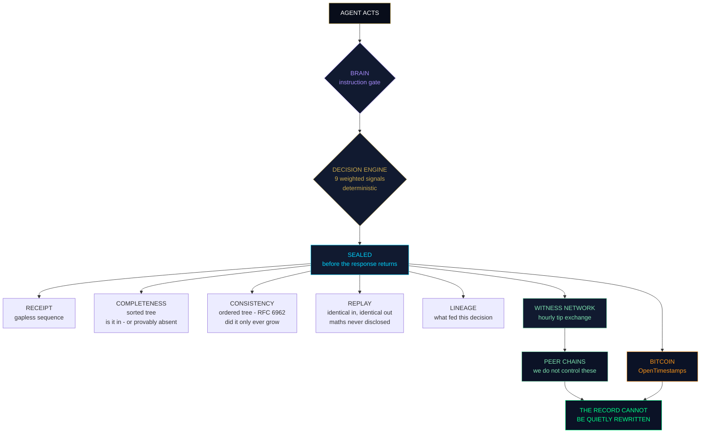
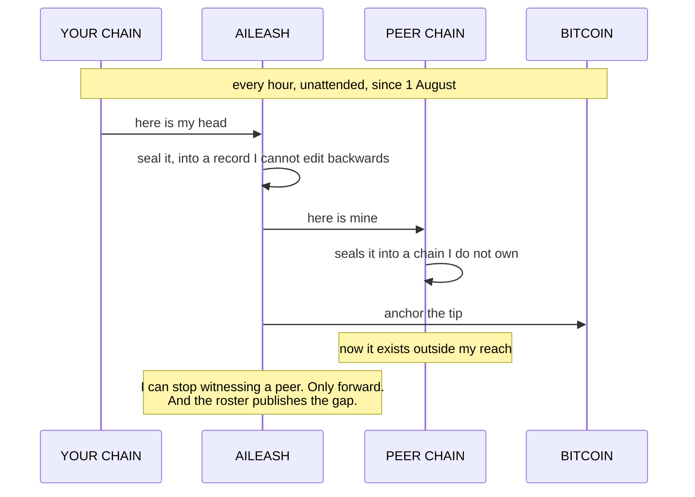

# Codebase — part 26 of 39

Contains:
- `tests/attack_continuity_6.py`
- `tests/attack_witnessed.py`
- `verify_authority.py`
- `AILeash-API-Reference-v6.4.2.md`
- `LICENCE`
- `README.md`
- `admin.html`


## `tests/attack_continuity_6.py`

92 lines, 3965 bytes

```python
"""End to end: issue, delegate, exercise, export a proof, verify it elsewhere,
then try to forge one."""
import hashlib, json, sqlite3, threading, time, sys, types, subprocess, copy
import continuity as C

m = types.ModuleType("server")
m.get_bearer = lambda *a, **k: None
m.score_event = lambda e: 0.12          # bare score, like the real engine
sys.modules["server"] = m

conn = sqlite3.connect(":memory:", check_same_thread=False)
lock = threading.RLock(); n = {"i": 0}
def seal(ev, res, ts, k):
    n["i"] += 1
    return hashlib.sha256(json.dumps([ev, res, ts], sort_keys=True, default=str).encode()).hexdigest(), n["i"], n["i"]
ctx = {"conn": conn, "lock": lock, "seal": seal}
C._ready = False; C._setup(ctx)

NOW, HOUR = time.time(), 3600
C._issue(ctx, "k", dict(id="root", issuer="justin@monopcontent.com", issuer_kind="human",
    subject="orchestrator", scope=["payments.refund", "payments.read"],
    constraints={"max_amount": 5000, "allowed_currency": ["GBP", "EUR"]},
    purpose="resolve customer refund complaints", purpose_tags=["refunds", "support"],
    not_after=NOW + 10 * HOUR, delegations_left=2))
C._issue(ctx, "k", dict(id="mid", parent="root", issuer="orchestrator", issuer_kind="agent",
    subject="refund-agent", scope=["payments.refund"],
    constraints={"max_amount": 200, "allowed_currency": ["GBP"]},
    purpose="issue small refunds", purpose_tags=["refunds"],
    not_after=NOW + 2 * HOUR, delegations_left=0))

def run(params, tag="refunds", action="payments.refund"):
    r, _ = C._evaluate(ctx, "k", {"grant": "mid", "action": action,
                                  "params": params, "purpose_tag": tag})
    return r

allow = run({"amount": 150, "currency": "GBP"})
block = run({"amount": 900, "currency": "GBP"})
print("allow verdict:", allow["verdict"], "| block verdict:", block["verdict"],
      "->", block["broken_invariant"])

def bundle_for(ev):
    b, code = C._proof(ctx, {"evaluation": ev})
    assert code == 200, b
    return b

for label, ev in (("ALLOW", allow["evaluation"]), ("BLOCK", block["evaluation"])):
    b = bundle_for(ev)
    open("/tmp/%s.json" % label, "w").write(json.dumps(b, indent=1))
    print("\n" + "#" * 66 + "\n# %s bundle\n" % label + "#" * 66)
    out = subprocess.run([sys.executable, "verify_authority.py", "/tmp/%s.json" % label],
                         capture_output=True, text=True)
    print(out.stdout.strip()); print("exit:", out.returncode)

print("\n" + "#" * 66 + "\n# forgeries\n" + "#" * 66)
good = json.load(open("/tmp/BLOCK.json"))

def forge(name, mutate):
    b = copy.deepcopy(good)
    mutate(b)
    open("/tmp/forged.json", "w").write(json.dumps(b))
    out = subprocess.run([sys.executable, "verify_authority.py", "/tmp/forged.json"],
                         capture_output=True, text=True)
    caught = out.returncode != 0
    line = [l for l in out.stdout.splitlines() if l.startswith("FAIL")]
    print(("  ok   " if caught else "  MISS ") + name)
    for l in line[:2]:
        print("         " + l.strip())

def flip_verdict(b):
    b["decision"]["verdict"] = "ALLOW"; b["decision"]["authority_verdict"] = "ALLOW"
def raise_cap(b):
    pass_idx = 1
    b["lineage"][1]["constraints"]["max_amount"] = 100000
def widen_scope(b):
    b["lineage"][1]["scope"] = ["payments.refund", "payments.transfer"]
def swap_human(b):
    b["lineage"][0]["issuer_kind"] = "agent"
def change_params(b):
    b["request"]["params"]["amount"] = 1
def drop_acceptor(b):
    for g in b["lineage"]: g["risk_accepted_by"] = None
def restamp(b):
    b["decision"]["evaluated_at_epoch"] = NOW + 9 * HOUR

forge("claimed ALLOW on a bundle that blocks", flip_verdict)
forge("cap raised inside the lineage", raise_cap)
forge("scope widened inside the lineage", widen_scope)
forge("root demoted from human", swap_human)
forge("parameters swapped after the fact", change_params)
forge("risk acceptor stripped", drop_acceptor)
forge("timestamp moved past the leaf's expiry", restamp)

```


## `tests/attack_witnessed.py`

160 lines, 7875 bytes

```python
"""Attack it the same way as everything else: from the position of an operator
trying to make a grant look older than it is."""
import hashlib, json, sqlite3, threading, time, sys, types
import witnessed as W

P, F = [], []
def check(n, c, d=""):
    (P if c else F).append(n)
    print(("  ok   " if c else "  FAIL ") + n + (("  -> " + str(d)[:200]) if d and not c else ""))

def make():
    conn = sqlite3.connect(":memory:", check_same_thread=False)
    lock = threading.RLock(); n = {"i": 0}
    conn.execute("CREATE TABLE audit_log(id INTEGER PRIMARY KEY AUTOINCREMENT,"
                 "ts REAL,user_id TEXT,api_key TEXT,result_json TEXT,audit_hash TEXT)")
    # the real grant table shape, including columns added later
    conn.execute("CREATE TABLE auth_grant(id TEXT PRIMARY KEY,parent TEXT,root TEXT,"
                 "issuer TEXT,subject TEXT,created REAL,digest TEXT,audit_hash TEXT,"
                 "block_index INTEGER,risk_accepted_by TEXT)")
    def seal(ev, res, ts, key):
        n["i"] += 1
        h = hashlib.sha256(json.dumps([ev,res,ts,n["i"]],sort_keys=True,default=str).encode()).hexdigest()
        conn.execute("INSERT INTO audit_log(ts,user_id,api_key,result_json,audit_hash) "
                     "VALUES(?,?,?,?,?)", (ts, ev.get("user_id"), key, json.dumps(res), h))
        conn.commit()
        return h, n["i"], n["i"]
    W._ready = False
    ctx = {"conn": conn, "lock": lock, "seal": seal}
    W._setup(ctx)
    return ctx

def seal_grant(ctx, gid, created):
    h, idx, _ = ctx["seal"]({"user_id": "lin:"+gid}, {"decision":"AUTHORITY_GRANTED","grant":gid}, created, "k")
    with ctx["lock"]:
        ctx["conn"].execute("INSERT INTO auth_grant(id,issuer,subject,created,audit_hash,block_index) "
                            "VALUES(?,?,?,?,?,?)", (gid,"owner@example.com","agent",created,h,idx))
        ctx["conn"].commit()
    return h

def noise(ctx, k=5):
    for i in range(k):
        ctx["seal"]({"user_id":"n%d"%i},{"decision":"ALLOW"},time.time(),"k")

def record_head(ctx, peer, accepted=1, when=None, size=None, tip=None):
    """Insert an attestation directly, standing in for a live peer."""
    s, t = W._head(ctx)
    when = when or time.time()
    with ctx["lock"]:
        ctx["conn"].execute(
            "INSERT INTO witnessed_head(peer,peer_url,tree_size,tip,head_digest,"
            "submitted,accepted,peer_response,peer_block,audit_hash,block_index,api_key)"
            " VALUES(?,?,?,?,?,?,?,?,?,?,?,?)",
            (peer,"https://%s"%peer, size or s, tip or t,"d",when,accepted,"{}","b1","ah",1,"k"))
        ctx["conn"].commit()

NOW = time.time()

print("\n=== 1. a grant witnessed after issue ===")
ctx = make()
noise(ctx, 3)
g = seal_grant(ctx, "root", NOW - 3600)
noise(ctx, 4)
record_head(ctx, "redflagai.pro", when=NOW - 1800)
r, code = W._grant(ctx, {"id": "root"})
check("witnessed grant reports externally_witnessed", code==200 and r["externally_witnessed"], r)
check("names the peer and the time", r["earliest_external_witness"]["peer"]=="redflagai.pro", r)
check("gives a four-step plan pointed at the peer",
      len(r["verification_plan"])==4 and "attest" in r["verification_plan"][0]["run"], r["verification_plan"][0])
check("states what it does not prove", "should ever have been issued" in r["what_this_does_not_prove"])
check("reports how long it sat unwitnessed", r["minutes_unwitnessed"] is not None, r.get("minutes_unwitnessed"))

print("\n=== 2. THE ATTACK: a grant back-dated after the fact ===")
# operator invents a root grant now, and writes created= last week
ctx = make()
noise(ctx, 3)
record_head(ctx, "redflagai.pro", when=NOW - 86400)      # peer saw the log yesterday
forged = seal_grant(ctx, "forged", NOW - 7*86400)        # grant CLAIMS to be a week old
r, code = W._grant(ctx, {"id": "forged"})
check("a grant sealed after the last witness is NOT covered", not r["externally_witnessed"], r)
check("and says so plainly rather than staying quiet", "rests on this operator's own record" in r.get("flag",""), r.get("flag"))
# now a peer witnesses; from here it is covered, but only from here
record_head(ctx, "redflagai.pro", when=NOW)
r2, _ = W._grant(ctx, {"id": "forged"})
check("after a later witness it becomes covered", r2["externally_witnessed"])
gapdays = round(r2["minutes_unwitnessed"]/1440.0, 1)
check("the seven-day claim-to-witness gap is published, not hidden",
      r2.get("flag") and "days" in r2["flag"] and gapdays >= 6.9, {"gap_days":gapdays,"flag":r2.get("flag")})

print("\n=== 3. coverage counts only what a peer accepted ===")
ctx = make()
noise(ctx, 2); g = seal_grant(ctx, "g1", NOW); noise(ctx, 2)
record_head(ctx, "peer-that-refused", accepted=0)
r, _ = W._grant(ctx, {"id": "g1"})
check("a refused submission gives no coverage", not r["externally_witnessed"], r.get("earliest_external_witness"))
h, _ = W._heads(ctx, {})
check("but the refusal is still on the public record", h["count"]==1 and h["heads"][0]["accepted"] is False, h)

print("\n=== 4. a head that predates the grant does not cover it ===")
ctx = make()
record_head(ctx, "early-peer", when=NOW-9999)   # size 0
noise(ctx, 3)
seal_grant(ctx, "later", NOW)
r, _ = W._grant(ctx, {"id": "later"})
check("an earlier, smaller head cannot reach a later record", not r["externally_witnessed"], r)

print("\n=== 5. the earliest witness wins, not the most convenient ===")
ctx = make()
noise(ctx, 2); seal_grant(ctx, "g", NOW - 600); noise(ctx, 2)
record_head(ctx, "second-peer", when=NOW - 100)
record_head(ctx, "first-peer",  when=NOW - 400)
r, _ = W._grant(ctx, {"id": "g"})
check("earliest accepted attestation is the one reported",
      r["earliest_external_witness"]["peer"]=="first-peer", r["earliest_external_witness"])
check("the others are listed too", any(c["peer"]=="second-peer" for c in r["also_witnessed_by"]), r["also_witnessed_by"])

print("\n=== 6. status is honest about thin networks ===")
ctx = make(); noise(ctx, 3)
s, _ = W._status(ctx)
check("no peers at all reports strength none", s["strength"]=="none" and "rests on our own record" in s["flag"], s)
record_head(ctx, "only-peer")
s, _ = W._status(ctx)
check("one peer reports weak and names collusion", s["strength"]=="weak" and "collude" in s["flag"], s)
for p in ("p2","p3"): record_head(ctx, p)
s, _ = W._status(ctx)
check("three peers reports reasonable", s["strength"]=="reasonable", s)
noise(ctx, 6)
s, _ = W._status(ctx)
check("records sealed since the last head are counted as unwitnessed",
      s["records_not_yet_witnessed"]==6, s)

print("\n=== 7. tampering with the grant row ===")
ctx = make(); noise(ctx,2); seal_grant(ctx,"t",NOW); record_head(ctx,"peer")
with ctx["lock"]:
    ctx["conn"].execute("UPDATE auth_grant SET audit_hash='0'*64 WHERE id='t'")
    ctx["conn"].commit()
r, code = W._grant(ctx, {"id":"t"})
check("a grant whose seal is not in the log is a finding, not a 404",
      code==409 and "finding" in r.get("message",""), (code, r))

print("\n=== 8. url safety on submit ===")
ctx = make(); noise(ctx,2)
for bad, why in [("http://127.0.0.1/x","loopback"),("http://10.0.0.5/x","private"),
                 ("ftp://example.com","scheme"),("https://example.com:8443/x","port")]:
    r, code = W._submit(ctx, "k", {"peer":"p","url":bad})
    check("refuses %s" % why, code==400 and r.get("error")=="url_refused", (bad,code,r))

print("\n=== 9. any sealed record, not just grants ===")
ctx = make(); noise(ctx,2)
h,_ ,_ = ctx["seal"]({"user_id":"x"},{"decision":"ALLOW"},NOW,"k")
noise(ctx,1); record_head(ctx,"peer")
r, code = W._record(ctx, {"hash": h})
check("a decision receipt gets the same treatment", code==200 and r["externally_witnessed"], r)
r, code = W._record(ctx, {"hash": "zz"})
check("a malformed hash is refused", code==400, (code,r))

print("\n" + "="*62)
print("passed %d, failed %d" % (len(P), len(F)))
for f in F: print("  FAILED: " + f)
sys.exit(1 if F else 0)

```


## `verify_authority.py`

596 lines, 22636 bytes

```python
#!/usr/bin/env python3
"""
verify_authority.py  -  check an AILeash authority proof without AILeash

    python3 verify_authority.py proof.json
    curl -s "https://sebbi.pro/x/continuity/proof?evaluation=e_..." \\
        | python3 verify_authority.py -

WHAT THIS IS FOR
----------------
A proof that can only be checked by the party who issued it is not a proof.
This script takes a bundle and reaches its own conclusion using nothing but
the Python standard library. It does not call the issuing system, it does not
import anything you have to install, and it does not take a single field of
the bundle at face value.

It does four separate things, and each one can fail on its own:

  1. SIGNATURE   Ed25519 over the canonical bundle. Confirms the bundle came
                 from the holder of the named key and has not been edited by
                 anybody since.

  2. INTEGRITY   Recomputes every grant digest, the lineage digest and the
                 parameter digest from the fields in front of it. Confirms
                 the bundle is internally consistent with its own contents.

  3. DERIVATION  Re-runs the authority rules from scratch: root issued by a
                 human, an unbroken parent chain, scope covered at every hop,
                 constraints narrowing on every axis, purpose narrowing,
                 validity windows contained, nothing revoked, and the action
                 itself inside the effective limits of the whole lineage.

  4. AGREEMENT   Compares the verdict this script reached with the verdict the
                 bundle claims. Disagreement is reported as a failure of the
                 issuer, not of this script.

WHAT A PASS MEANS
-----------------
That the authority for this action was derivable, at that time, from that
human grant - or, for a refusal, that it genuinely was not, and that the named
grant and invariant really are where it broke.

WHAT A PASS DOES NOT MEAN
-------------------------
That the root grant should ever have been issued. That the parameters describe
something that really happened. That the risk engine was right. Derivation is
not merit and it is not truth.

The risk half of a composed verdict cannot be re-derived here, because that
needs the issuer's scoring engine. Where the bundle's authority verdict is
BLOCK, the composed verdict stands regardless, because the composition takes
the worse of the two.

THE SIGNED MATERIAL
-------------------
Exactly one field is removed before checking: signature. Everything else the
bundle carries, including verify_with, is inside the signature, which is what
the bundle's own instruction says. A verifier that quietly strips more fields
than the published method does is checking a different document from the one
the issuer told the world to check.
"""

import binascii
import hashlib
import json
import sys

GRANT_PREFIX = b"AILEASH-GRANT-v1:"
EVAL_PREFIX = b"AILEASH-AUTHEVAL-v1:"
BUNDLE_PREFIX = b"AILEASH-AUTHORITY-PROOF-v1:"

MAX_DEPTH = 32
RANK = {"ALLOW": 0, "CHALLENGE": 1, "BLOCK": 2}


# ======================================================================
# Ed25519, RFC 8032, standard library only
# ======================================================================

_Q = 2 ** 255 - 19
_L = 2 ** 252 + 27742317777372353535851937790883648493
_D = -121665 * pow(121666, _Q - 2, _Q) % _Q
_I = pow(2, (_Q - 1) // 4, _Q)


def _h(m):
    return hashlib.sha512(m).digest()


def _inv(x):
    return pow(x, _Q - 2, _Q)


def _xrecover(y):
    xx = (y * y - 1) * _inv(_D * y * y + 1)
    x = pow(xx, (_Q + 3) // 8, _Q)
    if (x * x - xx) % _Q != 0:
        x = (x * _I) % _Q
    if x % 2 != 0:
        x = _Q - x
    return x


_BY = 4 * _inv(5) % _Q
_BX = _xrecover(_BY)
_B = (_BX % _Q, _BY % _Q, 1, (_BX * _BY) % _Q)
_IDENT = (0, 1, 1, 0)


def _add(p, q):
    x1, y1, z1, t1 = p
    x2, y2, z2, t2 = q
    a = (y1 - x1) * (y2 - x2) % _Q
    b = (y1 + x1) * (y2 + x2) % _Q
    c = t1 * 2 * _D * t2 % _Q
    dd = z1 * 2 * z2 % _Q
    e, f, g, hh = b - a, dd - c, dd + c, b + a
    return (e * f % _Q, g * hh % _Q, f * g % _Q, e * hh % _Q)


def _scalarmult(p, e):
    if e == 0:
        return _IDENT
    q = _scalarmult(p, e // 2)
    q = _add(q, q)
    if e & 1:
        q = _add(q, p)
    return q


def _encodepoint(p):
    x, y, z, _t = p
    zi = _inv(z)
    x, y = x * zi % _Q, y * zi % _Q
    bits = [(y >> i) & 1 for i in range(255)] + [x & 1]
    return bytes(sum(bits[i * 8 + j] << j for j in range(8)) for i in range(32))


def _bit(h, i):
    return (h[i // 8] >> (i % 8)) & 1


def _hint(m):
    h = _h(m)
    return sum(2 ** i * _bit(h, i) for i in range(512))


def _isoncurve(p):
    x, y, z, t = p
    return (z % _Q != 0 and x * y % _Q == z * t % _Q
            and (y * y - x * x - z * z - _D * t * t) % _Q == 0)


def _decodepoint(s):
    y = int.from_bytes(s, "little") & ((1 << 255) - 1)
    x = _xrecover(y)
    if x & 1 != _bit(s, 255):
        x = _Q - x
    p = (x, y, 1, (x * y) % _Q)
    if not _isoncurve(p):
        raise ValueError("point off curve")
    return p


def ed25519_verify(sig, msg, pk):
    if len(sig) != 64 or len(pk) != 32:
        return False
    try:
        rr = _decodepoint(sig[:32])
        a = _decodepoint(pk)
    except Exception:
        return False
    s = int.from_bytes(sig[32:64], "little")
    if s >= _L:
        return False
    hh = _hint(sig[:32] + pk + msg)
    return _encodepoint(_scalarmult(_B, s)) == _encodepoint(_add(rr, _scalarmult(a, hh)))


# ======================================================================
# the rules, reimplemented from the published spec
# ======================================================================

def canon(obj):
    return json.dumps(obj, sort_keys=True, separators=(",", ":"), default=str)


def sha(prefix, text):
    return hashlib.sha256(prefix + text.encode("utf-8")).hexdigest()


def grant_digest(g):
    material = {
        "id": g["id"], "parent": g["parent"], "issuer": g["issuer"],
        "issuer_kind": g["issuer_kind"], "subject": g["subject"],
        "subject_kind": g["subject_kind"], "scope": sorted(g["scope"]),
        "constraints": g["constraints"], "purpose": g["purpose"],
        "purpose_tags": sorted(g["purpose_tags"]),
        "not_before": g["not_before"], "not_after": g["not_after"],
        "depth": g["depth"], "delegations_left": g["delegations_left"],
        "created": g["created"], "risk_accepted_by": g.get("risk_accepted_by"),
    }
    return sha(GRANT_PREFIX, canon(material))


def covers(held, wanted):
    if held == wanted or held == "*":
        return True
    if held.endswith(".*"):
        return wanted == held[:-2] or wanted.startswith(held[:-1])
    return False


def wildcard_breadth(scope, capability):
    best = None
    for held in scope:
        if not covers(held, capability):
            continue
        if held == capability:
            return 0
        width = (capability.count(".") + 2 if held == "*"
                 else capability.count(".") - held[:-2].count("."))
        best = width if best is None else min(best, width)
    return best


def direction(key):
    for p in ("max_", "min_", "allowed_", "denied_", "may_"):
        if key.startswith(p):
            return p
    return None


def num(v):
    if isinstance(v, bool) or v is None:
        raise ValueError("not a number")
    return float(v)


def as_set(v):
    if isinstance(v, (list, tuple, set)):
        return set(v)
    return {v}


def narrower(parent_c, child_c):
    for key in sorted(child_c):
        d = direction(key)
        cval = child_c[key]
        if d is None:
            return False, "constraint '%s' has no narrowing rule" % key
        if key not in parent_c:
            return False, "constraint '%s' is not expressed by the parent" % key
        pval = parent_c[key]
        try:
            if d == "max_" and num(cval) > num(pval):
                return False, "%s raised from %s to %s" % (key, pval, cval)
            if d == "min_" and num(cval) < num(pval):
                return False, "%s lowered from %s to %s" % (key, pval, cval)
            if d == "allowed_" and not as_set(cval) <= as_set(pval):
                return False, "%s adds values the parent does not hold" % key
            if d == "denied_" and not as_set(pval) <= as_set(cval):
                return False, "%s drops values the parent denies" % key
            if d == "may_" and bool(cval) and not bool(pval):
                return False, "%s enabled where the parent withholds it" % key
        except (TypeError, ValueError):
            return False, "constraint '%s' is not comparable" % key
    return True, None


def effective(chain):
    eff = {}
    for g in chain:
        for k, v in g["constraints"].items():
            d = direction(k)
            if k not in eff:
                eff[k] = v
                continue
            cur = eff[k]
            try:
                if d == "max_":
                    eff[k] = min(num(cur), num(v))
                elif d == "min_":
                    eff[k] = max(num(cur), num(v))
                elif d == "allowed_":
                    eff[k] = sorted(as_set(cur) & as_set(v))
                elif d == "denied_":
                    eff[k] = sorted(as_set(cur) | as_set(v))
                elif d == "may_":
                    eff[k] = bool(cur) and bool(v)
            except (TypeError, ValueError):
                eff[k] = v
    return eff


def params_against(params, eff):
    hard, unconstrained = [], []
    for key in sorted(params):
        val = params[key]
        checked = False
        for cname, cval in eff.items():
            d = direction(cname)
            if not d or cname[len(d):] != key:
                continue
            checked = True
            try:
                if d == "max_" and num(val) > num(cval):
                    hard.append("%s=%s exceeds %s=%s" % (key, val, cname, cval))
                elif d == "min_" and num(val) < num(cval):
                    hard.append("%s=%s is below %s=%s" % (key, val, cname, cval))
                elif d == "allowed_" and val not in as_set(cval):
                    hard.append("%s=%s is outside %s" % (key, val, cname))
                elif d == "denied_" and val in as_set(cval):
                    hard.append("%s=%s is denied by %s" % (key, val, cname))
                elif d == "may_" and bool(val) and not bool(cval):
                    hard.append("%s requested where %s withholds it" % (key, cname))
            except (TypeError, ValueError):
                hard.append("%s cannot be compared with %s" % (key, cname))
        if not checked:
            unconstrained.append(key)
    return hard, unconstrained


# ======================================================================
# the four checks
# ======================================================================

class Report(object):
    def __init__(self):
        self.rows = []
        self.failed = False

    def add(self, ok, name, detail=""):
        self.rows.append((ok, name, detail))
        if not ok:
            self.failed = True

    def note(self, name, detail=""):
        self.rows.append((None, name, detail))

    def render(self):
        out = []
        for ok, name, detail in self.rows:
            mark = "  ok  " if ok else ("FAIL  " if ok is False else "  --  ")
            out.append(mark + name + (("\n        " + detail) if detail else ""))
        return "\n".join(out)


def check_signature(bundle, rep):
    sig_hex = bundle.get("signature")
    pk_hex = (bundle.get("issued_by") or {}).get("public_key")
    if not sig_hex or not pk_hex:
        rep.add(False, "Signature present", "the bundle carries no signature or no key")
        return
    # Only the signature itself is removed. Every other field the bundle
    # carries is inside the signed material, exactly as the bundle's own
    # verify_with instruction states.
    body = dict(bundle)
    body.pop("signature", None)
    try:
        sig = binascii.unhexlify(sig_hex)
        pk = binascii.unhexlify(pk_hex)
    except Exception:
        rep.add(False, "Signature is readable hex")
        return
    ok = ed25519_verify(sig, BUNDLE_PREFIX + canon(body).encode("utf-8"), pk)
    rep.add(ok, "Ed25519 signature over the canonical bundle",
            "key " + pk_hex[:16] + "…  Verify this key independently at the issuer's "
            "published address before trusting who signed." if ok else
            "the bundle was altered after signing, or it was not signed by this key")


def check_integrity(bundle, rep):
    lineage = bundle.get("lineage") or []
    bad = []
    for g in lineage:
        try:
            if grant_digest(g) != g.get("digest"):
                bad.append(g.get("id"))
        except Exception:
            bad.append(g.get("id"))
    rep.add(not bad, "Every grant digest recomputes from its own fields",
            "" if not bad else "mismatched: " + ", ".join(str(b) for b in bad))

    claimed = (bundle.get("decision") or {}).get("lineage_digest")
    mine = sha(EVAL_PREFIX, canon([g.get("digest") for g in lineage]))
    rep.add(mine == claimed, "Lineage digest matches the ordered path",
            "" if mine == claimed else "computed " + mine[:20] + "… claimed " + str(claimed)[:20] + "…")

    req = bundle.get("request") or {}
    claimed_p = (bundle.get("decision") or {}).get("params_digest")
    mine_p = sha(EVAL_PREFIX, canon({"action": req.get("action"),
                                     "params": req.get("params") or {}}))
    rep.add(mine_p == claimed_p, "Parameter digest matches the request as stated",
            "" if mine_p == claimed_p else "the parameters shown are not the "
            "parameters that were judged")

    # The decision records its own action separately from the request block.
    # Everything downstream - the scope check, the wildcard breadth - is run
    # against the request's action, so if the two ever disagreed this script
    # would be checking one action while the issuer decided another.
    decided_action = (bundle.get("decision") or {}).get("action")
    shown_action = req.get("action")
    rep.add(decided_action == shown_action,
            "The action shown is the action that was decided",
            "" if decided_action == shown_action else
            "the decision names '" + str(decided_action) + "' and the request shows '"
            + str(shown_action) + "' - the bundle describes one action and was judged "
            "on another")


def rederive(bundle, rep):
    """Run the published rules from scratch and reach an independent verdict."""
    lineage = bundle.get("lineage") or []
    decision = bundle.get("decision") or {}
    req = bundle.get("request") or {}
    at = decision.get("evaluated_at_epoch")

    hard, soft = [], []
    broken_at = broken_invariant = None

    def fail(grant, invariant, detail):
        nonlocal broken_at, broken_invariant
        hard.append(detail)
        if broken_at is None:
            broken_at, broken_invariant = grant, invariant

    if not lineage:
        fail(None, "authority_continuity", "the bundle carries no authority path")
    else:
        root = lineage[0]
        if root.get("parent") is not None:
            fail(root["id"], "authority_continuity",
                 "the path does not begin at a parentless root")
        if root.get("issuer_kind") != "human":
            fail(root["id"], "identity_continuity",
                 "the root grant was not issued by a human principal")

        previous = None
        for g in lineage:
            if g.get("revoked_at") is not None:
                fail(g["id"], "authority_continuity",
                     "grant %s was revoked" % g["id"])
            if at is not None:
                if at < g["not_before"]:
                    fail(g["id"], "temporal_validity",
                         "grant %s was not yet valid at the time of the decision" % g["id"])
                if at >= g["not_after"]:
                    fail(g["id"], "temporal_validity",
                         "grant %s had expired at the time of the decision" % g["id"])
            if previous is not None:
                if g.get("parent") != previous.get("id"):
                    fail(g["id"], "authority_continuity",
                         "grant %s does not point at the grant above it" % g["id"])
                missing = [c for c in g["scope"]
                           if not any(covers(p, c) for p in previous["scope"])]
                if missing:
                    fail(g["id"], "boundary_integrity",
                         "%s holds scope its parent does not: %s"
                         % (g["id"], ", ".join(sorted(missing))))
                ok, why = narrower(previous["constraints"], g["constraints"])
                if not ok:
                    fail(g["id"], "boundary_integrity", "%s: %s" % (g["id"], why))
                if not set(g["purpose_tags"]) <= set(previous["purpose_tags"]):
                    fail(g["id"], "intent_continuity",
                         "%s carries purpose tags its parent does not" % g["id"])
                if (g["not_before"] < previous["not_before"]
                        or g["not_after"] > previous["not_after"]):
                    fail(g["id"], "temporal_validity",
                         "%s is valid outside its parent's window" % g["id"])
                if g["depth"] != previous["depth"] + 1:
                    fail(g["id"], "authority_continuity",
                         "%s records a depth inconsistent with its parent" % g["id"])
            previous = g

        if len(lineage) - 1 > MAX_DEPTH:
            fail(lineage[-1]["id"], "boundary_integrity", "delegation depth exceeds the ceiling")

        if not any(g.get("risk_accepted_by") for g in lineage):
            fail(lineage[0]["id"], "identity_continuity",
                 "no grant in this path names who accepted the risk")

        leaf = lineage[-1]
        action = req.get("action")
        params = req.get("params") or {}

        if action and not any(covers(c, action) for c in leaf["scope"]):
            fail(leaf["id"], "boundary_integrity",
                 "action '%s' is outside the scope of the grant exercised" % action)
        elif action:
            breadth = wildcard_breadth(leaf["scope"], action)
            if breadth and breadth >= 2:
                soft.append("action '%s' is only covered by a broad wildcard" % action)

        eff = effective(lineage)
        failures, unconstrained = params_against(params, eff)
        for f in failures:
            fail(leaf["id"], "boundary_integrity", f)
        for u in unconstrained:
            soft.append("parameter '%s' is not constrained anywhere in the path" % u)

        tag = req.get("purpose_tag")
        if tag:
            if tag not in leaf["purpose_tags"]:
                soft.append("declared purpose '%s' is not carried by the grant" % tag)
        else:
            soft.append("the action declared no purpose")

    verdict = "BLOCK" if hard else ("CHALLENGE" if soft else "ALLOW")
    return verdict, hard, soft, broken_at, broken_invariant


def check_agreement(bundle, rep, mine, hard, soft, broken_at, broken_invariant):
    decision = bundle.get("decision") or {}
    claimed = decision.get("authority_verdict") or decision.get("verdict")

    rep.add(mine == claimed,
            "Independently re-derived authority verdict: " + mine,
            "" if mine == claimed else
            "the issuer claims " + str(claimed) + " and this script reaches " + mine +
            " from the same path. One of us is wrong and the rules are published.")

    if mine == "BLOCK":
        same_grant = (broken_at == decision.get("broken_at"))
        same_inv = (broken_invariant == decision.get("broken_invariant"))
        rep.add(same_grant and same_inv,
                "Refusal reproduces at the same grant and invariant",
                ("grant %s, invariant %s" % (broken_at, broken_invariant))
                if same_grant and same_inv else
                "this script breaks at grant %s / %s, the issuer says %s / %s"
                % (broken_at, broken_invariant,
                   decision.get("broken_at"), decision.get("broken_invariant")))
        rep.note("Why authority could not be derived")
        for h in hard:
            rep.note("  " + h)
    elif soft:
        rep.note("Why this could not be settled without a person")
        for x in soft:
            rep.note("  " + x)

    risk = decision.get("risk_verdict")
    if risk and mine != "BLOCK":
        rep.note("Risk verdict reported as " + str(risk) + ", not re-derivable here",
                 "the composed verdict is the worse of the two; the scoring engine "
                 "is not part of this bundle and is not checked by this script")


def main():
    if len(sys.argv) < 2:
        print(__doc__)
        return 2
    src = sys.argv[1]
    raw = sys.stdin.read() if src == "-" else open(src, "r").read()
    try:
        bundle = json.loads(raw)
    except Exception as exc:
        print("Not readable JSON: " + str(exc))
        return 2

    rep = Report()
    print("=" * 66)
    print("AUTHORITY PROOF  ·  independent verification")
    print("=" * 66)
    d = bundle.get("decision") or {}
    print("evaluation   " + str(d.get("evaluation")))
    print("action       " + str((bundle.get("request") or {}).get("action")))
    print("at           " + str(d.get("evaluated_at")))
    print("hops         " + str(max(0, len(bundle.get("lineage") or []) - 1)))
    if bundle.get("lineage"):
        print("authorised   " + str(bundle["lineage"][0].get("issuer")))
        print("executed     " + str(bundle["lineage"][-1].get("subject")))
        acc = [g.get("risk_accepted_by") for g in bundle["lineage"] if g.get("risk_accepted_by")]
        print("risk owner   " + str(acc[-1] if acc else None))
    print("-" * 66)

    check_signature(bundle, rep)
    check_integrity(bundle, rep)
    mine, hard, soft, ba, bi = rederive(bundle, rep)
    check_agreement(bundle, rep, mine, hard, soft, ba, bi)

    print(rep.render())
    print("-" * 66)
    if rep.failed:
        print("RESULT: NOT VERIFIED. Something above did not hold.")
        return 1
    print("RESULT: VERIFIED - " + mine)
    if mine == "BLOCK":
        print("This is a proof that the action was NOT authorised, and where it failed.")
    print("Checked with no network access, no dependencies, and nothing taken on")
    print("the issuer's word except the meaning of their public key.")
    return 0


if __name__ == "__main__":
    sys.exit(main())

```


## `AILeash-API-Reference-v6.4.2.md`

256 lines, 6799 bytes

```markdown
# AILeash v6.4.2 — Complete API Reference

## Core Decision Endpoint

### POST /api/govern
**The engine. Every action scores here.**

Auth: `Bearer YOUR_API_KEY`

**Request:**
```json
{
  "user_id": "string (required)",
  "action": "string (required) — payment/login/message/transfer/checkout/api_call",
  "amount": "number (optional, default 0) — monetary value in GBP",
  "country": "string (required) — ISO 3166-1 alpha-2 code",
  "device_id": "string (required) — unique device identifier",
  "anomaly": "number 0..1 (optional) — behavioural anomaly score",
  "device_risk": "number 0..1 (optional) — device risk score"
}
```

**Response (200 OK):**
```json
{
  "decision": "ALLOW|CHALLENGE|BLOCK",
  "score": 0.0..1.0,
  "trust": 0.05..1.0,
  "reasons": ["velocity_spike", "high_amount", "country_shift"],
  "audit_hash": "sha256_hex_string",
  "block_index": 12345,
  "receipt_seq": 42,
  "timestamp": 1719072000.0,
  "challenge_url": "https://sebbi.pro/verify-challenge?token=...",
  "challenge_expires_in": 900
}
```

**Error responses:**
- `401 Unauthorized` — Missing or invalid API key
- `403 Forbidden` — Account inactive or over quota
- `429 Too Many Requests` — Rate limited
- `503 Service Unavailable` — Server overloaded

---

## Account Management

### POST /api/keys or /signup
**Create a new API key. Instant. No card. No humans in the loop.**

No auth required.

**Request:**
```json
{
  "email": "user@example.com (required)",
  "name": "John Doe (optional)",
  "phone": "+441234567890 (optional)",
  "org": "Acme Corp (optional)",
  "product": "aileash|guardian|sonicboom|sentinel (default: aileash)",
  "devices": 1..1000000 (default: 1),
  "ref_code": "REF-XXXX-1234 (optional)"
}
```

**Response (200 OK):**
```json
{
  "api_key": "al_live_...",
  "email": "user@example.com",
  "product": "aileash",
  "devices": 1,
  "monthly_cost": 0.50,
  "quota": 100,
  "ref_code": "REF-JOHN-5678",
  "badge_id": "abc123def456",
  "message": "100 free decisions. Then 50p per device per month via Stripe."
}
```

---

## Verification & Public Endpoints

### GET /api/spec
**Engine specification. Public. No auth.**

**Response (200 OK):**
```json
{
  "engine": "AILeash v6.4.2",
  "version": "6.4.2",
  "signals": 9,
  "decision_latency_ms": 28,
  "threshold_allow": 0.35,
  "threshold_challenge": 0.70,
  "threshold_block": 1.0,
  "features": ["deterministic scoring", "tamper-evident chain", "real-time alerts", "gapless receipts", "sovereign deployment"]
}
```

### GET /api/verify-chain
**Full audit chain integrity proof. Public. No auth.**

**Response (200 OK):**
```json
{
  "valid": true,
  "blocks": 45678,
  "genesis": "GENESIS",
  "tip": "abc123...",
  "message": "Chain intact. No tampering detected.",
  "verifiable_by": "anyone, anywhere"
}
```

### GET /api/health
**Server health and load. Public. No auth.**

**Response (200 OK):**
```json
{
  "status": "ok",
  "version": "6.4.2",
  "uptime_seconds": 864000,
  "rps": 42,
  "timestamp": 1719072000.0
}
```

---

## Real-time Dashboards

### GET /api/pulse
**Live risk posture. Your current state.**

Auth: `Bearer YOUR_API_KEY`

**Response (200 OK):**
```json
{
  "last_hour": {
    "ALLOW": 486,
    "CHALLENGE": 23,
    "BLOCK": 4
  },
  "recent": [
    {
      "ts": 1719072000,
      "user_id": "u_7f2",
      "action": "payment",
      "decision": "ALLOW",
      "score": 0.12,
      "reasons": [],
      "audit_hash": "abc123..."
    }
  ],
  "chain_tip": "abc123...",
  "message": "All green. Chain tip sealed."
}
```

---

## Billing & Webhooks

### POST /stripe-webhook
**Stripe webhook receiver. Signature verified automatically.**

Supports events:
- `checkout.session.completed` — User upgraded
- `invoice.paid` — Monthly subscription paid
- `customer.subscription.deleted` — User cancelled
- `invoice.payment_failed` — Payment failed

---

## Four Products. One Engine.

### AILeash
- **What:** Every AI decision your platform makes about a person gets scored, explained, and sealed.
- **Who:** Platforms using AI for any regulated decision (lending, hiring, content moderation, fraud, access control).
- **Price:** 50p per device per month + your margin.
- **Free tier:** 100 decisions/month, no card.

### Guardian
- **What:** Free message checker for families. Child pastes a message in, gets instant plain-English assessment against grooming patterns.
- **Who:** Families. Free forever. No card. No catch.
- **Price:** Free. Always.
- **Built for:** ICO Children's Code, Online Safety Act, child safety.

### SonicBoom
- **What:** One line of code. Drops into AWS, Azure, GCP, OpenAI, Anthropic. Adds full compliance audit chain to every call.
- **Who:** Platforms already running AI in the cloud.
- **Price:** 50p per device per month + your margin.
- **Latency:** No impact. Chain sealing is asynchronous.

### Sentinel
- **What:** Fraud and anomaly alerting. Scores unusual patterns (500 messages in a minute, login from new country, velocity spikes) in real-time.
- **Who:** Platforms managing fraud, abuse, takeovers.
- **Price:** 50p per device per month + your margin.
- **Real-time:** Alerts the moment thresholds trip.

---

## The Score Formula (Immutable)

**Raw weighted sum (Σ_raw):**
```
Σ_raw =
  (1 − trust) × 0.30
  + min(velocity_60s / 20, 1) × 0.15
  + min(velocity_5m / 50, 1) × 0.10
  + min(velocity_1h / 200, 1) × 0.10
  + min(ln(1+amount) / ln(1+10000), 1) × 0.15
  + device_risk × 0.10
  + behavioural_anomaly × 0.10
  + country_shift × 0.10
  + unsafe_country × 0.10
```

**Normalization:** the nine weights above sum to 1.20, not 1.0. To keep every signal's *relative* importance exactly as designed while guaranteeing the score behaves as a true 0–1 weighted average (not one that can reach BLOCK-level values from fewer combined signals than intended), divide by the actual weight total before clamping:

```
WEIGHT_TOTAL = 0.30 + 0.15 + 0.10 + 0.10 + 0.15 + 0.10 + 0.10 + 0.10 + 0.10   # = 1.20

score = clamp( Σ_raw / WEIGHT_TOTAL , 0, 1 )

decision = ALLOW if score < 0.35
         = CHALLENGE if score < 0.70
         = BLOCK otherwise
```

No machine learning. No drift. No retraining. Weights are written in code and cannot change without a new release. `WEIGHT_TOTAL` is a fixed constant (1.20) recomputed only if a signal is added, removed, or reweighted in a future release — never at runtime.

---

## Rate Limits

- **Free tier:** 100 decisions/month
- **Paid:** Unlimited (or by plan)
- **Public endpoints:** No rate limit

---

## Documentation

- **Homepage:** https://sebbi.pro
- **Whitepaper:** https://sebbi.pro/whitepaper
- **Developers:** https://sebbi.pro/developers
- **Scanner (free):** https://sebbi.pro/scan
- **Guardian:** https://sebbi.pro/guardian-app
- **Contact:** justrightdecorators@gmail.com

```


## `LICENCE`

22 lines, 1074 bytes

```
MIT License

Copyright (c) 2026 Monop (Blyth, UK)

Permission is hereby granted, free of charge, to any person obtaining a copy
of this software and associated documentation files (the "Software"), to deal
in the Software without restriction, including without limitation the rights
to use, copy, modify, merge, publish, distribute, sublicense, and/or sell
copies of the Software, and to permit persons to whom the Software is
furnished to do so, subject to the following conditions:

The above copyright notice and this permission notice shall be included in all
copies or substantial portions of the Software.

THE SOFTWARE IS PROVIDED "AS IS", WITHOUT WARRANTY OF ANY KIND, EXPRESS OR
IMPLIED, INCLUDING BUT NOT LIMITED TO THE WARRANTIES OF MERCHANTABILITY,
FITNESS FOR A PARTICULAR PURPOSE AND NONINFRINGEMENT. IN NO EVENT SHALL THE
AUTHORS OR COPYRIGHT HOLDERS BE LIABLE FOR ANY CLAIM, DAMAGES OR OTHER
LIABILITY, WHETHER IN AN ACTION OF CONTRACT, TORT OR OTHERWISE, ARISING FROM,
OUT OF OR IN CONNECTION WITH THE SOFTWARE OR THE USE OR OTHER DEALINGS IN THE
SOFTWARE.

```


## `README.md`

498 lines, 24821 bytes

```markdown
<div align="center">


### **ONE CHAIN. EVERY PROOF.**

*Every event sealed the moment it happens — the decision, **and the basis it rested on** —*
*unalterable by anyone. Including us.*

<br>

[](https://sebbi.pro)
[](https://sebbi.pro/api/verify-chain)
[](https://sebbi.pro/seal)
[](https://sebbi.pro/self-check)

**[Try it](https://sebbi.pro/seal)** · **[Verify it](https://sebbi.pro/verify)** · **[Docs](https://sebbi.pro/developers)** · **[Packs](https://sebbi.pro/packs.html)** · **[Whitepaper](https://sebbi.pro/whitepaper)**

</div>

---

> ### *A system that does not trust its own creator*
> ### *is the only kind whose records qualify as evidence.*

---

## Don't read about it. Watch it break.

A **real** four-block chain. Every hash is reproducible — same inputs, same seals, forever.

```
        ╔═══════════════════════════════════════════════════════╗
        ║   #4  brain: approve supplier 88          ALLOW       ║ ◄── tip
        ║       6abba40eb964959e…                               ║
        ╚═══════════════════════════════════════════════════════╝
             ╲                                                ╲
              ╔═══════════════════════════════════════════════════════╗
              ║   #3  govern: payment 9000 GBP          BLOCK         ║
              ║       293181a2bc2dab88…                               ║
              ╚═══════════════════════════════════════════════════════╝
                   ╲                                                ╲
                    ╔═══════════════════════════════════════════════════════╗
                    ║   #2  seal_post: quarterly_report     NOTARISED       ║
                    ║       c7309616a9e92bc7…                               ║
                    ╚═══════════════════════════════════════════════════════╝
                         ╲                                                ╲
                          ╔═══════════════════════════════════════════════════════╗
                          ║   #1  system_regmap                    ALLOW         ║
                          ║       411ffd9a31a3d9f4…                              ║
                          ╚═══════════════════════════════════════════════════════╝
                                          genesis  9fd06d6fdc19761d…
```

Now watch someone cover up that blocked £9,000 payment by flipping block 3 from **BLOCK** to **ALLOW**:

```diff
- tip  6abba40eb964959e…      ← what the chain says
+ tip  5e15bc5710426088…      ← what the forgery produces
```

**The tip changed. The forgery is exposed instantly, by arithmetic, to anyone — no account, no trust required.**

That is the entire product in four lines. Everything below is detail.

<details>
<summary><b>▸ Reproduce every hash yourself — 10 lines of Python</b></summary>

<br>

```python
import hashlib, json
seal = lambda prev, ts, ev, res, basis: hashlib.sha256(
    json.dumps({"prev":prev,"ts":ts,"event":ev,"result":res,"basis":basis},
               sort_keys=True).encode()).hexdigest()

prev = hashlib.sha256(b"AILEASH_BRAIN_GENESIS|sebbi.pro|v5").hexdigest()
chain = [("system_regmap","ALLOW","regmap-v7"),
         ("seal_post: quarterly_report.pdf","NOTARISED","NO_BASIS"),
         ("govern: payment 9000 GBP","BLOCK","invoice_4471|regmap-v7"),
         ("brain: approve supplier 88","ALLOW","invoice_4471|regmap-v7")]
ts = 1752940000
for ev,res,basis in chain:
    prev = seal(prev, ts, ev, res, basis); ts += 3600
    print(prev[:16], "…", ev)
# final line prints the tip: 6abba40eb964959e …
```

Change one character of one event and every seal after it changes. That's the whole idea.

</details>

---

## Thirty seconds, no account

```bash
curl https://sebbi.pro/api/verify-chain
```
```json
{ "valid": true, "blocks": 1874, "tip": "bf9257ab…" }
```

Now the one nobody else can do — **prove something is not there**:

```bash
curl "https://sebbi.pro/x/complete/prove?period=2026-08&value=neverhappened"
```
```json
{ "absent": true,
  "left":  { "index": 14, "leaf": "3a1f…" },
  "right": { "index": 15, "leaf": "9c02…" },
  "why": "consecutive indices. nothing can sit between them." }
```

Anyone can show you a log of what happened. **Absence is the one that decides disputes.**

<details>
<summary><b>▸ Four more, right now</b></summary>

<br>

```bash
# Prove the log only ever grew — RFC 6962, works with existing CT verifiers
curl "https://sebbi.pro/x/consistency/proof?first=100&second=500"

# Every chain witnessing us, with first-seen dates
curl https://sebbi.pro/x/roster/list

# Determinism, without us ever disclosing the maths
curl -X POST https://sebbi.pro/x/replay/challenge \
  -d '{"inputs":{"action":"payment","amount":49.99,"trust":0.5,"v60":1,
       "v5m":1,"v1h":1,"device_risk":0.05,"anomaly":0.1,
       "country":"UK","country_shift":0}}'

# The ten conformance checks, and which are publicly demonstrable
curl https://sebbi.pro/.well-known/ordering-test.json
```

Then run the **whole suite yourself** in a browser at **[sebbi.pro/self-check](https://sebbi.pro/self-check)** — it reads the published document, runs every check in declared order, and never counts *reachable* as a pass.

</details>

---

## Why this exists

Every system keeps logs. Logs live in databases. Databases can be edited — by an attacker, an insider, or the operator itself. So an ordinary log only ever says *"this is what we currently claim happened."* It can never say *"and nobody changed it since."*

Nobody notices the difference — until a regulator, a court, an insurer or a customer asks for **proof**. Then *"our system recorded it"* and *"here is proof it wasn't changed"* become two very different sentences. Only the second carries weight.

**sebbi.pro produces the second sentence automatically, as a by-product of your system doing its normal work.**

---

## The chain, in one formula

```
seal(n) = SHA-256( seal(n−1) · timestamp · event · result · basis )
```

| Property | What it means |
|---|---|
| **Tamper-evident** | Each seal contains its predecessor. Alter history → every later seal fails, publicly. |
| **Gapless receipts** | A sequence number issued in the same transaction as the write. Edited records break the chain; **missing** records break the sequence. |
| **Truncation-evident** | The tip is anchored per-write. Chop blocks off the end and the anchor breaks. |
| **Basis-sealed** | Not just *what* was decided — *what it rested on*: sources, versions, ruleset. Same block. |
| **Jurisdiction-tagged** | Sealed with the frameworks that applied at that moment. |
| **Fast** | Score, decide, seal and respond inline. **~28 ms** median. |
| **Crash-safe** | WAL journaling, full-sync commits, single-lock seal path, no race window, daily sealed backups. |

> **The one honest boundary, up front:** basis-sealing proves **what** a decision relied on — not that it was **correct**. Cryptography verifies integrity, never truth. Any product claiming to prove correctness is misdescribing what maths can do. We won't.

---

## The stack



| Layer | What it proves | Key |
|:--|:--|:--:|
| **Brain** | Instructions gated before the AI acts, basis sealed with the verdict | ○ |
| **Decision engine** | Nine weighted signals, EWMA trust decay, deterministic below the model layer | ◐ |
| **The chain** | Sealed before the response returns · gapless receipts | ○ |
| **Completeness** | What is in the record — and what provably is not | ○ |
| **Consistency** | The log only ever grew | ○ |
| **Replay** | Identical inputs, identical verdict, maths undisclosed | ○ |
| **Lineage** | Which receipts fed a decision, across organisations | ◐ |
| **Authority** | Derivable from a named human, re-derived at execution | ● |
| **Witness network** | Somebody we do not control holds a copy | ○ **forever** |
| **Anchoring** | The time was fixed where we cannot reach | ○ |

○ no key · ◐ part keyed · ● keyed

---

## The thing nobody else will say

Our own published manifest contains this line:

```yaml
Audit-Rewritable-By-Operator-Without-External-Reference: true
Audit-Rewrite-Prevention: external-timestamp + independent-witnesses
```

Read it again. **We publish that the operator can rewrite forward.** Every competitor claims immutability and hopes you never ask who holds the keys.

Because the answer to an operator who can rewrite is not a better promise *from the operator*.

**It is a copy held by somebody else.**



**Joining is free and ungated. Permanently.** The protocol code never checks subscription status. There is no membership list, no seat to grant, none to revoke.

If that sounds like giving the network away — **it is, deliberately.** Gating it would make the operator the party asking to be trusted, which is precisely the thing this removes.

---

## The products — one chain underneath all of them

| | Product | What it does | Access |
|---|---|---|---|
| 🧠 | **Brain** | Instruction gate for AI. Blocks prompt injection, exfiltration, compliance-bypass, child-safety and destruction patterns — with unicode and homoglyph defences — and seals every decision plus its basis. Pure Python, runs on your machine. | **Free** |
| ⚡ | **SonicBoom** | Decision engine. Any event scored in ~28 ms: ALLOW / CHALLENGE / BLOCK, plain-English reasons, sealed before it replies. Trust learned per user and lost 8× faster than earned, so burst attacks destroy their own standing. | API key |
| 🐕 | **Sebdog** | The engine on your own hardware. **Ed25519 licence validated locally — no phone home, ever.** Serves its own `/tip`, so your record is externally witnessed while the data never leaves the building. | Licence |
| 💰 | **Token saver** | Cost reduction over nine spend signals. Change one line — `base_url` to localhost. Fails open. Prompts never leave your machine; `--offline` needs no account at all. | 50p/device |
| 📦 | **Cost packs** | An open library of decision rules. Free to read, write, fork and publish — publishing seals your authorship with the date, **including against us**. Running one is the metered part. | **Free to write** |
| 🧾 | **Evidence packs** | The quarterly auditor document. Every block re-verified, links rewalked, sequence checked, with an *unbroken since* date that resets if the run breaks. | API key |
| 🔒 | **Wallet gate** | Give an agent a budget; stop it when the budget is gone. The spend record and the decision record are **the same record**. | API key |
| 🔐 | **Delegation layer** | Signed authority tokens — who may approve, to what limit, until when, the grant itself sealed. KYC outcome provable with zero personal data held. Article 14 human oversight as engineering. | API key |
| 🛡️ | **Sentinel** | Fraud pattern and velocity detection: credential stuffing, card testing, country-jump takeovers. Flags sealed as evidence. | API key |
| 👁️ | **Guardian** | Child-safety flags — grooming patterns: secrecy, isolation, channel-moving. Content never stored, only fingerprints. | Platform |
| 📝🆔💷 | **The Notaries** | Prove exact text existed on a date · prove a profile is the genuine original · stop invoice and APP fraud, with MISMATCH stopping the payment and the check itself sealed. | **Free, no account** |

**Privacy by design:** the notaries fingerprint content *locally*. Your content never leaves your device — only the 64-character hash is sealed. The KYC sealer keeps only the SHA-256 of the provider reference, never the document.

---

## The open standard — `ai.txt`

Like `robots.txt` for crawlers and `security.txt` for researchers, **`ai.txt`** is a public, machine-readable declaration of how your AI is governed: decision model, audit method, regulations designed toward, human override. Its companion **`comply.txt`** declares the rulebook every instruction is subject to.

Declarations are claims. **Sealing them into the chain makes them provable** — and their history tamper-evident.

```
   declaration   ──▶   rulebook   ──▶   enforcement
     ai.txt          comply.txt          brain.py
    "we claim"       "the rules"     "the code that proves it"
```

Publish yours at `/.well-known/ai.txt`. Read [ours](https://sebbi.pro/.well-known/ai.txt).

---

## Integrate in minutes

```python
# ── Notary: seal anything, free, no key. Content stays on your machine. ──
import hashlib, requests
fp = hashlib.sha256(content.encode()).hexdigest()
requests.post("https://sebbi.pro/api/post/seal", json={"fingerprint": fp})
#   → { sealed, seal, block_index, code }   ← keep the code; anyone can verify it

# ── Decision engine: score + seal an event (API key) ──
requests.post("https://sebbi.pro/api/govern",
  headers={"Authorization":"Bearer YOUR_KEY"},
  json={"user_id":"u1","action":"payment","amount":9000,
        "country":"UK","device_id":"d1","anomaly":0,"device_risk":0})
#   → ALLOW / CHALLENGE / BLOCK · reasons · jurisdiction tag · sealed hash · receipt_seq

# ── Delegated authority: grant sealed, enforcement deterministic ──
tok = requests.post("https://sebbi.pro/api/authority/issue",
  headers={"Authorization":"Bearer YOUR_KEY"},
  json={"user_id":"u1","role":"payments_approver",
        "max_amount":5000,"ttl_hours":24}).json()["authority_token"]

# ── Brain: gate an instruction and seal its basis (free, local) ──
from brain import BrainGovernor
BrainGovernor().evaluate("approve payment to supplier 88", basis={
  "sources":["invoice_4471.pdf"], "source_versions":["sha256:ab12…"],
  "ruleset":"AI-TXT/1.0 + EU-AI-Act-2024/1689", "ruleset_version":"regmap-v7"})
```

<details>
<summary><b>▸ For agents: one decorator</b></summary>

<br>

```python
from sebbi_sdk import witness

@witness()
def run_agent(prompt):
    return model.complete(prompt)
```

Single file, zero dependencies, **~0.1 ms added per call**. Never blocks the caller, never swallows the caller's exception. Background daemon thread, batching, disk spool on outage and replay.

Egress is hash-only — and there is a test that plants a secret in a payload, then greps the wire *and* the spool files to prove it never left.

</details>

Full reference → **[sebbi.pro/developers](https://sebbi.pro/developers)**

---

## Verify without us

> A proof you can only check with the prover's own online tool is a reassurance, not a proof.

```bash
curl -sO https://sebbi.pro/verify-authority.py
curl -s "https://sebbi.pro/x/continuity/proof" | python3 verify-authority.py -
```

```
RESULT: VERIFIED - BLOCK
This is a proof that the action was NOT authorised, and where it failed.
Checked with no network access, no dependencies, and nothing taken on
the issuer's word except the meaning of their public key.
```

**Standard library only** — including the Ed25519 implementation. No network. No dependencies. **No telemetry.** A verification tool that phones home to the party being verified is not a verification tool.

It checks four things, each able to fail alone: the **signature**, every recomputed **digest**, the whole authority path **re-derived** from published rules, and its own verdict **against ours**. A disagreement is reported as *our* failure, not its.

---

## Architecture

Pure Python standard library. No FastAPI. No framework. No build step.

```
server.py              the engine, the chain, the API
modules/<name>.py      everything else  ──▶  /x/<name>/<action>
```

A module exposes exactly one function:

```python
PUBLIC = {("GET", "spec"), ("POST", "observe")}    # (METHOD, action) tuples

def handle(method, action, data, api_key, ctx):
    return {"ok": True}, 200                       # (dict, status) — that order
```

New features are new files. `server.py` does not get edited.

<details>
<summary><b>⚠️ The one that catches everybody</b></summary>

<br>

A **method mismatch returns 404 `unknown_action`** — not 405 — with the accepted GET and POST lists in the body.

A client that reads 404 as *endpoint missing* will report false failures against every POST-only route. This has cost more debugging hours than anything else in the codebase.

</details>

---

## The Ordering Test

Ten checks, published as a discovery document **any vendor can serve from their own domain**.

```
rule_binding          commit_before_reveal   completeness_proof
absence_proof         consistency_proof      reproducibility
mutual_witnessing     external_anchoring     authority_tokens
reconciliation
```

Each check declares `supported` and — separately — `demonstrable_publicly`.

Because **"we built it"** and **"you can check it without an account"** are different claims, and separating them is the only thing that stops an operator marking their own homework.

**Nobody owns a test.** That is the point of publishing it.

---

## What this evidences — stated precisely

A versioned, hash-sealed **regulation map** links each capability to the obligations it helps evidence: EU AI Act record-keeping, transparency and human oversight (Articles 9, 12, 13, 14 — delegated-authority tokens directly supporting Article 14's attributable human oversight), UK Online Safety Act duty-of-care documentation, ICO Children's Code. Jurisdiction tagging extends this per decision: every sealed block records which frameworks applied at the moment.

These tools help you **evidence** your obligations — tamper-evident, explainable, independently verifiable records of what your systems decided and why. **They do not, on their own, make you compliant. No software does. Anyone who says otherwise is selling you something.**

---

<details>
<summary><b>🔍 Honest limits — click, because we would rather you heard it here</b></summary>

<br>

*A vendor who states their limits is giving you the strongest available evidence of how they'll behave when it matters.*

- **Sealing proves integrity, not truth** — exact content, exact time, unchanged. Not that it was true or agreed to.
- **Basis-sealing proves what was relied on, not that it was right** — cryptography can't verify the real world.
- **An operator holding the file and the keys can rebuild a chain forward** with no internal gap. External timestamps and independent witnesses are what make that visible — which is exactly why both exist.
- **Collusion resistance scales with the number of independent chains.** With a handful of peers it is thin, and the status route names that limit rather than reporting a comfortable number. Five peers is a claim. Fifty is a structure.
- **An OpenTimestamps proof is `pending` until upgraded.** Both states are reported as what they are, everywhere — because your own verifier will say it first.
- **Authority tokens prove the grant, not the wisdom** — who was empowered, to what limit, until when. Not that granting it was a good idea.
- **Jurisdiction tagging records applicable frameworks; it does not decide law** — courts do that. A versioned, sealed lookup, nothing grander, deliberately.
- **Brain's filter is a first line, not a wall** — known patterns caught, novel phrasing can pass. The guarantee is the sealed record.
- **Fingerprints match exact content** — a re-encoded copy or a paraphrase won't match.
- **Lineage edges are dated, non-repudiable claims** about what fed a decision. Not proof the claim is true.
- No external security audit. Single replica, SQLite.
- **We evidence compliance; we don't confer it.**

</details>

---

## Deployment & pricing

- **Cloud** — a few lines against the hosted API. Notaries and Brain free forever.
- **Sovereign** — the whole engine inside your own network. **Ed25519 licence validated locally against a published public key**: we sign on our server and ship only the public half, so nothing that can mint a licence ever reaches a customer machine. No phone home, air-gap ready.
- **50p per active device per month.** Partners set their own price above the platform fee and keep the margin.

## Investors

The whitepaper carries a dedicated investor section — market timing, the metered per-device model, the moat, and the stage stated honestly: **[sebbi.pro/whitepaper](https://sebbi.pro/whitepaper)** · justin@monopcontent.com

---

<div align="center">

## Check us. Don't trust us.

*That's not a slogan. It's the design requirement — and the only standard by which an evidence layer should ever be judged.*

**[Verify the chain now →](https://sebbi.pro/api/verify-chain)**

<br>

```
  Built by Justin Dobson · Monop Content · Blyth, Northumberland, UK
  Solo-built, from scratch, on a phone —
  because the evidence layer wasn't going to build itself.
```

[LinkedIn](https://www.linkedin.com/in/justin-dobson-037721217) · [sebbi.pro](https://sebbi.pro) · [developers](https://sebbi.pro/developers) · [packs](https://sebbi.pro/packs.html) · [self-check](https://sebbi.pro/self-check)

</div>

<!--
Keywords: tamper-evident audit trail · AI governance · AI compliance evidence ·
EU AI Act record keeping · hash chain audit log · provable ordering · absence proof ·
RFC 6962 consistency proof · APP fraud prevention · invoice verification ·
prompt injection defence · AI decision audit · delegated authority tokens ·
KYC evidence sealing · jurisdiction tagging · ai.txt standard · comply.txt ·
cryptographic proof of action · witness network · OpenTimestamps · Bitcoin anchoring ·
agentic AI governance · sovereign AI deployment · token cost reduction ·
SonicBoom · Brain · Sentinel · Guardian · Sebdog · AILeash
-->

```


## `admin.html`

761 lines, 43637 bytes

```html
<!DOCTYPE html>
<html lang="en">
<head>
<meta charset="UTF-8">
<meta name="viewport" content="width=device-width,initial-scale=1">
<meta name="robots" content="noindex,nofollow">
<title>sebbi.pro — command centre</title>
<style>
*{box-sizing:border-box;margin:0;padding:0}
:root{
  --bg:#070b16;--panel:#0e1628;--panel2:#0a1120;--line:#1c2742;--line2:#26355a;
  --gold:#c9a84c;--gold2:#f0d78a;--cyan:#00d4ff;--green:#7fe3b0;--ok:#00ff88;
  --red:#ff6b5e;--amber:#ffb020;--txt:#e8e8f0;--mut:#6f7793;--dim:#454d69;
  --mono:'JetBrains Mono',ui-monospace,SFMono-Regular,Menlo,Consolas,monospace;
}
body{font-family:-apple-system,BlinkMacSystemFont,"Segoe UI",Roboto,sans-serif;background:var(--bg);color:var(--txt);line-height:1.5;-webkit-font-smoothing:antialiased}
body::before{content:'';position:fixed;inset:0;pointer-events:none;z-index:0;
  background:radial-gradient(ellipse 70% 45% at 50% 0%,rgba(201,168,76,.10),transparent 70%),
             radial-gradient(ellipse 50% 40% at 85% 20%,rgba(0,212,255,.06),transparent 70%)}
.wrap{max-width:1120px;margin:0 auto;padding:16px;position:relative;z-index:1}

#login{max-width:380px;margin:14vh auto;text-align:center}
#login input{width:100%;padding:14px;border-radius:10px;border:1px solid var(--line2);background:var(--panel2);color:#fff;font-size:16px;margin:14px 0;font-family:var(--mono)}
#login input:focus{outline:none;border-color:var(--gold)}
button{background:var(--gold);color:#070b16;border:none;border-radius:9px;padding:13px 22px;font-weight:800;cursor:pointer;font-size:15px;width:100%;font-family:inherit;transition:filter .15s}
button:hover{filter:brightness(1.1)}button:active{transform:translateY(1px)}
button.sm{width:auto;padding:9px 15px;font-size:12.5px;font-weight:700}
button.ghost{background:transparent;border:1px solid var(--line2);color:var(--mut)}
button.ghost:hover{color:#fff;border-color:var(--gold)}
button.danger{background:#2a0f0c;border:1px solid var(--red);color:var(--red)}
button.go{background:#07301f;border:1px solid #1fae79;color:var(--green)}
.err{color:var(--red);font-size:13px;margin-top:10px;min-height:18px;font-family:var(--mono)}

#dash{display:none}
.hdr{display:flex;justify-content:space-between;align-items:flex-start;gap:12px;flex-wrap:wrap;margin-bottom:14px;padding-bottom:14px;border-bottom:1px solid var(--line)}
h1{font-size:19px;font-weight:800;letter-spacing:-.3px}h1 span{color:var(--gold)}
.sub{color:var(--dim);font-size:11px;font-family:var(--mono);letter-spacing:1.4px;text-transform:uppercase;margin-top:3px}
.live{display:inline-flex;align-items:center;gap:6px;font-family:var(--mono);font-size:10px;letter-spacing:1.5px;color:var(--green);text-transform:uppercase}
.dot{width:7px;height:7px;border-radius:50%;background:var(--ok);box-shadow:0 0 9px var(--ok);animation:bl 2s ease-in-out infinite}
@keyframes bl{0%,100%{opacity:1}50%{opacity:.25}}

.rail{display:grid;grid-template-columns:repeat(auto-fit,minmax(122px,1fr));gap:9px;margin-bottom:16px}
.st{background:linear-gradient(160deg,var(--panel),var(--panel2));border:1px solid var(--line);border-radius:11px;padding:13px 14px;position:relative;overflow:hidden}
.st::after{content:'';position:absolute;left:0;top:0;bottom:0;width:2px;background:var(--gold);opacity:.5}
.st.good::after{background:var(--ok)}.st.bad::after{background:var(--red)}.st.cy::after{background:var(--cyan)}
.st .big{font-size:25px;font-weight:800;color:var(--gold);font-family:var(--mono);line-height:1.15}
.st.good .big{color:var(--ok)}.st.bad .big{color:var(--red)}.st.cy .big{color:var(--cyan)}
.st .lab{font-size:9.5px;color:var(--dim);text-transform:uppercase;letter-spacing:1.4px;margin-top:4px;font-family:var(--mono)}

.tabs{display:flex;gap:6px;margin-bottom:15px;flex-wrap:wrap}
.tab{background:var(--panel);border:1px solid var(--line);color:var(--mut);padding:8px 14px;border-radius:8px;cursor:pointer;font-size:12px;font-weight:700;font-family:var(--mono);letter-spacing:.6px;transition:.15s}
.tab:hover{color:#fff;border-color:var(--line2)}
.tab.on{background:var(--gold);color:#070b16;border-color:var(--gold)}
.panel{display:none}.panel.on{display:block;animation:fi .22s ease}
@keyframes fi{from{opacity:0;transform:translateY(5px)}to{opacity:1;transform:none}}

.card{background:var(--panel);border:1px solid var(--line);border-radius:11px;padding:13px 14px;margin-bottom:9px;font-size:14px}
.card .top{display:flex;justify-content:space-between;gap:10px;flex-wrap:wrap;margin-bottom:5px}
.card .nm{font-weight:700}
.meta{color:var(--mut);font-size:12px}
.mono{font-family:var(--mono);font-size:11.5px;color:var(--dim);word-break:break-all}
.badge{font-size:9.5px;padding:2px 8px;border-radius:10px;font-weight:800;text-transform:uppercase;font-family:var(--mono);letter-spacing:.8px}
.badge.paid{background:#07301f;color:var(--green);border:1px solid #1fae79}
.badge.free{background:#1a1206;color:var(--gold);border:1px solid var(--gold)}
.empty{color:var(--dim);text-align:center;padding:34px 14px;font-size:13.5px;font-family:var(--mono)}
.sechead{font-family:var(--mono);font-size:10px;letter-spacing:2.4px;text-transform:uppercase;color:var(--dim);margin:20px 0 9px;padding-top:14px;border-top:1px solid var(--line)}
.row{display:flex;gap:8px;flex-wrap:wrap;align-items:center;margin-bottom:12px}
input.f{flex:1;min-width:170px;padding:10px 12px;border-radius:8px;border:1px solid var(--line2);background:var(--panel2);color:#fff;font-size:13px;font-family:var(--mono)}
input.f:focus{outline:none;border-color:var(--gold)}
a.ext{display:inline-block;background:#07301f;border:1px solid #1fae79;color:var(--green);padding:10px 15px;border-radius:9px;text-decoration:none;font-size:12.5px;font-weight:700;margin-bottom:14px}
.out{font-family:var(--mono);font-size:11.5px;color:var(--green);margin-bottom:12px;padding:11px 13px;background:var(--panel2);border:1px solid var(--line);border-radius:9px;white-space:pre-wrap;word-break:break-all;min-height:40px;line-height:1.75}
.out.bad{color:var(--red);border-color:rgba(255,107,94,.4);background:#1a0b09}
.out.warn{color:var(--amber);border-color:rgba(255,176,32,.35)}
.out.idle{color:var(--dim)}
.note{border:1px solid rgba(201,168,76,.3);background:rgba(201,168,76,.05);border-radius:9px;padding:12px 14px;font-size:12.5px;color:var(--mut);margin-bottom:12px}
.note b{color:var(--gold)}

/* ---------- route grid ---------- */
.rgrid{display:grid;grid-template-columns:repeat(auto-fill,minmax(148px,1fr));gap:7px}
.rt{background:var(--panel2);border:1px solid var(--line);border-radius:8px;padding:9px 10px;font-family:var(--mono);font-size:11px;cursor:pointer;transition:.15s;position:relative;overflow:hidden}
.rt:hover{border-color:var(--line2)}
.rt .rn{color:var(--txt);font-weight:600;font-size:11.5px}
.rt .rs{font-size:9px;letter-spacing:1.2px;text-transform:uppercase;margin-top:3px;color:var(--dim)}
.rt.armed{border-color:rgba(0,255,136,.45)}.rt.armed .rs{color:var(--ok)}
.rt.armed::before{content:'';position:absolute;inset:0;background:rgba(0,255,136,.05)}
.rt.fail{border-color:rgba(255,107,94,.45)}.rt.fail .rs{color:var(--red)}
.rt.err{border-color:rgba(255,176,32,.5)}.rt.err .rs{color:var(--amber)}
.rt.wait .rs{color:var(--amber)}
.bar{height:3px;background:var(--line);border-radius:2px;overflow:hidden;margin:12px 0}
.bar i{display:block;height:100%;background:linear-gradient(90deg,var(--gold),var(--ok));width:0;transition:width .3s}

/* ================= CHAIN NODE GRAPH ================= */
.graphwrap{border:1px solid var(--line);border-radius:12px;background:linear-gradient(180deg,var(--panel),var(--panel2));overflow:hidden}
.gtop{display:flex;justify-content:space-between;align-items:center;gap:10px;flex-wrap:wrap;padding:11px 14px;border-bottom:1px solid var(--line);background:rgba(0,0,0,.25)}
.gtop .gt{font-family:var(--mono);font-size:10px;letter-spacing:2px;text-transform:uppercase;color:var(--dim)}
.gtop .gv{font-family:var(--mono);font-size:11px;color:var(--green)}
.gtop .gv.bad{color:var(--red)}

.spine{position:relative;padding:16px 14px 6px 14px;max-height:70vh;overflow-y:auto;-webkit-overflow-scrolling:touch}
.spine::-webkit-scrollbar{width:4px}
.spine::-webkit-scrollbar-thumb{background:rgba(201,168,76,.3);border-radius:2px}

.node{position:relative;padding-left:44px;padding-bottom:14px}
/* the vertical link line */
.node::before{content:'';position:absolute;left:15px;top:26px;bottom:-4px;width:2px;
  background:linear-gradient(180deg,rgba(0,255,136,.55),rgba(0,255,136,.14))}
.node:last-child::before{display:none}
.node.broken::before{background:linear-gradient(180deg,var(--red),rgba(255,107,94,.2));width:3px;left:14.5px}

/* the block itself */
.orb{position:absolute;left:6px;top:8px;width:21px;height:21px;border-radius:6px;
  transform:rotate(45deg);border:1.6px solid;background:var(--panel2);transition:.18s}
.orb::after{content:'';position:absolute;inset:3px;border-radius:2px;opacity:.85}
.node:hover .orb{transform:rotate(45deg) scale(1.16)}
.node.broken .orb{border-color:var(--red)!important;box-shadow:0 0 14px rgba(255,107,94,.55)}

.blk{background:rgba(255,255,255,.018);border:1px solid var(--line);border-radius:9px;
  padding:9px 11px;cursor:pointer;transition:.15s}
.blk:hover{border-color:var(--line2);background:rgba(255,255,255,.04)}
.blk .l1{display:flex;justify-content:space-between;align-items:baseline;gap:9px;flex-wrap:wrap}
.blk .seq{font-family:var(--mono);font-size:12.5px;font-weight:700;color:var(--gold2)}
.blk .dec{font-family:var(--mono);font-size:10px;font-weight:800;letter-spacing:1.4px;padding:1px 7px;border-radius:4px}
.blk .tm{font-family:var(--mono);font-size:10px;color:var(--dim);margin-left:auto}
.blk .sl{font-family:var(--mono);font-size:10.5px;color:var(--green);margin-top:4px;word-break:break-all;opacity:.8}
.blk .who{font-family:var(--mono);font-size:10px;color:var(--mut);margin-top:2px}
.det{display:none;margin-top:8px;padding-top:8px;border-top:1px dashed var(--line2);
  font-family:var(--mono);font-size:10.5px;line-height:1.9;color:var(--mut);word-break:break-all}
.det.on{display:block}
.det .k{color:var(--dim);display:inline-block;min-width:52px}
.det .v{color:var(--green)}
.det .v.p{color:var(--cyan)}

.breakflag{margin:2px 0 12px 44px;font-family:var(--mono);font-size:10.5px;color:var(--red);
  border:1px solid rgba(255,107,94,.45);background:#1a0b09;border-radius:7px;padding:8px 10px;line-height:1.8}
.gfoot{padding:12px 14px;border-top:1px solid var(--line);display:flex;gap:8px;flex-wrap:wrap;align-items:center;background:rgba(0,0,0,.2)}
.gcount{font-family:var(--mono);font-size:10.5px;color:var(--dim);margin-left:auto}
.sentinel{height:1px}

.glass{border:1px solid rgba(255,107,94,.35);background:linear-gradient(160deg,#170a09,#0b0709);border-radius:12px;padding:16px;margin-top:8px}
.glass h3{font-family:var(--mono);font-size:11px;letter-spacing:2.4px;text-transform:uppercase;color:var(--red);margin-bottom:8px}
.glass p{font-size:13px;color:var(--mut);margin-bottom:12px}
.steps{font-family:var(--mono);font-size:11px;color:var(--dim);line-height:2;margin-bottom:13px}
.steps b{color:var(--mut);font-weight:400}
@media(max-width:640px){.wrap{padding:12px}.rail{grid-template-columns:repeat(2,1fr)}.spine{max-height:66vh}}
</style>
</head>
<body>
<div class="wrap">

  <div id="login">
    <h1>sebbi<span>.pro</span></h1>
    <div class="sub">command centre</div>
    <input id="pw" type="password" placeholder="admin password" onkeydown="if(event.key==='Enter')doLogin()">
    <button onclick="doLogin()">Authenticate</button>
    <div class="err" id="loginerr"></div>
  </div>

  <div id="dash">
    <div class="hdr">
      <div>
        <h1>sebbi<span>.pro</span> command centre</h1>
        <div class="sub">Monop Content &middot; <span class="live"><span class="dot"></span>live</span></div>
      </div>
      <div style="display:flex;gap:7px">
        <button class="sm ghost" onclick="loadAll()">Refresh</button>
        <button class="sm ghost" onclick="logout()">Log out</button>
      </div>
    </div>

    <div class="rail" id="rail"></div>

    <div class="tabs">
      <div class="tab on" onclick="show('blocks',this)">Blocks</div>
      <div class="tab" onclick="show('routes',this)">Routes</div>
      <div class="tab" onclick="show('chain',this)">Chain</div>
      <div class="tab" onclick="show('network',this)">Network</div>
      <div class="tab" onclick="show('traffic',this)">Traffic</div>
      <div class="tab" onclick="show('customers',this)">Customers</div>
      <div class="tab" onclick="show('contacts',this)">Messages</div>
      <div class="tab" onclick="show('referrals',this)">Referrals</div>
    </div>

    <!-- ================= BLOCKS — the node graph ================= -->
    <div class="panel on" id="p-blocks">
      <div class="row">
        <input class="f" id="apikey" type="password" placeholder="your API key (al_live_…) — needed for block reads">
        <button class="sm go" onclick="loadBlocks()">Load chain</button>
      </div>
      <div class="row">
        <input class="f" id="bsearch" placeholder="search seal, user, decision…" oninput="renderGraph(true)">
        <button class="sm ghost" onclick="checkLinks()">Check links</button>
        <button class="sm ghost" onclick="toggleAll()">Expand all</button>
        <button class="sm ghost" onclick="exportBlocks()">Export</button>
      </div>

      <div class="graphwrap">
        <div class="gtop">
          <div><div class="gt">chain integrity</div><div class="gv" id="gint">not loaded</div></div>
          <div><div class="gt">tip</div><div class="gv" id="gtip">—</div></div>
          <div><div class="gt">blocks</div><div class="gv" id="gblocks">—</div></div>
        </div>
        <div class="spine" id="spine">
          <div class="empty">Tap <b>Load chain</b> to walk the blocks.</div>
        </div>
        <div class="gfoot">
          <button class="sm ghost" onclick="more()">Show more</button>
          <button class="sm ghost" onclick="document.getElementById('spine').scrollTop=0">Top</button>
          <span class="gcount" id="gcount"></span>
        </div>
      </div>

      <div class="note" style="margin-top:12px"><b>Every link is checked as it draws.</b> The connector between two nodes is green when a block's <span class="mono">prev_hash</span> equals the seal of the block below it. If it ever doesn't, that joint turns red and the exact mismatch is printed in place — you don't have to go looking for the break, it shows itself.</div>
      <div class="note" id="depthnote" style="display:none"></div>
    </div>

    <!-- ================= ROUTES ================= -->
    <div class="panel" id="p-routes">
      <div class="note"><b>The arming dance, in one tap.</b> Every module 404s after a deploy until something hits its <span class="mono">/x/</span> prefix.<br><br>
      <span style="color:var(--ok)">green</span> = armed. A <span class="mono">401</span> counts, because the router loads the module and matches the action <i>before</i> checking auth, so a key demand proves the route is live.
      <span style="color:var(--amber)">amber</span> = loaded but its status action is throwing.
      <span style="color:var(--red)">red</span> = genuinely missing from <span class="mono">modules/</span>.</div>
      <div class="row">
        <button class="sm go" onclick="armAll()">Arm every route</button>
        <button class="sm ghost" onclick="armAll(true)">Re-check failures</button>
        <input class="f" id="newroute" placeholder="add a module, e.g. map">
        <button class="sm ghost" onclick="addRoute()">Add</button>
      </div>
      <div class="bar"><i id="armbar"></i></div>
      <div class="out idle" id="armout">not run yet</div>
      <div class="rgrid" id="rgrid"></div>
      <div class="sechead">Pages</div>
      <div class="rgrid" id="pgrid"></div>
    </div>

    <!-- ================= CHAIN ================= -->
    <div class="panel" id="p-chain">
      <div class="row">
        <button class="sm go" onclick="verifyChain()">Verify chain</button>
        <button class="sm ghost" onclick="consRoot()">Consistency root</button>
        <button class="sm ghost" onclick="otsStatus()">Anchoring</button>
        <button class="sm ghost" onclick="ownTip()">Tip</button>
      </div>
      <div class="out idle" id="chainout">not checked yet</div>
      <div class="sechead">Break glass</div>
      <div class="glass">
        <h3>If the chain ever breaks</h3>
        <p>This does <b>not</b> repair anything. Repairing a broken chain is the operator rewriting the record — the one thing this platform exists to make impossible. It captures the break instead, so its exact shape stays provable.</p>
        <div class="steps">
          <b>1.</b> freeze &mdash; read and pin the current tip<br>
          <b>2.</b> locate &mdash; walk the links, name the first block whose prev_hash stops matching<br>
          <b>3.</b> export &mdash; pull every record to this phone as JSON<br>
          <b>4.</b> externalise &mdash; hand the frozen tip to the witness network
        </div>
        <button class="danger" onclick="breakGlass()">Capture the break</button>
      </div>
      <div class="out idle" id="glassout" style="margin-top:12px">standing by</div>
    </div>

    <!-- ================= NETWORK ================= -->
    <div class="panel" id="p-network">
      <div class="row">
        <button class="sm go" onclick="loadNetwork()">Refresh network</button>
        <button class="sm ghost" onclick="openRaw('/x/roster/list')">Raw roster</button>
        <button class="sm ghost" onclick="openRaw('/x/mutual/status')">Mutual status</button>
      </div>
      <div class="out idle" id="netout">not loaded</div>
      <div id="netlist"></div>
    </div>

    <!-- ================= TRAFFIC ================= -->
    <div class="panel" id="p-traffic">
      <div class="row">
        <button class="sm go" onclick="loadTraffic()">Load traffic</button>
        <button class="sm ghost" onclick="openRaw('/x/stats')">Raw stats</button>
        <button class="sm ghost" onclick="openRaw('/x/demo/stats')">Proving ground</button>
      </div>
      <div class="out idle" id="trafout">not loaded</div>
      <div class="note" style="margin-top:14px"><b>Unique visitors is not counted anywhere yet.</b> Nothing in server.py records a visit, so no route can report it. Everything above is decision and demo activity, not people.</div>
    </div>

    <div class="panel" id="p-customers">
      <a class="ext" href="https://dashboard.stripe.com" target="_blank" rel="noopener">Stripe dashboard &rarr;</a>
      <div id="custlist"><div class="empty">Loading&hellip;</div></div>
    </div>
    <div class="panel" id="p-contacts"><div id="contlist"><div class="empty">Loading&hellip;</div></div></div>
    <div class="panel" id="p-referrals"><div id="reflist"><div class="empty">Loading&hellip;</div></div></div>

  </div>
</div>

<script>
var TOKEN="";
var BLOCKS=[];          /* newest first, exactly as the server returns */
var SHOWN=0;            /* how many are drawn */
var PAGE=40;
var LOADED_LIMIT=0;
var CHAININFO={};
var EXPANDED={};
var ALLOPEN=false;

var ROUTES=["selfcheck","standard","savings","verifier","network","publish","continuity",
            "praxis","roster","mutual","witness","packs","pack","packconsole","register",
            "demo","wallet","ots","complete","consistency","replay","lineage","witnessed",
            "codebase","identify","watch","tokensaver","signed","stats","console"];
var PAGES=["/console","/pack","/witness","/self-check","/praxis","/packs.html","/registry.html",
           "/developers","/whitepaper","/seal","/verify","/scan","/notary"];
var RSTATE={};

function esc(s){return String(s==null?"":s).replace(/[&<>"']/g,function(c){return{"&":"&amp;","<":"&lt;",">":"&gt;",'"':"&quot;","'":"&#39;"}[c]})}
function when(ts){if(!ts)return"";try{var n=Number(ts);if(n>1e12)n=n/1000;return new Date(n*1000).toLocaleString()}catch(e){return""}}
function shortT(ts){if(!ts)return"";try{var n=Number(ts);if(n>1e12)n=n/1000;var d=new Date(n*1000);
  return d.toLocaleDateString([], {day:"2-digit",month:"short"})+" "+d.toLocaleTimeString([], {hour:"2-digit",minute:"2-digit"});}catch(e){return""}}
function setOut(id,txt,cls){var e=document.getElementById(id);if(!e)return;e.textContent=txt;e.className="out"+(cls?" "+cls:"")}
function openRaw(p){window.open(p,"_blank")}

/* a block's colour comes from its own seal, so identical hashes always
   look identical and a changed hash visibly changes face */
function hueOf(h){
  var s=String(h||"");if(s.length<6)return 200;
  return parseInt(s.slice(0,4),16)%360;
}

/* ---------- auth ---------- */
async function doLogin(){
  var pw=document.getElementById("pw").value;
  document.getElementById("loginerr").textContent="";
  try{
    var r=await fetch("/admin/auth",{method:"POST",headers:{"Content-Type":"application/json"},body:JSON.stringify({password:pw})});
    var d=await r.json();
    if(d.token){TOKEN=d.token;document.getElementById("login").style.display="none";document.getElementById("dash").style.display="block";loadAll();}
    else if(d.error==="admin_disabled"){document.getElementById("loginerr").textContent="Admin password not set. Add ADMIN_PASSWORD in Railway variables.";}
    else if(d.error==="too_many_attempts"){document.getElementById("loginerr").textContent="Too many attempts. Wait a minute.";}
    else{document.getElementById("loginerr").textContent="Wrong password.";}
  }catch(e){document.getElementById("loginerr").textContent="Connection error.";}
}
function logout(){TOKEN="";document.getElementById("dash").style.display="none";document.getElementById("login").style.display="block";document.getElementById("pw").value="";}

async function api(path,body){
  var r=await fetch(path,{method:"POST",
    headers:{"Authorization":"Bearer "+TOKEN,"Content-Type":"application/json"},
    body:JSON.stringify(body||{})});
  var txt=await r.text();var d;
  /* Admin tokens live in memory on the server. Any restart or redeploy wipes
     them, so a 401 here almost always means the container bounced rather than
     anything being wrong with the chain. Say so, and send them back to log in. */
  if(r.status===401){ sessionLost(); throw new Error("session expired — the server restarted and dropped its in-memory tokens. Log in again."); }
  try{ d=JSON.parse(txt); }
  catch(e){ throw new Error("HTTP "+r.status+" — not JSON: "+txt.slice(0,150)); }
  if(!r.ok) throw new Error("HTTP "+r.status+" — "+(d.error||txt.slice(0,150)));
  if(d && d.error) throw new Error(String(d.error));
  return d;
}
function sessionLost(){
  if(!TOKEN)return;
  TOKEN="";
  document.getElementById("dash").style.display="none";
  document.getElementById("login").style.display="block";
  document.getElementById("loginerr").textContent="Session expired — the server restarted. Log in again.";
}

async function loadAll(){
  try{
    var s=await api("/admin/stats");
    document.getElementById("rail").innerHTML=
      st(s.total_keys,"signups")+
      st(s.paid_keys,"paying","good")+
      st((s.total_keys||0)-(s.paid_keys||0),"free / leads")+
      st(s.audit_blocks,"audit blocks","cy")+
      st(s.chain_valid?"OK":"BROKEN","chain",s.chain_valid?"good":"bad")+
      st('<span id="armcount">—</span>',"routes armed","cy")+
      st('<span id="peercount">—</span>',"peers","cy");
  }catch(e){
    document.getElementById("rail").innerHTML='<div class="st bad"><div class="big">ERR</div><div class="lab">'+esc(e.message).slice(0,60)+'</div></div>';
  }
  buildRoutes();loadCustomers();loadContacts();loadReferrals();loadNetwork();
}
function st(v,l,cls){return '<div class="st '+(cls||"")+'"><div class="big">'+v+'</div><div class="lab">'+esc(l)+'</div></div>';}

/* ================= BLOCKS ================= */
/* Reads through modules/blocks.py, not /admin/audit.
   /admin/audit re-verifies the entire chain on every call, which is what
   was taking the container down. This route only reads rows, and it takes
   an offset, so the whole chain is reachable a page at a time. */
var APIKEY="";
var OFFSET=0;

function keyBox(){
  var k=document.getElementById("apikey");
  APIKEY=k?k.value.trim():"";
  return APIKEY;
}

async function xget(mod,action,params){
  var q=[];
  for(var k in params){ if(params[k]!==""&&params[k]!=null) q.push(encodeURIComponent(k)+"="+encodeURIComponent(params[k])); }
  var url="/x/"+mod+"/"+action+(q.length?"?"+q.join("&"):"");
  var r=await fetch(url,{cache:"no-store",headers:{"Authorization":"Bearer "+keyBox()}});
  var txt=await r.text();var d;
  try{ d=JSON.parse(txt); }catch(e){ throw new Error("HTTP "+r.status+" — not JSON: "+txt.slice(0,140)); }
  if(r.status===401) throw new Error("401 — this route needs your API key. Paste it in the box above (al_live_…).");
  if(!r.ok) throw new Error("HTTP "+r.status+" — "+(d.error||txt.slice(0,140)));
  if(d&&d.error) throw new Error(String(d.error));
  return d;
}

async function loadBlocks(reset){
  if(reset!==false){ OFFSET=0; BLOCKS=[]; }
  document.getElementById("spine").innerHTML='<div class="empty">Reading blocks&hellip;</div>';
  var d;
  try{ d=await xget("blocks","list",{limit:50,offset:OFFSET,api_key:""}); }
  catch(e){
    document.getElementById("spine").innerHTML='<div class="empty" style="color:var(--red)">'+esc(e.message)
      +'<br><br>If this says 404, <span class="mono">modules/blocks.py</span> is not deployed yet.</div>';
    document.getElementById("gint").textContent="request failed";
    document.getElementById("gint").className="gv bad";
    return;
  }
  var got=d.blocks||[];
  BLOCKS=OFFSET?BLOCKS.concat(got):got;
  OFFSET=d.next_offset;
  CHAININFO={chain_blocks:d.total,has_more:d.has_more};
  SHOWN=0;EXPANDED={};
  document.getElementById("gint").textContent="reading — not verified";
  document.getElementById("gint").className="gv";
  document.getElementById("gtip").textContent=BLOCKS.length?String(BLOCKS[0].audit_hash||"").slice(0,16)+"…":"—";
  document.getElementById("gblocks").textContent=(d.total!=null?d.total:"?");

  var note=document.getElementById("depthnote");
  if(d.total&&BLOCKS.length<d.total){
    note.style.display="block";
    note.innerHTML='<b>Holding '+BLOCKS.length+' of '+d.total+' blocks.</b> Scroll or tap Show more and the next page loads. This route takes an offset, so the whole chain is reachable.';
  } else note.style.display="none";
  renderGraph(true);
}

/* whole-chain verification stays deliberate, on its own button */
async function checkLinks(){
  document.getElementById("gint").textContent="checking…";
  try{
    var d=await xget("blocks","links",{limit:200,offset:0});
    if(d.clean){
      document.getElementById("gint").textContent="links hold ("+d.pairs_checked+" pairs)";
      document.getElementById("gint").className="gv";
    }else{
      document.getElementById("gint").textContent="BROKEN at #"+d.broken[0].between;
      document.getElementById("gint").className="gv bad";
    }
  }catch(e){
    document.getElementById("gint").textContent="check failed";
    document.getElementById("gint").className="gv bad";
  }
}

function matchQ(b,q){
  if(!q)return true;
  q=q.toLowerCase();
  return String(b.audit_hash||"").toLowerCase().indexOf(q)>=0
      || String(b.prev_hash||"").toLowerCase().indexOf(q)>=0
      || String(b.user_id||"").toLowerCase().indexOf(q)>=0
      || String(b.decision||"").toLowerCase().indexOf(q)>=0
      || String(b.seq||"").indexOf(q)>=0;
}

function renderGraph(reset){
  var q=document.getElementById("bsearch").value.trim();
  var list=BLOCKS.filter(function(b){return matchQ(b,q)});
  if(reset)SHOWN=0;
  SHOWN=Math.min(list.length,SHOWN?SHOWN:PAGE);
  var spine=document.getElementById("spine");
  if(!list.length){
    spine.innerHTML='<div class="empty">'+(BLOCKS.length?'Nothing matches that.':'No records returned. The chain reports '+(CHAININFO.chain_blocks!=null?CHAININFO.chain_blocks:"?")+' blocks &mdash; if that is above zero the rows exist and something is filtering them out.')+'</div>';
    document.getElementById("gcount").textContent="";
    return;
  }
  var h="";
  for(var i=0;i<SHOWN;i++){
    var b=list[i];
    var older=list[i+1];              /* the block below it in time */
    /* the link holds when this block's prev_hash equals the older block's seal */
    var linked = older ? (String(b.prev_hash||"")===String(older.audit_hash||"")) : true;
    var broken = older && !linked;
    var dec=String(b.decision||"—");
    var col=dec==="BLOCK"?"var(--red)":dec==="CHALLENGE"?"var(--gold)":dec==="ALLOW"?"var(--ok)":"var(--mut)";
    var hue=hueOf(b.audit_hash);
    var open=(ALLOPEN||EXPANDED[b.seq])?" on":"";

    h+='<div class="node'+(broken?" broken":"")+'">'
      +'<span class="orb" style="border-color:hsl('+hue+',65%,58%)"><span style="position:absolute;inset:3px;border-radius:2px;background:hsl('+hue+',60%,45%);opacity:.8"></span></span>'
      +'<div class="blk" onclick="tog(\''+esc(b.seq)+'\')">'
        +'<div class="l1"><span class="seq">#'+esc(b.seq)+'</span>'
        +'<span class="dec" style="color:'+col+';border:1px solid '+col+'">'+esc(dec)+'</span>'
        +'<span class="tm">'+esc(shortT(b.ts))+'</span></div>'
        +'<div class="sl">'+esc(String(b.audit_hash||"").slice(0,32))+'…</div>'
        +'<div class="who">'+esc(b.user_id||"—")
          +(b.score!=null&&b.score!==""?" · score "+esc(b.score):"")
          +(b.reasons&&b.reasons.length?" · "+esc(b.reasons.slice(0,3).join(", ")):"")+'</div>'
        +'<div class="det'+open+'" id="det-'+esc(b.seq)+'">'
          +'<div><span class="k">seal</span> <span class="v">'+esc(b.audit_hash||"—")+'</span></div>'
          +'<div><span class="k">prev</span> <span class="v p">'+esc(b.prev_hash||"—")+'</span></div>'
          +'<div><span class="k">time</span> '+esc(when(b.ts))+'</div>'
          +'<div><span class="k">user</span> '+esc(b.user_id||"—")+'</div>'
          +(b.reasons&&b.reasons.length?'<div><span class="k">why</span> '+esc(b.reasons.join(", "))+'</div>':'')
          +'<div><span class="k">link</span> '+(older?(linked?'<span style="color:var(--ok)">holds — prev matches #'+esc(older.seq)+'</span>':'<span style="color:var(--red)">BROKEN</span>'):'<span style="color:var(--dim)">oldest loaded</span>')+'</div>'
        +'</div>'
      +'</div></div>';

    if(broken){
      h+='<div class="breakflag">LINK BROKEN between #'+esc(b.seq)+' and #'+esc(older.seq)+'<br>'
        +'expected prev: '+esc(String(older.audit_hash||"").slice(0,44))+'…<br>'
        +'found prev:&nbsp;&nbsp;&nbsp; '+esc(String(b.prev_hash||"").slice(0,44))+'…</div>';
    }
  }
  spine.innerHTML=h;
  document.getElementById("gcount").textContent=SHOWN+" of "+list.length+(q?" matching":" loaded");
  attachSentinel(list.length);
}

function attachSentinel(total){
  if(SHOWN>=total)return;
  var spine=document.getElementById("spine");
  var s=document.createElement("div");
  s.className="sentinel";
  spine.appendChild(s);
  if(!window.IntersectionObserver)return;
  var io=new IntersectionObserver(function(en){
    if(en[0].isIntersecting){io.disconnect();more();}
  },{root:spine,rootMargin:"200px"});
  io.observe(s);
}
function more(){
  var q=document.getElementById("bsearch").value.trim();
  var total=BLOCKS.filter(function(b){return matchQ(b,q)}).length;
  if(SHOWN>=total){
    if(CHAININFO.has_more){ loadBlocks(false); }   /* pull the next page */
    return;
  }
  SHOWN=Math.min(total,SHOWN+PAGE);
  renderGraph(false);
}
function tog(seq){
  var el=document.getElementById("det-"+seq);
  if(!el)return;
  var on=el.className.indexOf("on")>=0;
  el.className="det"+(on?"":" on");
  EXPANDED[seq]=!on;
}
function toggleAll(){ALLOPEN=!ALLOPEN;EXPANDED={};renderGraph(false);}
function exportBlocks(){
  if(!BLOCKS.length)return;
  var blob=new Blob([JSON.stringify({exported_at:new Date().toISOString(),chain:CHAININFO.chain_valid,tip:CHAININFO.chain_tip,blocks:BLOCKS},null,2)],{type:"application/json"});
  var url=URL.createObjectURL(blob);var a=document.createElement("a");
  a.href=url;a.download="sebbi-blocks-"+Date.now()+".json";a.click();URL.revokeObjectURL(url);
}

/* ================= ROUTES ================= */
function buildRoutes(){
  var h="";
  ROUTES.forEach(function(m){
    var s=RSTATE[m]||{cls:"",txt:"not checked"};
    h+='<div class="rt '+s.cls+'" id="rt-'+m+'" onclick="armOne(\''+m+'\')">'
      +'<div class="rn">/x/'+esc(m)+'</div><div class="rs">'+esc(s.txt)+'</div></div>';
  });
  document.getElementById("rgrid").innerHTML=h;
  var p="";
  PAGES.forEach(function(u){p+='<div class="rt" onclick="openRaw(\''+u+'\')"><div class="rn">'+esc(u)+'</div><div class="rs">open</div></div>';});
  document.getElementById("pgrid").innerHTML=p;
}
function addRoute(){
  var v=document.getElementById("newroute").value.trim().replace(/[^a-z0-9_-]/gi,"");
  if(!v)return;
  if(ROUTES.indexOf(v)<0)ROUTES.push(v);
  document.getElementById("newroute").value="";buildRoutes();
}
function mark(m,cls,txt){
  RSTATE[m]={cls:cls,txt:txt};
  var el=document.getElementById("rt-"+m);
  if(el){el.className="rt "+cls;el.querySelector(".rs").textContent=txt;}
}
async function armOne(m){
  mark(m,"wait","pinging");
  var t0=Date.now();
  try{
    var r=await fetch("/x/"+m+"/status",{cache:"no-store"});
    var ms=Date.now()-t0;var txt=await r.text();
    /* The router imports the module and matches the action BEFORE checking
       auth, so anything other than "module not found" proves it loaded. */
    if(r.ok){ mark(m,"armed","armed "+ms+"ms"); return true; }
    if(r.status===401||r.status===403){ mark(m,"armed","armed · keyed"); return true; }
    if(r.status===500){ mark(m,"err","armed · 500 error"); return true; }
    if(txt.indexOf("unknown_action")>=0){ mark(m,"armed","armed "+ms+"ms"); return true; }
    if(r.status===404){ mark(m,"fail","not deployed"); return false; }
    mark(m,"fail","HTTP "+r.status);return false;
  }catch(e){ mark(m,"fail","unreachable"); return false; }
}
async function armAll(failsOnly){
  var list=failsOnly?ROUTES.filter(function(m){return !RSTATE[m]||RSTATE[m].cls==="fail"}):ROUTES.slice();
  if(!list.length){setOut("armout","nothing to re-check","");return;}
  setOut("armout","arming "+list.length+" routes…","warn");
  var done=0;
  for(var i=0;i<list.length;i++){
    await armOne(list[i]);done++;
    document.getElementById("armbar").style.width=Math.round(done/list.length*100)+"%";
  }
  var armed=ROUTES.filter(function(m){var s=RSTATE[m];return s&&(s.cls==="armed"||s.cls==="err")}).length;
  var ac=document.getElementById("armcount");if(ac)ac.textContent=armed+"/"+ROUTES.length;
  var erroring=ROUTES.filter(function(m){return RSTATE[m]&&RSTATE[m].cls==="err"});
  var missing=ROUTES.filter(function(m){return RSTATE[m]&&RSTATE[m].cls==="fail"});
  var msg=armed+" of "+ROUTES.length+" armed.";
  if(erroring.length)msg+="\nloaded but throwing: "+erroring.join(", ");
  if(missing.length)msg+="\nnot deployed — check modules/: "+missing.join(", ");
  if(!erroring.length&&!missing.length)msg+="\neverything is up.";
  setOut("armout",msg,(erroring.length||missing.length)?"warn":"");
  setTimeout(function(){document.getElementById("armbar").style.width="0"},900);
}

/* ================= CHAIN ================= */
async function verifyChain(){
  setOut("chainout","verifying…","warn");
  try{
    var r=await fetch("/api/verify-chain",{cache:"no-store"});var d=await r.json();
    if(d.valid)setOut("chainout","VERIFIED — CHAIN INTACT\nblocks: "+d.blocks+"\ntip:    "+(d.tip||"")+(d.message?"\n"+d.message:""),"");
    else setOut("chainout","CHAIN BROKEN\nblocks: "+d.blocks+"\n"+(d.message||"")+"\n\nGo to Break glass. Do not redeploy first.","bad");
  }catch(e){setOut("chainout","could not reach /api/verify-chain — "+e.message,"bad");}
}
async function grab(url,id){
  setOut(id,"reading…","warn");
  try{var r=await fetch(url,{cache:"no-store"});var t=await r.text();setOut(id,t.slice(0,1600),r.ok?"":"bad");}
  catch(e){setOut(id,"unreachable — "+e.message,"bad");}
}
function consRoot(){grab("/x/consistency/root","chainout")}
function otsStatus(){grab("/x/ots/status","chainout")}
function ownTip(){grab("/x/witness/tip","chainout")}

async function breakGlass(){
  var log=[];function push(s){log.push(s);setOut("glassout",log.join("\n"),"warn");}
  push("CAPTURE STARTED — "+new Date().toISOString());
  var frozenTip="";
  try{
    var r=await fetch("/api/verify-chain",{cache:"no-store"});var d=await r.json();
    frozenTip=d.tip||"";
    push("1. frozen tip: "+(frozenTip||"(none)"));
    push("   chain reports: "+(d.valid?"INTACT":"BROKEN")+" across "+d.blocks+" blocks");
  }catch(e){push("1. could not read tip — "+e.message);}
  var recs=[];
  try{
    var d2=await xget("blocks","list",{limit:200,offset:0});
    recs=d2.blocks||[];push("2. pulled "+recs.length+" of "+(d2.total!=null?d2.total:"?")+" blocks");
    var brk=null;
    for(var i=0;i<recs.length-1;i++){
      var newer=recs[i],older=recs[i+1];
      if(newer.prev_hash&&older.audit_hash&&newer.prev_hash!==older.audit_hash){
        brk={at:newer.seq,below:older.seq,expected:older.audit_hash,found:newer.prev_hash};break;}
    }
    if(brk)push("3. FIRST BREAK between #"+brk.at+" and #"+brk.below+"\n   expected prev: "+String(brk.expected).slice(0,32)+"…\n   found prev:    "+String(brk.found).slice(0,32)+"…");
    else push("3. no link mismatch in the records pulled");
  }catch(e){push("2. could not pull records — "+e.message);}
  try{
    var blob=new Blob([JSON.stringify({captured_at:new Date().toISOString(),frozen_tip:frozenTip,record_count:recs.length,records:recs},null,2)],{type:"application/json"});
    var url=URL.createObjectURL(blob);var a=document.createElement("a");
    a.href=url;a.download="sebbi-break-capture-"+Date.now()+".json";a.click();URL.revokeObjectURL(url);
    push("4. evidence file downloaded to this device");
  }catch(e){push("4. export failed — "+e.message);}
  try{
    var rp=await fetch("/x/mutual/status",{cache:"no-store"});
    push("5. witness layer reachable: "+(rp.ok?"yes — the tip goes out next cycle":"NO, check /x/mutual/status"));
  }catch(e){push("5. witness layer unreachable — "+e.message);}
  push("");push("CAPTURE COMPLETE. Keep that file off this server.");
  push("Do not redeploy or reset until it is saved elsewhere.");
  setOut("glassout",log.join("\n"),"bad");
}

/* ================= NETWORK ================= */
async function loadNetwork(){
  setOut("netout","loading roster…","warn");
  try{
    var r=await fetch("/x/roster/list",{cache:"no-store"});var d=await r.json();
    var ch=d.chains||d.roster||d.peers||[];
    setOut("netout","roster v"+(d.roster_version||"?")+" — "+(d.count!=null?d.count:ch.length)+" listed"
      +(d.witnessable!=null?", "+d.witnessable+" witnessable":"")
      +(d.stale!=null?", "+d.stale+" stale":"")+(d.silent!=null?", "+d.silent+" silent":""),"");
    var pc=document.getElementById("peercount");if(pc)pc.textContent=(d.count!=null?d.count:ch.length);
    if(!ch.length){document.getElementById("netlist").innerHTML='<div class="empty">Roster returned no chains.</div>';return;}
    var h="";
    ch.forEach(function(c){
      var stt=(c.status||c.liveness||"").toLowerCase();
      var col=stt.indexOf("current")>=0?"var(--ok)":stt.indexOf("stale")>=0?"var(--amber)":stt.indexOf("silent")>=0?"var(--red)":"var(--mut)";
      h+='<div class="card"><div class="top"><span class="nm">'+esc(c.chain||c.name||c.peer||"(unnamed)")+'</span>'
        +'<span class="badge" style="color:'+col+';border:1px solid '+col+'">'+esc(c.status||c.liveness||"—")+'</span></div>'
        +'<div class="meta">'+(c.observations!=null?esc(c.observations)+' observations · ':'')
        +(c.hours_since!=null?esc(c.hours_since)+'h since last · ':'')+'name: '+esc(c.name_status||"—")+'</div>'
        +(c.first_seen?'<div class="meta">first seen '+esc(c.first_seen)+'</div>':'')
        +(c.url?'<div class="mono">'+esc(c.url)+'</div>':'')+'</div>';
    });
    document.getElementById("netlist").innerHTML=h;
  }catch(e){setOut("netout","could not load roster — "+e.message,"bad");}
}

/* ================= TRAFFIC ================= */
async function loadTraffic(){
  setOut("trafout","loading…","warn");
  var out=[];
  try{var r=await fetch("/x/stats",{cache:"no-store"});out.push("/x/stats\n"+(await r.text()).slice(0,900));}
  catch(e){out.push("/x/stats unreachable");}
  try{var r2=await fetch("/x/demo/stats",{cache:"no-store"});out.push("\n/x/demo/stats\n"+(await r2.text()).slice(0,700));}
  catch(e){out.push("\n/x/demo/stats unreachable");}
  setOut("trafout",out.join("\n"),"");
}

/* ================= LISTS ================= */
async function loadCustomers(){
  try{
    var d=await api("/admin/keys");var ks=d.keys||[];
    if(!ks.length){document.getElementById("custlist").innerHTML='<div class="empty">No signups yet.</div>';return;}
    var h="";
    ks.forEach(function(k){
      var paid=k.is_paid==1;
      h+='<div class="card"><div class="top"><span class="nm">'+esc(k.name||"(no name)")+' <span class="meta">'+esc(k.org||"")+'</span></span>'
        +'<span class="badge '+(paid?"paid":"free")+'">'+(paid?"paying":"free")+'</span></div>'
        +'<div class="meta">'+esc(k.email||"")+' · '+esc(k.product||"")+' · '+esc(k.devices||0)+' devices · used '+esc(k.actions_used||0)+'/'+esc(k.free_quota||0)+'</div>'
        +'<div class="meta">joined '+when(k.created)+'</div>'
        +(k.key?'<div class="mono">'+esc(k.key)+'</div>':'')+'</div>';
    });
    document.getElementById("custlist").innerHTML=h;
  }catch(e){document.getElementById("custlist").innerHTML='<div class="empty">Could not load — '+esc(e.message)+'</div>';}
}
async function loadContacts(){
  try{
    var d=await api("/admin/contacts");var cs=d.contacts||[];
    if(!cs.length){document.getElementById("contlist").innerHTML='<div class="empty">No messages yet.</div>';return;}
    var h="";
    cs.forEach(function(c){
      h+='<div class="card"><div class="top"><span class="nm">'+esc(c.name||"(no name)")+'</span><span class="meta">'+when(c.ts)+'</span></div>'
        +'<div class="meta">'+esc(c.email||"")+(c.phone?' · '+esc(c.phone):'')+(c.org?' · '+esc(c.org):'')+'</div>'
        +'<div style="margin-top:6px">'+esc(c.message||"")+'</div></div>';
    });
    document.getElementById("contlist").innerHTML=h;
  }catch(e){document.getElementById("contlist").innerHTML='<div class="empty">Could not load — '+esc(e.message)+'</div>';}
}
async function loadReferrals(){
  try{
    var d=await api("/admin/referrals");var rs=d.referrals||[];
    if(!rs.length){document.getElementById("reflist").innerHTML='<div class="empty">No referrals yet.</div>';return;}
    var h="";
    rs.forEach(function(r){
      h+='<div class="card"><div class="top"><span class="nm">'+esc(r.referrer_name||"(no name)")+' <span class="meta">'+esc(r.code||"")+'</span></span>'
        +'<span class="badge paid">£'+((r.earnings_pence||0)/100).toFixed(2)+'</span></div>'
        +'<div class="meta">'+esc(r.referrer_email||"")+' · '+esc(r.devices_referred||0)+' devices referred</div></div>';
    });
    document.getElementById("reflist").innerHTML=h;
  }catch(e){document.getElementById("reflist").innerHTML='<div class="empty">Could not load — '+esc(e.message)+'</div>';}
}

function show(name,el){
  document.querySelectorAll(".tab").forEach(function(t){t.className="tab"});el.className="tab on";
  document.querySelectorAll(".panel").forEach(function(p){p.className="panel"});
  document.getElementById("p-"+name).className="panel on";
}
</script>
</body>
</html>

```
